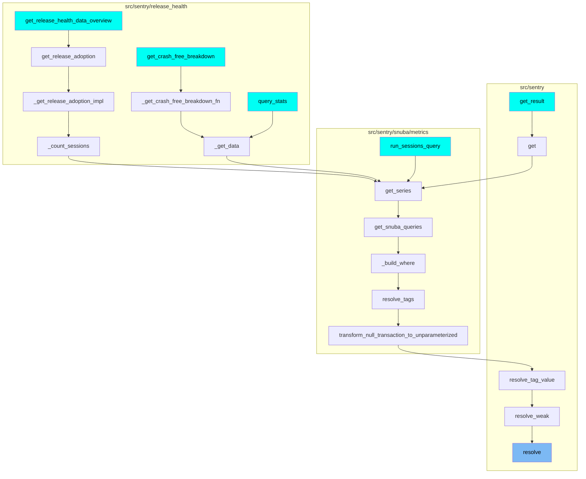
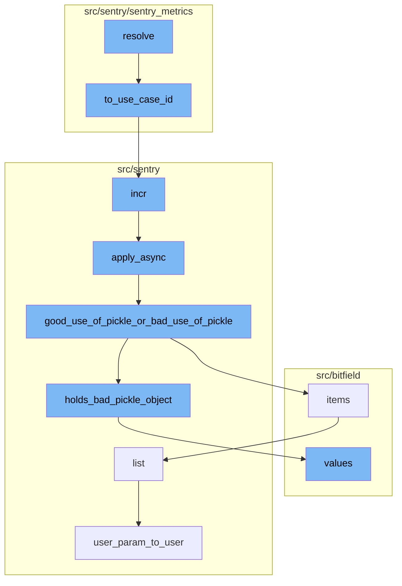

<SwmSnippet path="/src/sentry/sentry_metrics/utils.py" line="128">

---

# Resolve Flow

The `resolve` function is the entry point of the flow. It takes a use case ID, an organization ID, and a string as parameters. It then calls the `to_use_case_id` function to convert the use case ID into a specific format.

```python
def resolve(
    use_case_id: UseCaseID | UseCaseKey,
    org_id: int,
    string: str,
) -> int:
    use_case_id = to_use_case_id(use_case_id)
    resolved = indexer.resolve(use_case_id, org_id, string)
    if resolved is None:
        raise MetricIndexNotFound(f"Unknown string: {string!r}")

    return resolved
```

---

</SwmSnippet>

<SwmSnippet path="/src/sentry/sentry_metrics/indexer/base.py" line="388">

---

`to_use_case_id` checks if the use case is an instance of `UseCaseKey` and if so, it maps it to a `UseCaseID` using the `REVERSE_METRIC_PATH_MAPPING`. It then increments a metric for tracking.

```python
def to_use_case_id(use_case: UseCaseID | UseCaseKey) -> UseCaseID:
    if isinstance(use_case, UseCaseKey):
        use_case = REVERSE_METRIC_PATH_MAPPING[use_case]
        metrics.incr("sentry_metrics.indexer.unsafe_rev_resolve")
    return use_case
```

---

</SwmSnippet>

<SwmSnippet path="/src/sentry/buffer/base.py" line="83">

---

The `incr` function is called next, which prepares to increment a value in the database. It prepares the data and then calls `apply_async` to process the increment asynchronously.

```python
    def incr(
        self,
        model: type[models.Model],
        columns: dict[str, int],
        filters: dict[str, models.Model | str | int],
        extra: dict[str, Any] | None = None,
        signal_only: bool | None = None,
    ) -> None:
        """
        >>> incr(Group, columns={'times_seen': 1}, filters={'pk': group.pk})
        signal_only - added to indicate that `process` should only call the complete
        signal handler with the updated model and skip creates/updates in the database. this
        is useful in cases where we need to do additional processing before writing to the
        database and opt to do it in a `buffer_incr_complete` receiver.
        """
        process_incr.apply_async(
            kwargs={
                "model": model,
                "columns": columns,
                "filters": filters,
                "extra": extra,
```

---

</SwmSnippet>

<SwmSnippet path="/src/sentry/celery.py" line="103">

---

`apply_async` adds metadata to the task and checks if the task is using pickle in a way that could cause issues. If it detects a potential issue, it calls `good_use_of_pickle_or_bad_use_of_pickle`.

```python
    def apply_async(self, *args, **kwargs):
        self._add_metadata(kwargs)
        # If intended detect bad uses of pickle and make the tasks fail in tests.  This should
        # in theory pick up a lot of bad uses without accidentally failing tasks in prod.
        if (
            settings.CELERY_COMPLAIN_ABOUT_BAD_USE_OF_PICKLE
            and self.name not in LEGACY_PICKLE_TASKS
        ):
            good_use_of_pickle_or_bad_use_of_pickle(self, args, kwargs)

        with metrics.timer("jobs.delay", instance=self.name):
            return Task.apply_async(self, *args, **kwargs)
```

---

</SwmSnippet>

<SwmSnippet path="/src/sentry/celery.py" line="61">

---

`good_use_of_pickle_or_bad_use_of_pickle` checks each argument of the task for objects that should not be pickled. If it finds one, it raises a `TypeError`.

```python
def good_use_of_pickle_or_bad_use_of_pickle(task, args, kwargs):
    argiter = chain(enumerate(args), kwargs.items())

    for name, value in argiter:
        bad = holds_bad_pickle_object(value)
        if bad is not None:
            bad_object, reason = bad
            raise TypeError(
                "Task %r was invoked with an object that we do not want "
                "to pass via pickle (%r, reason is %s) in argument %s"
                % (task, bad_object, reason, name)
            )
```

---

</SwmSnippet>

<SwmSnippet path="/src/sentry/celery.py" line="29">

---

`holds_bad_pickle_object` is called within `good_use_of_pickle_or_bad_use_of_pickle` to check if a value is a bad pickle object. It checks if the value is a Django model or a custom class, both of which should not be pickled.

```python
def holds_bad_pickle_object(value, memo=None):
    if memo is None:
        memo = {}

    value_id = id(value)
    if value_id in memo:
        return
    memo[value_id] = value

    if isinstance(value, (tuple, list)):
        for item in value:
            bad_object = holds_bad_pickle_object(item)
            if bad_object is not None:
                return bad_object
    elif isinstance(value, dict):
        for item in value.values():
            bad_object = holds_bad_pickle_object(item)
            if bad_object is not None:
                return bad_object

    if isinstance(value, models.Model):
```

---

</SwmSnippet>

<SwmSnippet path="/src/sentry/runner/commands/permissions.py" line="76">

---

Finally, the `list` function is called to list the permissions for a user. It uses `user_param_to_user` to convert a user parameter to a user instance.

```python
def list(user: str) -> None:
    "List permissions for a user."
    from sentry.models.userpermission import UserPermission

    user_inst = user_param_to_user(user)
    up_list = UserPermission.objects.filter(user=user_inst).order_by("permission")
    click.echo(f"Permissions for `{user_inst.username}`:")
    for permission in up_list:
        click.echo(f"- {permission.permission}")
```

---

</SwmSnippet>

<SwmSnippet path="/src/sentry/runner/commands/permissions.py" line="14">

---

`user_param_to_user` finds a user based on the provided value. It raises an exception if no user is found, more than one user is found, or if the user is not a superuser.

```python
def user_param_to_user(value: str) -> User:
    from sentry.utils.auth import find_users

    users = find_users(value)
    if not users:
        raise click.ClickException(f"No user matching `{value}`")
    if len(users) > 1:
        raise click.ClickException(f"Found more than one user matching `{value}`")
    user = users[0]
    if not user.is_superuser:
        raise click.ClickException(f"User `{user.username}` does not have superuser status")
    return user
```

---

</SwmSnippet>

# Where is this flow used?

This flow is used multiple times in the codebase as represented in the following diagram. (Note - these are only some of the entry points of this flow)



# Flow drill down



<SwmSnippet path="/src/sentry/sentry_metrics/utils.py" line="128">

---

# Resolve Flow

The `resolve` function is the entry point of the flow. It takes a use case ID, an organization ID, and a string as parameters. It then calls the `to_use_case_id` function to convert the use case ID into a specific format.

```python
def resolve(
    use_case_id: UseCaseID | UseCaseKey,
    org_id: int,
    string: str,
) -> int:
    use_case_id = to_use_case_id(use_case_id)
    resolved = indexer.resolve(use_case_id, org_id, string)
    if resolved is None:
        raise MetricIndexNotFound(f"Unknown string: {string!r}")

    return resolved
```

---

</SwmSnippet>

<SwmSnippet path="/src/sentry/sentry_metrics/indexer/base.py" line="388">

---

`to_use_case_id` checks if the use case is an instance of `UseCaseKey` and if so, it maps it to a `UseCaseID` using the `REVERSE_METRIC_PATH_MAPPING`. It then increments a metric for tracking.

```python
def to_use_case_id(use_case: UseCaseID | UseCaseKey) -> UseCaseID:
    if isinstance(use_case, UseCaseKey):
        use_case = REVERSE_METRIC_PATH_MAPPING[use_case]
        metrics.incr("sentry_metrics.indexer.unsafe_rev_resolve")
    return use_case
```

---

</SwmSnippet>

<SwmSnippet path="/src/sentry/buffer/base.py" line="83">

---

The `incr` function is called next, which prepares to increment a value in the database. It prepares the data and then calls `apply_async` to process the increment asynchronously.

```python
    def incr(
        self,
        model: type[models.Model],
        columns: dict[str, int],
        filters: dict[str, models.Model | str | int],
        extra: dict[str, Any] | None = None,
        signal_only: bool | None = None,
    ) -> None:
        """
        >>> incr(Group, columns={'times_seen': 1}, filters={'pk': group.pk})
        signal_only - added to indicate that `process` should only call the complete
        signal handler with the updated model and skip creates/updates in the database. this
        is useful in cases where we need to do additional processing before writing to the
        database and opt to do it in a `buffer_incr_complete` receiver.
        """
        process_incr.apply_async(
            kwargs={
                "model": model,
                "columns": columns,
                "filters": filters,
                "extra": extra,
```

---

</SwmSnippet>

<SwmSnippet path="/src/sentry/celery.py" line="103">

---

`apply_async` adds metadata to the task and checks if the task is using pickle in a way that could cause issues. If it detects a potential issue, it calls `good_use_of_pickle_or_bad_use_of_pickle`.

```python
    def apply_async(self, *args, **kwargs):
        self._add_metadata(kwargs)
        # If intended detect bad uses of pickle and make the tasks fail in tests.  This should
        # in theory pick up a lot of bad uses without accidentally failing tasks in prod.
        if (
            settings.CELERY_COMPLAIN_ABOUT_BAD_USE_OF_PICKLE
            and self.name not in LEGACY_PICKLE_TASKS
        ):
            good_use_of_pickle_or_bad_use_of_pickle(self, args, kwargs)

        with metrics.timer("jobs.delay", instance=self.name):
            return Task.apply_async(self, *args, **kwargs)
```

---

</SwmSnippet>

<SwmSnippet path="/src/sentry/celery.py" line="61">

---

`good_use_of_pickle_or_bad_use_of_pickle` checks each argument of the task for objects that should not be pickled. If it finds one, it raises a `TypeError`.

```python
def good_use_of_pickle_or_bad_use_of_pickle(task, args, kwargs):
    argiter = chain(enumerate(args), kwargs.items())

    for name, value in argiter:
        bad = holds_bad_pickle_object(value)
        if bad is not None:
            bad_object, reason = bad
            raise TypeError(
                "Task %r was invoked with an object that we do not want "
                "to pass via pickle (%r, reason is %s) in argument %s"
                % (task, bad_object, reason, name)
            )
```

---

</SwmSnippet>

<SwmSnippet path="/src/sentry/celery.py" line="29">

---

`holds_bad_pickle_object` is called within `good_use_of_pickle_or_bad_use_of_pickle` to check if a value is a bad pickle object. It checks if the value is a Django model or a custom class, both of which should not be pickled.

```python
def holds_bad_pickle_object(value, memo=None):
    if memo is None:
        memo = {}

    value_id = id(value)
    if value_id in memo:
        return
    memo[value_id] = value

    if isinstance(value, (tuple, list)):
        for item in value:
            bad_object = holds_bad_pickle_object(item)
            if bad_object is not None:
                return bad_object
    elif isinstance(value, dict):
        for item in value.values():
            bad_object = holds_bad_pickle_object(item)
            if bad_object is not None:
                return bad_object

    if isinstance(value, models.Model):
```

---

</SwmSnippet>

<SwmSnippet path="/src/sentry/runner/commands/permissions.py" line="76">

---

Finally, the `list` function is called to list the permissions for a user. It uses `user_param_to_user` to convert a user parameter to a user instance.

```python
def list(user: str) -> None:
    "List permissions for a user."
    from sentry.models.userpermission import UserPermission

    user_inst = user_param_to_user(user)
    up_list = UserPermission.objects.filter(user=user_inst).order_by("permission")
    click.echo(f"Permissions for `{user_inst.username}`:")
    for permission in up_list:
        click.echo(f"- {permission.permission}")
```

---

</SwmSnippet>

<SwmSnippet path="/src/sentry/runner/commands/permissions.py" line="14">

---

`user_param_to_user` finds a user based on the provided value. It raises an exception if no user is found, more than one user is found, or if the user is not a superuser.

```python
def user_param_to_user(value: str) -> User:
    from sentry.utils.auth import find_users

    users = find_users(value)
    if not users:
        raise click.ClickException(f"No user matching `{value}`")
    if len(users) > 1:
        raise click.ClickException(f"Found more than one user matching `{value}`")
    user = users[0]
    if not user.is_superuser:
        raise click.ClickException(f"User `{user.username}` does not have superuser status")
    return user
```

---

</SwmSnippet>

# Where is this flow used?

This flow is used multiple times in the codebase as represented in the following diagram:

(Note - these are only some of the entry points of this flow)


&nbsp;

*This is an auto-generated document by Swimm AI 🌊 and has not yet been verified by a human*

<SwmMeta version="3.0.0" repo-id="Z2l0aHViJTNBJTNBc2VudHJ5LWRlbW8lM0ElM0FTd2ltbS1EZW1v" repo-name="sentry-demo" doc-type="flows"><sup>Powered by [Swimm](/)</sup></SwmMeta>
