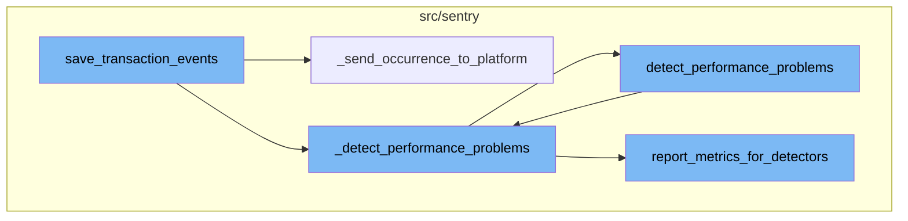
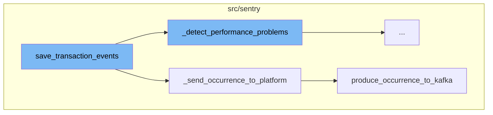
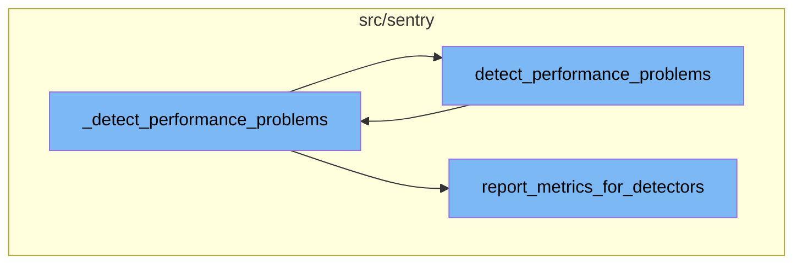
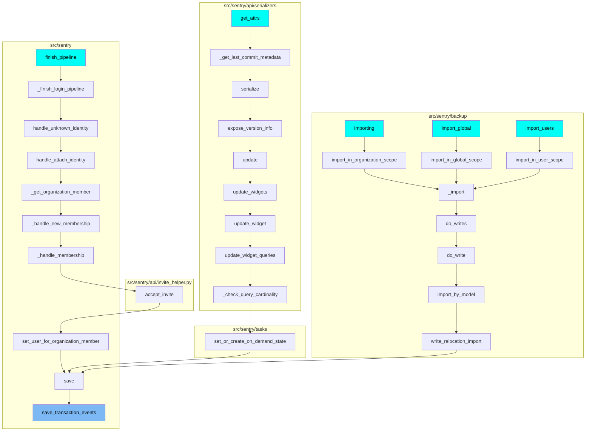

# Overview of save_transaction_events

The `save_transaction_events` function is a key component in the Sentry application. It is responsible for processing a sequence of jobs related to transaction events. These jobs include various operations such as setting measurements, deriving tags, calculating span grouping, and saving event metrics. The function also calls two important sub-functions: `_detect_performance_problems` and `_send_occurrence_to_platform`.

# \_send_occurrence_to_platform Function

The `_send_occurrence_to_platform` function is called within `save_transaction_events`. It iterates over the jobs and for each job, it creates an `IssueOccurrence` object for each performance problem associated with the job. This object is then sent to Kafka using the `produce_occurrence_to_kafka` function.

# produce_occurrence_to_kafka Function

The `produce_occurrence_to_kafka` function is responsible for preparing and sending the occurrence message to Kafka. It prepares the payload data based on the payload type and then sends it to the Kafka topic. If the event stream is not set to Kafka, it processes the message directly.

# \_detect_performance_problems Function

The `_detect_performance_problems` function in `event_manager.py` is the first step in the performance detection process. It iterates over a list of jobs and for each job, it calls the `detect_performance_problems` function, passing the job data, project information, and a flag indicating if the spans are standalone.

# detect_performance_problems Function

The `detect_performance_problems` function in `performance_detection.py` acts as a facade for the performance detection process. It tries to detect performance problems based on the provided data and project information. If the rate of problem detection is greater than a random value, it sets an experimental tag and starts a timer and a span for performance detection. It then calls the `_detect_performance_problems` function again.

# \_detect_performance_problems Function

The `_detect_performance_problems` function in `performance_detection.py` performs the detailed performance detection. It initializes performance detectors based on the detection settings and runs each detector on the data. It then reports metrics for the detectors and checks if the creation of performance problems is allowed for the system, organization, and project. It returns a list of unique performance problems.

# report_metrics_for_detectors Function

The `report_metrics_for_detectors` function in `performance_detection.py` reports metrics and creates spans for detection. It sets various tags and increments metrics based on the detected problems. It also sets tags for each detector and increments metrics for each problem detected by the detectors.



# Flow drill down

First, we'll zoom into this section of the flow:



<SwmSnippet path="/src/sentry/event_manager.py" line="3042">

---

# save_transaction_events Function

The `save_transaction_events` function is responsible for processing a sequence of jobs related to transaction events. It performs various operations such as setting measurements, deriving tags, calculating span grouping, and saving event metrics. It also calls two important functions: `_detect_performance_problems` and `_send_occurrence_to_platform`.

```python
def save_transaction_events(jobs: Sequence[Job], projects: ProjectsMapping) -> Sequence[Job]:
    organization_ids = {project.organization_id for project in projects.values()}
    organizations = {o.id: o for o in Organization.objects.get_many_from_cache(organization_ids)}

    for project in projects.values():
        try:
            project.set_cached_field_value("organization", organizations[project.organization_id])
        except KeyError:
            continue

    set_measurement(measurement_name="jobs", value=len(jobs))
    set_measurement(measurement_name="projects", value=len(projects))

    _get_or_create_release_many(jobs, projects)
    _get_event_user_many(jobs, projects)
    _derive_plugin_tags_many(jobs, projects)
    _derive_interface_tags_many(jobs)
    _calculate_span_grouping(jobs, projects)
    _materialize_metadata_many(jobs)
    _get_or_create_environment_many(jobs, projects)
    _get_or_create_release_associated_models(jobs, projects)
```

---

</SwmSnippet>

<SwmSnippet path="/src/sentry/event_manager.py" line="3014">

---

## \_send_occurrence_to_platform Function

The `_send_occurrence_to_platform` function is called within `save_transaction_events`. It iterates over the jobs and for each job, it creates an `IssueOccurrence` object for each performance problem associated with the job. This object is then sent to Kafka using the `produce_occurrence_to_kafka` function.

```python
def _send_occurrence_to_platform(jobs: Sequence[Job], projects: ProjectsMapping) -> None:
    for job in jobs:
        event = job["event"]
        project = event.project
        event_id = event.event_id

        performance_problems = job["performance_problems"]
        for problem in performance_problems:
            occurrence = IssueOccurrence(
                id=uuid.uuid4().hex,
                resource_id=None,
                project_id=project.id,
                event_id=event_id,
                fingerprint=[problem.fingerprint],
                type=problem.type,
                issue_title=problem.title,
                subtitle=problem.desc,
                culprit=event.transaction,
                evidence_data=problem.evidence_data,
                evidence_display=problem.evidence_display,
                detection_time=event.datetime,
```

---

</SwmSnippet>

<SwmSnippet path="/src/sentry/issues/producer.py" line="50">

---

### produce_occurrence_to_kafka Function

The `produce_occurrence_to_kafka` function is responsible for preparing and sending the occurrence message to Kafka. It prepares the payload data based on the payload type and then sends it to the Kafka topic. If the event stream is not set to Kafka, it processes the message directly.

```python
def produce_occurrence_to_kafka(
    payload_type: PayloadType = PayloadType.OCCURRENCE,
    occurrence: IssueOccurrence | None = None,
    status_change: StatusChangeMessage | None = None,
    event_data: dict[str, Any] | None = None,
    is_buffered_spans: bool | None = False,
) -> None:
    if payload_type == PayloadType.OCCURRENCE:
        payload_data = _prepare_occurrence_message(occurrence, event_data, is_buffered_spans)
    elif payload_type == PayloadType.STATUS_CHANGE:
        payload_data = _prepare_status_change_message(status_change)
    else:
        raise NotImplementedError(f"Unknown payload type: {payload_type}")

    if payload_data is None:
        return

    partition_key = None
    if occurrence and occurrence.fingerprint:
        partition_key = occurrence.fingerprint[0].encode()
    elif status_change and status_change.fingerprint:
```

---

</SwmSnippet>

Now, lets zoom into this section of the flow:



<SwmSnippet path="/src/sentry/event_manager.py" line="2969">

---

# Detecting Performance Problems

The `_detect_performance_problems` function in `event_manager.py` is the first step in the performance detection process. It iterates over a list of jobs and for each job, it calls the `detect_performance_problems` function, passing the job data, project information, and a flag indicating if the spans are standalone.

```python
def _detect_performance_problems(
    jobs: Sequence[Job], projects: ProjectsMapping, is_standalone_spans: bool = False
) -> None:
    for job in jobs:
        job["performance_problems"] = detect_performance_problems(
            job["data"], projects[job["project_id"]], is_standalone_spans=is_standalone_spans
        )
```

---

</SwmSnippet>

<SwmSnippet path="/src/sentry/utils/performance_issues/performance_detection.py" line="116">

---

# Facade for Performance Detection

The `detect_performance_problems` function in `performance_detection.py` acts as a facade for the performance detection process. It tries to detect performance problems based on the provided data and project information. If the rate of problem detection is greater than a random value, it sets an experimental tag and starts a timer and a span for performance detection. It then calls the `_detect_performance_problems` function again.

```python
# Facade in front of performance detection to limit impact of detection on our events ingestion
def detect_performance_problems(
    data: dict[str, Any], project: Project, is_standalone_spans: bool = False
) -> list[PerformanceProblem]:
    try:
        rate = options.get("performance.issues.all.problem-detection")
        if rate and rate > random.random():
            # Add an experimental tag to be able to find these spans in production while developing. Should be removed later.
            sentry_sdk.set_tag("_did_analyze_performance_issue", "true")
            with (
                metrics.timer("performance.detect_performance_issue", sample_rate=0.01),
                sentry_sdk.start_span(
                    op="py.detect_performance_issue", description="none"
                ) as sdk_span,
            ):
                return _detect_performance_problems(
                    data, sdk_span, project, is_standalone_spans=is_standalone_spans
                )
    except Exception:
        logging.exception("Failed to detect performance problems")
    return []
```

---

</SwmSnippet>

<SwmSnippet path="/src/sentry/utils/performance_issues/performance_detection.py" line="336">

---

# Detailed Performance Detection

The `_detect_performance_problems` function in `performance_detection.py` performs the detailed performance detection. It initializes performance detectors based on the detection settings and runs each detector on the data. It then reports metrics for the detectors and checks if the creation of performance problems is allowed for the system, organization, and project. It returns a list of unique performance problems.

```python
def _detect_performance_problems(
    data: dict[str, Any], sdk_span: Any, project: Project, is_standalone_spans: bool = False
) -> list[PerformanceProblem]:
    event_id = data.get("event_id", None)

    with sentry_sdk.start_span(op="function", description="get_detection_settings"):
        detection_settings = get_detection_settings(project.id)

    with sentry_sdk.start_span(op="initialize", description="PerformanceDetector"):
        detectors: list[PerformanceDetector] = [
            detector_class(detection_settings, data)
            for detector_class in DETECTOR_CLASSES
            if detector_class.is_detector_enabled()
        ]

    for detector in detectors:
        with sentry_sdk.start_span(
            op="function", description=f"run_detector_on_data.{detector.type.value}"
        ):
            run_detector_on_data(detector, data)

```

---

</SwmSnippet>

<SwmSnippet path="/src/sentry/utils/performance_issues/performance_detection.py" line="416">

---

# Reporting Metrics for Detectors

The `report_metrics_for_detectors` function in `performance_detection.py` reports metrics and creates spans for detection. It sets various tags and increments metrics based on the detected problems. It also sets tags for each detector and increments metrics for each problem detected by the detectors.

```python
# Reports metrics and creates spans for detection
def report_metrics_for_detectors(
    event: dict[str, Any],
    event_id: str | None,
    detectors: Sequence[PerformanceDetector],
    sdk_span: Any,
    organization: Organization,
    is_standalone_spans: bool = False,
) -> None:
    all_detected_problems = [i for d in detectors for i in d.stored_problems]
    has_detected_problems = bool(all_detected_problems)
    sdk_name = get_sdk_name(event)

    try:
        # Setting a tag isn't critical, the transaction doesn't exist sometimes, if it's called outside prod code (eg. load-mocks / tests)
        set_tag = sdk_span.containing_transaction.set_tag
    except AttributeError:
        set_tag = lambda *args: None

    if has_detected_problems:
        set_tag("_pi_all_issue_count", len(all_detected_problems))
```

---

</SwmSnippet>

# Where is this flow used?

This flow is used multiple times in the codebase as represented in the following diagram:

(Note - these are only some of the entry points of this flow)



&nbsp;

*This is an auto-generated document by Swimm AI 🌊 and has not yet been verified by a human*

<SwmMeta version="3.0.0" repo-id="Z2l0aHViJTNBJTNBc2VudHJ5LWRlbW8lM0ElM0FTd2ltbS1EZW1v" repo-name="sentry-demo" doc-type="flows"><sup>Powered by [Swimm](/)</sup></SwmMeta>
