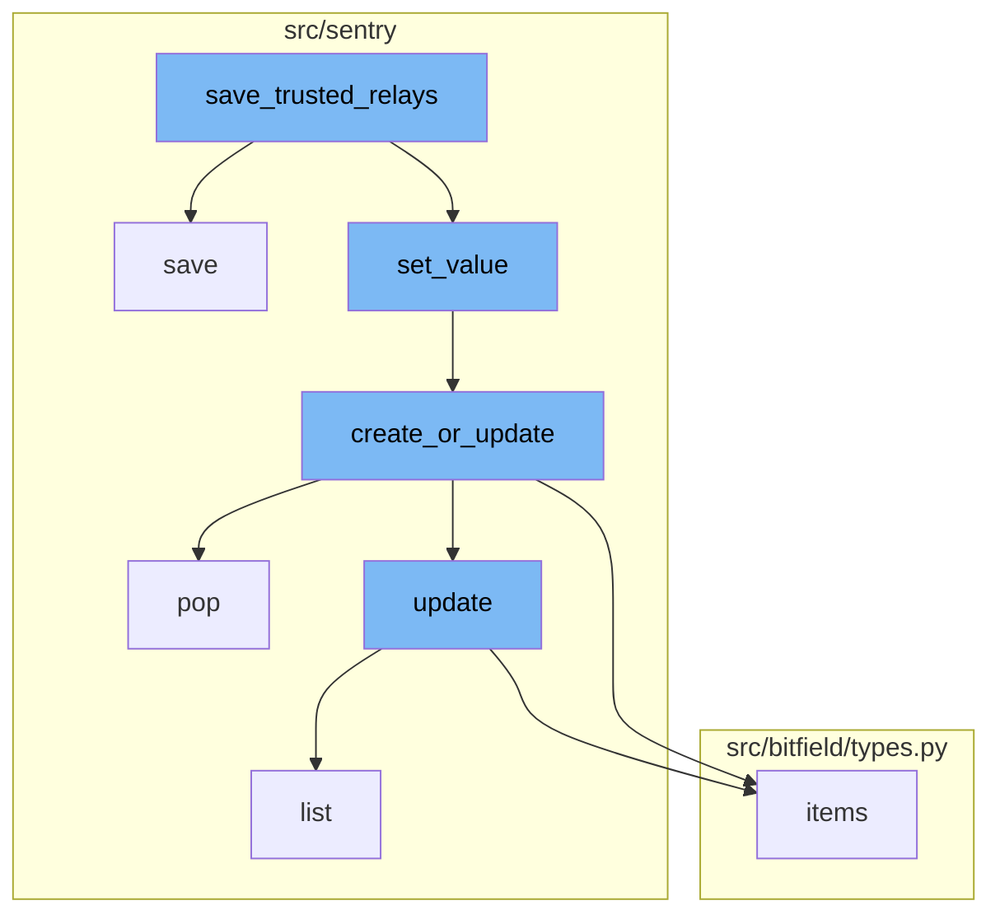
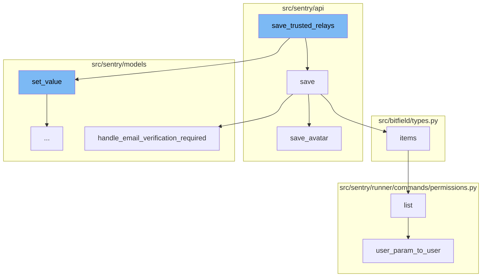
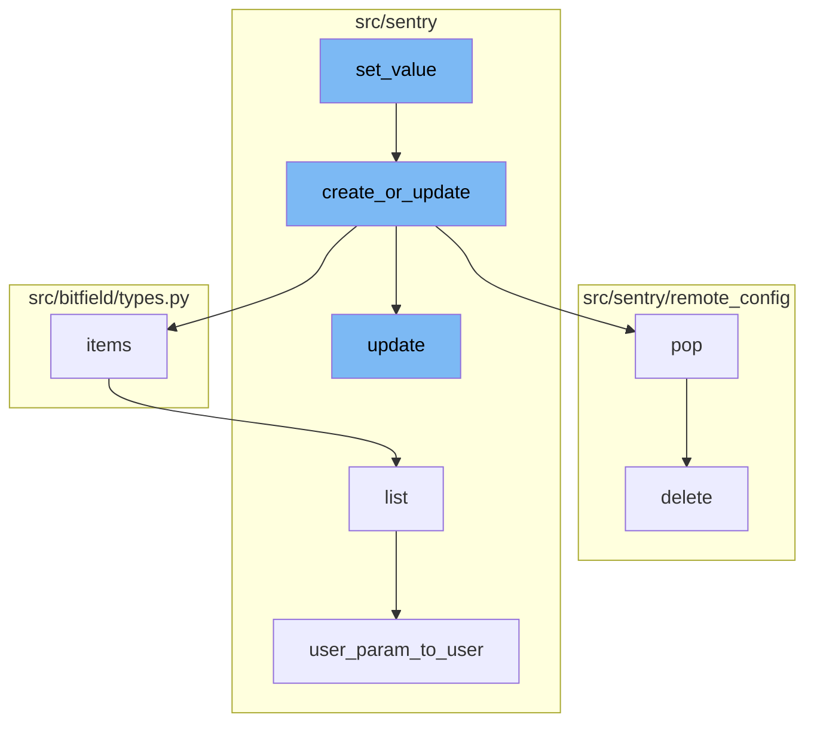
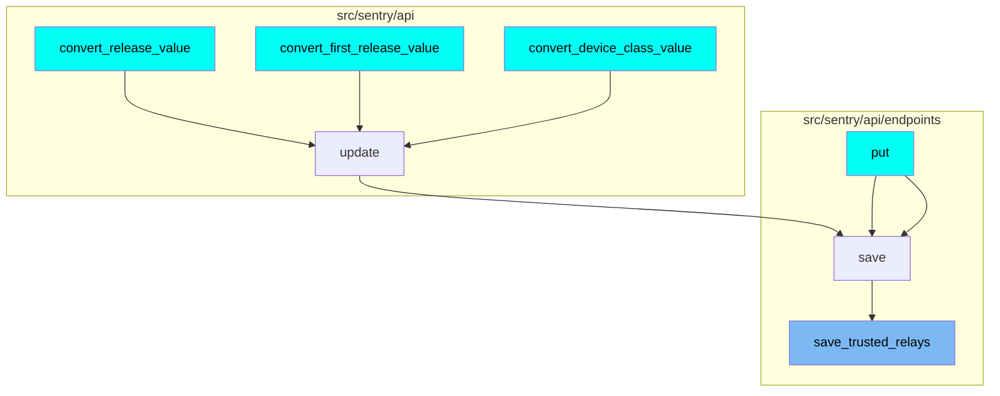

The `save_trusted_relays` function is a crucial part of the Sentry application. It is responsible for saving the trusted relays for an organization. The function first checks if there are existing trusted relays for the organization. If there are, it updates the existing relays with the new ones. If there are no existing relays, it creates new ones. The function also logs any changes made to the trusted relays.

The `save_trusted_relays` function is part of a larger flow that involves several other functions. The `save` function is a general function for saving organization details. It checks if there are changes in the organization's data and updates the data accordingly. If there are changes in the trusted relays, it calls the `save_trusted_relays` function to handle the changes.

The `save_avatar` function is used to save the avatar for an organization. It is called within the `save` function if there are changes in the avatar data. The `handle_email_verification_required` function is used to handle the requirement for email verification. It is called within the `save` function if the `requireEmailVerification` flag is set to true.

The `list` function is used to list the permissions for a user. It is not directly related to the `save_trusted_relays` function but provides context on how permissions are handled in the codebase. The `user_param_to_user` function is used to convert a user parameter to a user object. It is used within the `list` function to get the user object for which the permissions are to be listed.

The `set_value` function is the starting point of the flow. It calls the `create_or_update` function, passing the group instance, key, and value. It also updates the cache with the key-value pair. The `create_or_update` function either updates a row or creates it. It determines if the row exists by searching on all of the kwargs besides `values` and `default`. If the row exists, it is updated with the data in `values`. If it doesn't, it is created with the data in `values`, `defaults`, and the remaining kwargs.

The `items` function is called within `create_or_update`, it returns a list of items. The `pop` function is also called within `create_or_update`, it deletes the key from the default cache. The `update` function updates specified attributes on the current instance. It is called within `create_or_update` if the row exists.

The `list` function lists permissions for a user. It is called within `items`. The `user_param_to_user` function is called within `list`, it converts a user parameter to a user instance.

This flow is used multiple times in the codebase. Some of the entry points of this flow include the `put`, `convert_release_value`, `convert_first_release_value`, and `convert_device_class_value` functions.



# Flow drill down

First, we'll zoom into this section of the flow:



<SwmSnippet path="/src/sentry/api/endpoints/organization_details.py" line="398">

---

# save_trusted_relays

The `save_trusted_relays` function is responsible for saving the trusted relays for an organization. It first checks if there are existing trusted relays for the organization. If there are, it updates the existing relays with the new ones. If there are no existing relays, it creates new ones. The function also logs any changes made to the trusted relays.

```python
    def save_trusted_relays(self, incoming, changed_data, organization):
        timestamp_now = datetime.now(timezone.utc).isoformat()
        option_key = "sentry:trusted-relays"
        try:
            # get what we already have
            existing = OrganizationOption.objects.get(organization=organization, key=option_key)

            key_dict = {val.get("public_key"): val for val in existing.value}
            original_number_of_keys = len(existing.value)
        except OrganizationOption.DoesNotExist:
            key_dict = {}  # we don't have anything set
            original_number_of_keys = 0
            existing = None

        modified = False
        for option in incoming:
            public_key = option.get("public_key")
            existing_info = key_dict.get(public_key, {})

            option["created"] = existing_info.get("created", timestamp_now)
            option["last_modified"] = existing_info.get("last_modified")
```

---

</SwmSnippet>

<SwmSnippet path="/src/sentry/api/endpoints/organization_details.py" line="449">

---

# save

The `save` function is a general function for saving organization details. It checks if there are changes in the organization's data and updates the data accordingly. If there are changes in the trusted relays, it calls the `save_trusted_relays` function to handle the changes.

```python
    def save(self):
        from sentry import features

        org = self.context["organization"]
        changed_data = {}
        if not hasattr(org, "__data"):
            update_tracked_data(org)

        data = self.validated_data

        for key, option, type_, default_value in ORG_OPTIONS:
            if key not in data:
                continue
            try:
                option_inst = OrganizationOption.objects.get(organization=org, key=option)
                update_tracked_data(option_inst)
            except OrganizationOption.DoesNotExist:
                OrganizationOption.objects.set_value(
                    organization=org, key=option, value=type_(data[key])
                )

```

---

</SwmSnippet>

<SwmSnippet path="/src/sentry/api/bases/avatar.py" line="73">

---

# save_avatar

The `save_avatar` function is used to save the avatar for an organization. It is called within the `save` function if there are changes in the avatar data.

```python
    def save_avatar(self, obj: Any, serializer: serializers.Serializer, **kwargs: Any) -> AvatarT:
        result = serializer.validated_data

        return self.model.save_avatar(
            relation={self.object_type: obj},
            type=result["avatar_type"],
            avatar=result.get("avatar_photo"),
            filename=self.get_avatar_filename(obj),
            color=result.get("color"),
        )
```

---

</SwmSnippet>

<SwmSnippet path="/src/sentry/models/organization.py" line="437">

---

# handle_email_verification_required

The `handle_email_verification_required` function is used to handle the requirement for email verification. It is called within the `save` function if the `requireEmailVerification` flag is set to true.

```python
    def handle_email_verification_required(self, request):
        from sentry.tasks.auth import remove_email_verification_non_compliant_members

        if features.has("organizations:required-email-verification", self):
            self._handle_requirement_change(
                request, remove_email_verification_non_compliant_members
            )
```

---

</SwmSnippet>

<SwmSnippet path="/src/sentry/runner/commands/permissions.py" line="76">

---

# list

The `list` function is used to list the permissions for a user. It is not directly related to the `save_trusted_relays` function but provides context on how permissions are handled in the codebase.

```python
def list(user: str) -> None:
    "List permissions for a user."
    from sentry.models.userpermission import UserPermission

    user_inst = user_param_to_user(user)
    up_list = UserPermission.objects.filter(user=user_inst).order_by("permission")
    click.echo(f"Permissions for `{user_inst.username}`:")
    for permission in up_list:
        click.echo(f"- {permission.permission}")
```

---

</SwmSnippet>

<SwmSnippet path="/src/sentry/runner/commands/permissions.py" line="14">

---

# user_param_to_user

The `user_param_to_user` function is used to convert a user parameter to a user object. It is used within the `list` function to get the user object for which the permissions are to be listed.

```python
def user_param_to_user(value: str) -> User:
    from sentry.utils.auth import find_users

    users = find_users(value)
    if not users:
        raise click.ClickException(f"No user matching `{value}`")
    if len(users) > 1:
        raise click.ClickException(f"Found more than one user matching `{value}`")
    user = users[0]
    if not user.is_superuser:
        raise click.ClickException(f"User `{user.username}` does not have superuser status")
    return user
```

---

</SwmSnippet>

Now, lets zoom into this section of the flow:



<SwmSnippet path="/src/sentry/models/groupmeta.py" line="83">

---

# save_trusted_relays Flow

The `set_value` function is the starting point of the flow. It calls the `create_or_update` function, passing the group instance, key, and value. It also updates the cache with the key-value pair.

```python
    def set_value(self, instance, key, value):
        self.create_or_update(group=instance, key=key, values={"value": value})
        self.__cache.setdefault(instance.id, {})
        self.__cache[instance.id][key] = value
```

---

</SwmSnippet>

<SwmSnippet path="/src/sentry/db/models/query.py" line="173">

---

The `create_or_update` function either updates a row or creates it. It determines if the row exists by searching on all of the kwargs besides `values` and `default`. If the row exists, it is updated with the data in `values`. If it doesn't, it is created with the data in `values`, `defaults`, and the remaining kwargs.

```python
def create_or_update(
    model: type[Model], using: str | None = None, **kwargs: Any
) -> tuple[int, Literal[False]] | tuple[Model, Literal[True]]:
    """
    Similar to get_or_create, either updates a row or creates it.

    In order to determine if the row exists, this searches on all of the kwargs
    besides `values` and `default`.

    If the row exists, it is updated with the data in `values`. If it
    doesn't, it is created with the data in `values`, `defaults`, and the remaining
    kwargs.

    The result will be (rows affected, False) if the row was not created,
    or (instance, True) if the object is new.

    >>> create_or_update(MyModel, key='value', values={
    >>>     'col_name': F('col_name') + 1,
    >>> }, defaults={'created_at': timezone.now()})
    """
    values = kwargs.pop("values", {})
```

---

</SwmSnippet>

<SwmSnippet path="/src/bitfield/types.py" line="225">

---

The `items` function is called within `create_or_update`, it returns a list of items.

```python
    def items(self):
        return list(self.iteritems())
```

---

</SwmSnippet>

<SwmSnippet path="/src/sentry/remote_config/storage.py" line="51">

---

The `pop` function is also called within `create_or_update`, it deletes the key from the default cache.

```python
    def pop(self) -> None:
        try:
            default_cache.delete(self.key)
        except Exception:
            pass
```

---

</SwmSnippet>

<SwmSnippet path="/src/sentry/db/models/query.py" line="86">

---

The `update` function updates specified attributes on the current instance. It is called within `create_or_update` if the row exists.

```python
def update(instance: BaseModel, using: str | None = None, **kwargs: Any) -> int:
    """
    Updates specified attributes on the current instance.
    """
    assert instance.pk, "Cannot update an instance that has not yet been created."

    using = using or router.db_for_write(instance.__class__, instance=instance)

    for field in instance._meta.fields:
        if getattr(field, "auto_now", False) and field.name not in kwargs:
            kwargs[field.name] = field.pre_save(instance, False)

    affected = (
        instance.__class__.objects.using(using)
        .filter(pk=instance.pk)
        # Disable the post update query signal since we're going to send a more specific `post_save` signal here.
        .with_post_update_signal(False)
        .update(**kwargs)
    )
    for k, v in kwargs.items():
        setattr(instance, k, _handle_value(instance, v))
```

---

</SwmSnippet>

<SwmSnippet path="/src/sentry/runner/commands/permissions.py" line="76">

---

The `list` function lists permissions for a user. It is called within `items`.

```python
def list(user: str) -> None:
    "List permissions for a user."
    from sentry.models.userpermission import UserPermission

    user_inst = user_param_to_user(user)
    up_list = UserPermission.objects.filter(user=user_inst).order_by("permission")
    click.echo(f"Permissions for `{user_inst.username}`:")
    for permission in up_list:
        click.echo(f"- {permission.permission}")
```

---

</SwmSnippet>

<SwmSnippet path="/src/sentry/runner/commands/permissions.py" line="14">

---

The `user_param_to_user` function is called within `list`, it converts a user parameter to a user instance.

```python
def user_param_to_user(value: str) -> User:
    from sentry.utils.auth import find_users

    users = find_users(value)
    if not users:
        raise click.ClickException(f"No user matching `{value}`")
    if len(users) > 1:
        raise click.ClickException(f"Found more than one user matching `{value}`")
    user = users[0]
    if not user.is_superuser:
        raise click.ClickException(f"User `{user.username}` does not have superuser status")
    return user
```

---

</SwmSnippet>

# Where is this flow used?

This flow is used multiple times in the codebase as represented in the following diagram:

(Note - these are only some of the entry points of this flow)



&nbsp;

*This is an auto-generated document by Swimm AI 🌊 and has not yet been verified by a human*

<SwmMeta version="3.0.0" repo-id="Z2l0aHViJTNBJTNBc2VudHJ5LWRlbW8lM0ElM0FTd2ltbS1EZW1v" repo-name="sentry-demo" doc-type="flows"><sup>Powered by [Swimm](/)</sup></SwmMeta>
