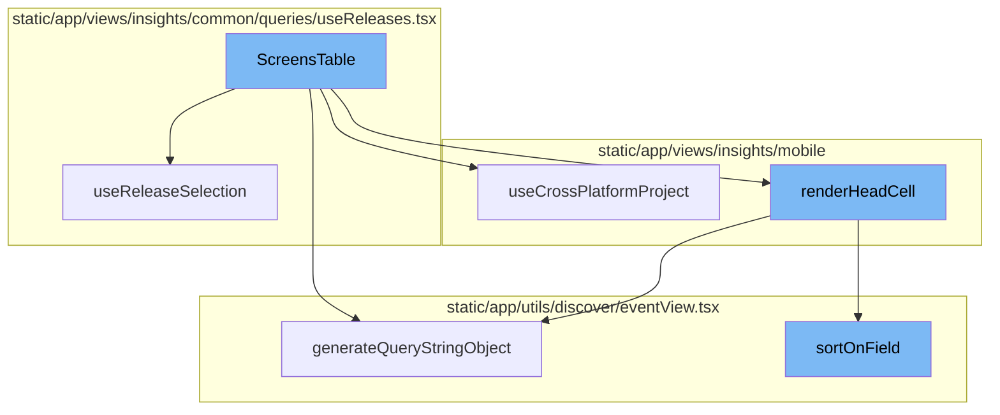
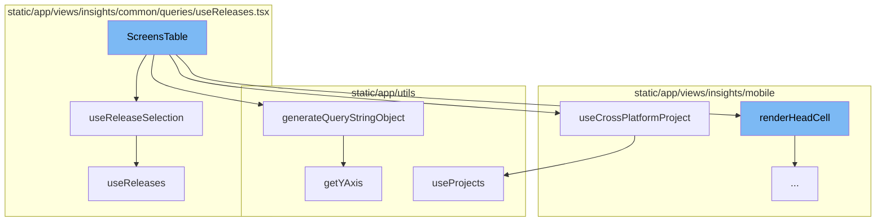
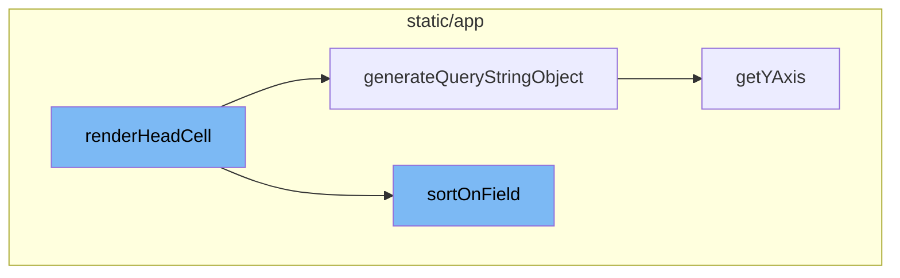

# ScreensTable Overview

The `ScreensTable` is a key component in the application that displays screen load data. It utilizes several hooks and helper functions to fetch and process the necessary data. The `ScreensTable` function defines helper functions `renderBodyCell` and `renderHeadCell` for rendering individual cells in the table.

## useReleaseSelection Hook

The `useReleaseSelection` hook is utilized within `ScreensTable` to fetch the primary and secondary releases. It uses the `useReleases` hook to fetch all releases and then selects the primary and secondary ones based on the location query or the order of releases.

## useCrossPlatformProject Hook

The `useCrossPlatformProject` hook is used within `ScreensTable` to fetch the project data. It uses the `usePageFilters` and `useProjects` hooks to fetch all projects and then selects the one that matches the current selection.

## generateQueryStringObject Method

The `generateQueryStringObject` method is used within `ScreensTable` to generate a query string object based on the current state of the `eventView` object. This object is then used to fetch the data for the table.

## getYAxis Method

The `getYAxis` method is used within `ScreensTable` to get the current Y-axis value. It checks if a Y-axis value is already set, and if not, it selects a default value from the available options.

## renderHeadCell Function

The `renderHeadCell` function is the starting point of the flow. It takes a column and table metadata as arguments and returns a React node. The function defines a `generateSortLink` function which is used to generate a sort link for the column based on the field and table metadata.

## sortOnField Function

The `sortOnField` function is also called within `generateSortLink`. It sorts the event view based on the provided field and table metadata. The sorted event view is then used to generate the query string object.



# Flow drill down

First, we'll zoom into this section of the flow:



<SwmSnippet path="/static/app/views/insights/mobile/screenload/components/tables/screensTable.tsx" line="46">

---

# ScreensTable Function

The `ScreensTable` function is the main component of the table that displays screen load data. It uses several hooks and helper functions to fetch and process the data it needs. It also defines helper functions `renderBodyCell` and `renderHeadCell` for rendering individual cells in the table.

```tsx
export function ScreensTable({data, eventView, isLoading, pageLinks, onCursor}: Props) {
  const moduleURL = useModuleURL('screen_load');
  const location = useLocation();
  const organization = useOrganization();
  const {primaryRelease, secondaryRelease} = useReleaseSelection();
  const {project} = useCrossPlatformProject();
  const eventViewColumns = eventView.getColumns();

  const ttidColumnNamePrimaryRelease = `avg_if(measurements.time_to_initial_display,release,${primaryRelease})`;
  const ttidColumnNameSecondaryRelease = `avg_if(measurements.time_to_initial_display,release,${secondaryRelease})`;
  const ttfdColumnNamePrimaryRelease = `avg_if(measurements.time_to_full_display,release,${primaryRelease})`;
  const ttfdColumnNameSecondaryRelease = `avg_if(measurements.time_to_full_display,release,${secondaryRelease})`;
  const countColumnName = `count()`;

  const columnNameMap = {
    transaction: t('Screen'),
    [ttidColumnNamePrimaryRelease]: t('AVG TTID (%s)', PRIMARY_RELEASE_ALIAS),
    [ttidColumnNameSecondaryRelease]: t('AVG TTID (%s)', SECONDARY_RELEASE_ALIAS),
    [ttfdColumnNamePrimaryRelease]: t('AVG TTFD (%s)', PRIMARY_RELEASE_ALIAS),
    [ttfdColumnNameSecondaryRelease]: t('AVG TTFD (%s)', SECONDARY_RELEASE_ALIAS),
    [countColumnName]: t('Total Count'),
```

---

</SwmSnippet>

<SwmSnippet path="/static/app/views/insights/common/queries/useReleases.tsx" line="116">

---

## useReleaseSelection Hook

The `useReleaseSelection` hook is used within `ScreensTable` to fetch the primary and secondary releases. It uses the `useReleases` hook to fetch all releases and then selects the primary and secondary ones based on the location query or the order of releases.

```tsx
export function useReleaseSelection(): {
  isLoading: boolean;
  primaryRelease: string | undefined;
  secondaryRelease: string | undefined;
} {
  const location = useLocation();

  const {data: releases, isLoading} = useReleases();

  // If there are more than 1 release, the first one should be the older one
  const primaryRelease =
    decodeScalar(location.query.primaryRelease) ??
    (releases && releases.length > 1 ? releases?.[1]?.version : releases?.[0]?.version);

  // If there are more than 1 release, the second one should be the newest one
  const secondaryRelease =
    decodeScalar(location.query.secondaryRelease) ??
    (releases && releases.length > 1 ? releases?.[0]?.version : undefined);

  return {primaryRelease, secondaryRelease, isLoading};
}
```

---

</SwmSnippet>

<SwmSnippet path="/static/app/views/insights/mobile/common/queries/useCrossPlatformProject.tsx" line="13">

---

## useCrossPlatformProject Hook

The `useCrossPlatformProject` hook is used within `ScreensTable` to fetch the project data. It uses the `usePageFilters` and `useProjects` hooks to fetch all projects and then selects the one that matches the current selection.

```tsx
function useCrossPlatformProject() {
  const {selection} = usePageFilters();
  const {projects} = useProjects();
  const location = useLocation();

  const project = useMemo(() => {
    if (selection.projects.length !== 1) {
      return null;
    }

    return projects.find(p => p.id === String(selection.projects)) ?? null;
  }, [projects, selection.projects]);

  const isProjectCrossPlatform = useMemo(
    () => !!(project && isCrossPlatform(project)),
    [project]
  );

  const selectedPlatform =
    decodeScalar(location.query[PLATFORM_QUERY_PARAM]) ??
    localStorage.getItem(PLATFORM_LOCAL_STORAGE_KEY) ??
```

---

</SwmSnippet>

<SwmSnippet path="/static/app/utils/discover/eventView.tsx" line="672">

---

## generateQueryStringObject Method

The `generateQueryStringObject` method is used within `ScreensTable` to generate a query string object based on the current state of the `eventView` object. This object is then used to fetch the data for the table.

```tsx
  generateQueryStringObject(): Query {
    const output = {
      id: this.id,
      name: this.name,
      field: this.getFields(),
      widths: this.getWidths(),
      sort: encodeSorts(this.sorts),
      environment: this.environment,
      project: this.project,
      query: this.query,
      yAxis: this.yAxis || this.getYAxis(),
      dataset: this.dataset,
      display: this.display,
      topEvents: this.topEvents,
      interval: this.interval,
    };

    for (const field of EXTERNAL_QUERY_STRING_KEYS) {
      if (this[field]?.length) {
        output[field] = this[field];
      }
```

---

</SwmSnippet>

<SwmSnippet path="/static/app/utils/discover/eventView.tsx" line="1319">

---

## getYAxis Method

The `getYAxis` method is used within `ScreensTable` to get the current Y-axis value. It checks if a Y-axis value is already set, and if not, it selects a default value from the available options.

```tsx
  getYAxis(): string {
    const yAxisOptions = this.getYAxisOptions();

    const yAxis = this.yAxis;
    const defaultOption = yAxisOptions[0].value;

    if (!yAxis) {
      return defaultOption;
    }

    // ensure current selected yAxis is one of the items in yAxisOptions
    const result = yAxisOptions.findIndex(
      (option: SelectValue<string>) => option.value === yAxis
    );

    if (result >= 0) {
      return typeof yAxis === 'string' ? yAxis : yAxis[0];
    }

    return defaultOption;
  }
```

---

</SwmSnippet>

Now, lets zoom into this section of the flow:



<SwmSnippet path="/static/app/views/insights/mobile/screenload/components/tables/screensTable.tsx" line="156">

---

# ScreensTable Flow

The `renderHeadCell` function is the starting point of the flow. It takes a column and table metadata as arguments and returns a React node. The function defines a `generateSortLink` function which is used to generate a sort link for the column based on the field and table metadata.

```tsx
  function renderHeadCell(
    column: GridColumnHeader,
    tableMeta?: MetaType
  ): React.ReactNode {
    const fieldType = tableMeta?.fields?.[column.key];
    const alignment = fieldAlignment(column.key as string, fieldType);
    const field = {
      field: column.key as string,
      width: column.width,
    };

    function generateSortLink() {
      if (!tableMeta) {
        return undefined;
      }

      const nextEventView = eventView.sortOnField(field, tableMeta);
      const queryStringObject = nextEventView.generateQueryStringObject();

      return {
        ...location,
```

---

</SwmSnippet>

<SwmSnippet path="/static/app/utils/discover/eventView.tsx" line="672">

---

The `generateQueryStringObject` function is called within `generateSortLink`. It generates a query string object based on the properties of the event view. This object is used to update the query parameters of the sort link.

```tsx
  generateQueryStringObject(): Query {
    const output = {
      id: this.id,
      name: this.name,
      field: this.getFields(),
      widths: this.getWidths(),
      sort: encodeSorts(this.sorts),
      environment: this.environment,
      project: this.project,
      query: this.query,
      yAxis: this.yAxis || this.getYAxis(),
      dataset: this.dataset,
      display: this.display,
      topEvents: this.topEvents,
      interval: this.interval,
    };

    for (const field of EXTERNAL_QUERY_STRING_KEYS) {
      if (this[field]?.length) {
        output[field] = this[field];
      }
```

---

</SwmSnippet>

<SwmSnippet path="/static/app/utils/discover/eventView.tsx" line="1253">

---

The `sortOnField` function is also called within `generateSortLink`. It sorts the event view based on the provided field and table metadata. The sorted event view is then used to generate the query string object.

```tsx
  sortOnField(
    field: Field,
    tableMeta: MetaType,
    kind?: 'desc' | 'asc',
    useFunctionFormat?: boolean
  ): EventView {
    // check if field can be sorted
    if (!isFieldSortable(field, tableMeta)) {
      return this;
    }

    const needleIndex = this.sorts.findIndex(sort =>
      isSortEqualToField(sort, field, tableMeta)
    );

    if (needleIndex >= 0) {
      const newEventView = this.clone();

      const currentSort = this.sorts[needleIndex];

      const sorts = [...newEventView.sorts];
```

---

</SwmSnippet>

<SwmSnippet path="/static/app/utils/discover/eventView.tsx" line="1319">

---

The `getYAxis` function is called within `generateQueryStringObject`. It returns the y-axis value for the event view, which is included in the generated query string object.

```tsx
  getYAxis(): string {
    const yAxisOptions = this.getYAxisOptions();

    const yAxis = this.yAxis;
    const defaultOption = yAxisOptions[0].value;

    if (!yAxis) {
      return defaultOption;
    }

    // ensure current selected yAxis is one of the items in yAxisOptions
    const result = yAxisOptions.findIndex(
      (option: SelectValue<string>) => option.value === yAxis
    );

    if (result >= 0) {
      return typeof yAxis === 'string' ? yAxis : yAxis[0];
    }

    return defaultOption;
  }
```

---

</SwmSnippet>

&nbsp;

*This is an auto-generated document by Swimm AI 🌊 and has not yet been verified by a human*

<SwmMeta version="3.0.0" repo-id="Z2l0aHViJTNBJTNBc2VudHJ5LWRlbW8lM0ElM0FTd2ltbS1EZW1v" repo-name="sentry-demo" doc-type="flows"><sup>Powered by [Swimm](/)</sup></SwmMeta>
