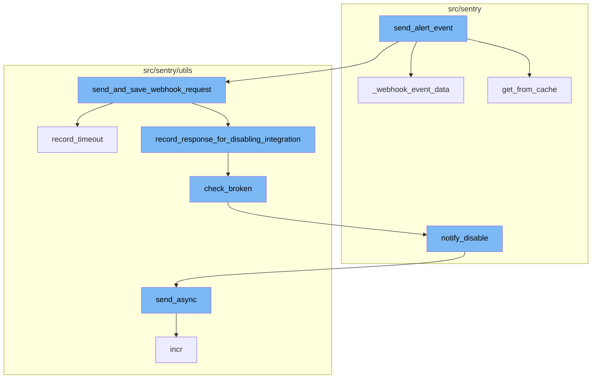
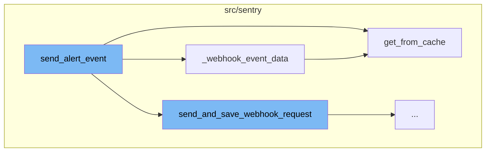
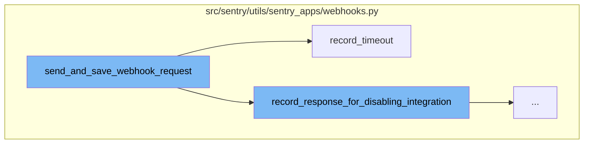
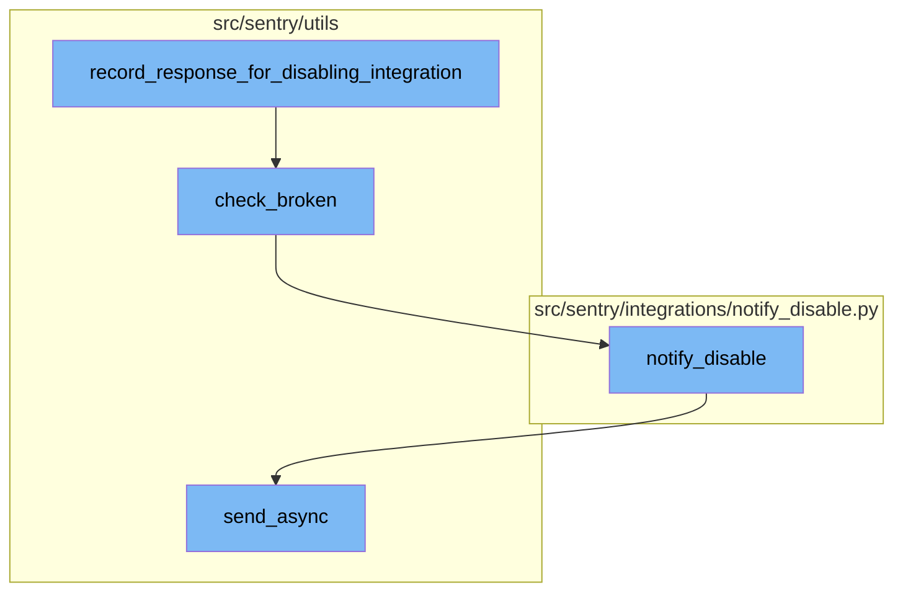

# Overview of send_alert_event

The `send_alert_event` function is a key part of the alerting system in Sentry. It is responsible for sending incident data to a SentryApp's webhook when an incident alert is triggered. This function takes in an event, rule, sentry_app_id, and optional additional payload. It retrieves the group, project, and organization related to the event from the cache. It then prepares the data to be sent to the webhook, which includes the event context and the triggered rule. If there's additional payload, it's attached to the data. The data is then sent to the webhook via the `send_and_save_webhook_request` function.

# Preparing the Event Context

The `_webhook_event_data` function is called within `send_alert_event` to prepare the event context. It retrieves the project and organization related to the event from the cache. It then generates the URLs for the event and attaches them to the event context. The event context is then returned to be used in `send_alert_event`.

# Caching Mechanism

The `get_from_cache` function is a wrapper around QuerySet.get which supports caching of the intermediate value. It's used in both `send_alert_event` and `_webhook_event_data` to retrieve the project and organization related to the event from the cache. If the requested data is not in the cache, it retrieves it from the database and stores it in the cache for future use.

# Sending the Webhook Request

The `send_and_save_webhook_request` function is responsible for notifying a SentryApp's webhook about an incident and logging the response on Redis. It takes in parameters like the SentryApp to notify, the incident data, and the URL to hit for the webhook. It then sends a request to the webhook URL and handles different types of responses and errors.

# Handling Timeouts

In the event of a timeout or connection error, the `record_timeout` function is called. This function records the timeout or connection error in the integration buffer for the unpublished Sentry App. It checks if the Sentry App is broken and should be disabled.

# Recording Responses for Disabling Integration

If the action of the app platform event is not 'event.alert', the `record_response_for_disabling_integration` function is called. This function is responsible for recording the response for the purpose of disabling integrations.

# Checking Broken Integration

The `check_broken` function checks if the integration is broken by using the `IntegrationRequestBuffer`. If the integration is broken, it disables the integration, clears the buffer, and calls the `notify_disable` function to notify about the disabled integration.

# Notifying about Disabled Integration

The `notify_disable` function is used to notify the owners of the organization about the disabled integration. It creates a message with the necessary details and sends it asynchronously using the `send_async` function.

# Sending Email Asynchronously

The `send_async` function is used to send the email message asynchronously. It builds the message, queues it for sending, and logs the queued mail.



# Flow drill down

First, we'll zoom into this section of the flow:



<SwmSnippet path="/src/sentry/tasks/sentry_apps.py" line="88">

---

# send_alert_event Function

The `send_alert_event` function is responsible for sending incident data to the SentryApp's webhook when an incident alert is triggered. It takes in an event, rule, sentry_app_id, and optional additional payload. It retrieves the group, project, and organization related to the event from the cache. It then prepares the data to be sent to the webhook, which includes the event context and the triggered rule. If there's additional payload, it's attached to the data. The data is then sent to the webhook via the `send_and_save_webhook_request` function.

```python
def send_alert_event(
    event: Event,
    rule: str,
    sentry_app_id: int,
    additional_payload_key: str | None = None,
    additional_payload: Mapping[str, Any] | None = None,
) -> None:
    """
    When an incident alert is triggered, send incident data to the SentryApp's webhook.
    :param event: The `Event` for which to build a payload.
    :param rule: The AlertRule that was triggered.
    :param sentry_app_id: The SentryApp to notify.
    :param additional_payload_key: The key used to attach additional data to the webhook payload
    :param additional_payload: The extra data attached to the payload body at the key specified by `additional_payload_key`.
    :return:
    """
    group = event.group
    project = Project.objects.get_from_cache(id=group.project_id)
    organization = Organization.objects.get_from_cache(id=project.organization_id)

    extra = {
```

---

</SwmSnippet>

<SwmSnippet path="/src/sentry/tasks/sentry_apps.py" line="60">

---

# \_webhook_event_data Function

The `_webhook_event_data` function is called within `send_alert_event` to prepare the event context. It retrieves the project and organization related to the event from the cache. It then generates the URLs for the event and attaches them to the event context. The event context is then returned to be used in `send_alert_event`.

```python
def _webhook_event_data(event, group_id, project_id):
    project = Project.objects.get_from_cache(id=project_id)
    organization = Organization.objects.get_from_cache(id=project.organization_id)

    event_context = event.as_dict()
    event_context["url"] = absolute_uri(
        reverse(
            "sentry-api-0-project-event-details",
            args=[project.organization.slug, project.slug, event.event_id],
        )
    )

    event_context["web_url"] = absolute_uri(
        reverse(
            "sentry-organization-event-detail", args=[organization.slug, group_id, event.event_id]
        )
    )

    # The URL has a regex OR in it ("|") which means `reverse` cannot generate
    # a valid URL (it can't know which option to pick). We have to manually
    # create this URL for, that reason.
```

---

</SwmSnippet>

<SwmSnippet path="/src/sentry/db/models/manager/base.py" line="281">

---

# get_from_cache Function

The `get_from_cache` function is a wrapper around QuerySet.get which supports caching of the intermediate value. It's used in both `send_alert_event` and `_webhook_event_data` to retrieve the project and organization related to the event from the cache. If the requested data is not in the cache, it retrieves it from the database and stores it in the cache for future use.

```python
    def get_from_cache(
        self, use_replica: bool = settings.SENTRY_MODEL_CACHE_USE_REPLICA, **kwargs: Any
    ) -> M:
        """
        Wrapper around QuerySet.get which supports caching of the
        intermediate value.  Callee is responsible for making sure
        the cache key is cleared on save.
        """
        if not self.cache_fields:
            raise ValueError("We cannot cache this query. Just hit the database.")

        key, pk_name, value = self._get_cacheable_kv_from_kwargs(kwargs)
        if key not in self.cache_fields and key != pk_name:
            raise ValueError("We cannot cache this query. Just hit the database.")

        cache_key = self.__get_lookup_cache_key(**{key: value})
        local_cache = self._get_local_cache()

        def validate_result(inst: Any) -> M:
            if isinstance(inst, self.model) and (key != pk_name or int(value) == inst.pk):
                return inst
```

---

</SwmSnippet>

Now, lets zoom into this section of the flow:



<SwmSnippet path="/src/sentry/utils/sentry_apps/webhooks.py" line="116">

---

# send_alert_event Flow

The `send_and_save_webhook_request` function is the starting point of the focused flow. It is responsible for notifying a SentryApp's webhook about an incident and logging the response on Redis. It takes in parameters like the SentryApp to notify, the incident data, and the URL to hit for the webhook. It then sends a request to the webhook URL and handles different types of responses and errors.

```python
def send_and_save_webhook_request(
    sentry_app: SentryApp | RpcSentryApp,
    app_platform_event: AppPlatformEvent,
    url: str | None = None,
) -> Response:
    """
    Notify a SentryApp's webhook about an incident and log response on redis.

    :param sentry_app: The SentryApp to notify via a webhook.
    :param app_platform_event: Incident data. See AppPlatformEvent.
    :param url: The URL to hit for this webhook if it is different from `sentry_app.webhook_url`.
    :return: Webhook response
    """
    buffer = SentryAppWebhookRequestsBuffer(sentry_app)

    org_id = app_platform_event.install.organization_id
    event = f"{app_platform_event.resource}.{app_platform_event.action}"
    slug = sentry_app.slug_for_metrics
    url = url or sentry_app.webhook_url
    assert url is not None

```

---

</SwmSnippet>

<SwmSnippet path="/src/sentry/utils/sentry_apps/webhooks.py" line="82">

---

## Handling Timeouts

In the event of a timeout or connection error, the `record_timeout` function is called. This function records the timeout or connection error in the integration buffer for the unpublished Sentry App. It checks if the Sentry App is broken and should be disabled.

```python
def record_timeout(
    sentryapp: SentryApp | RpcSentryApp, org_id: str, e: ConnectionError | Timeout
) -> None:
    """
    Record Unpublished Sentry App timeout or connection error in integration buffer to check if it is broken and should be disabled
    """
    if not sentryapp.is_internal:
        return
    redis_key = get_redis_key(sentryapp, org_id)
    if not len(redis_key):
        return
    buffer = IntegrationRequestBuffer(redis_key)
    buffer.record_timeout()
    check_broken(sentryapp, org_id)
```

---

</SwmSnippet>

<SwmSnippet path="/src/sentry/utils/sentry_apps/webhooks.py" line="181">

---

## Recording Responses for Disabling Integration

If the action of the app platform event is not 'event.alert', the `record_response_for_disabling_integration` function is called. This function is responsible for recording the response for the purpose of disabling integrations.

```python
        record_response_for_disabling_integration(sentry_app, org_id, response)
```

---

</SwmSnippet>

Now, lets zoom into this section of the flow:



<SwmSnippet path="/src/sentry/utils/sentry_apps/webhooks.py" line="98">

---

# Record Response for Disabling Integration

The `record_response_for_disabling_integration` function is used to record the response of a webhook request. If the response indicates an error, it records the error and calls the `check_broken` function to check if the integration is broken.

```python
def record_response_for_disabling_integration(
    sentryapp: SentryApp | RpcSentryApp, org_id: str, response: Response
) -> None:
    if not sentryapp.is_internal:
        return
    redis_key = get_redis_key(sentryapp, org_id)
    if not len(redis_key):
        return
    buffer = IntegrationRequestBuffer(redis_key)
    if is_response_success(response):
        buffer.record_success()
        return
    if is_response_error(response):
        buffer.record_error()
        check_broken(sentryapp, org_id)
```

---

</SwmSnippet>

<SwmSnippet path="/src/sentry/utils/sentry_apps/webhooks.py" line="53">

---

# Check Broken Integration

The `check_broken` function checks if the integration is broken by using the `IntegrationRequestBuffer`. If the integration is broken, it disables the integration, clears the buffer, and calls the `notify_disable` function to notify about the disabled integration.

```python
def check_broken(sentryapp: SentryApp | RpcSentryApp, org_id: str) -> None:
    from sentry.sentry_apps.services.app.service import app_service

    redis_key = get_redis_key(sentryapp, org_id)
    buffer = IntegrationRequestBuffer(redis_key)
    if buffer.is_integration_broken():
        org = Organization.objects.get(id=org_id)
        app_service.disable_sentryapp(id=sentryapp.id)
        notify_disable(org, sentryapp.name, redis_key, sentryapp.slug, sentryapp.webhook_url)
        buffer.clear()
        create_system_audit_entry(
            organization=org,
            target_object=org.id,
            event=audit_log.get_event_id("INTERNAL_INTEGRATION_DISABLED"),
            data={"name": sentryapp.name},
        )
        extra = {
            "sentryapp_webhook": sentryapp.webhook_url,
            "sentryapp_slug": sentryapp.slug,
            "sentryapp_uuid": sentryapp.uuid,
            "org_id": org_id,
```

---

</SwmSnippet>

<SwmSnippet path="/src/sentry/integrations/notify_disable.py" line="42">

---

# Notify Disable

The `notify_disable` function is used to notify the owners of the organization about the disabled integration. It creates a message with the necessary details and sends it asynchronously using the `send_async` function.

```python
def notify_disable(
    organization: RpcOrganization | Organization,
    integration_name: str,
    redis_key: str,
    integration_slug: str | None = None,
    webhook_url: str | None = None,
    project: str | None = None,
):

    integration_link = get_url(
        organization,
        get_provider_type(redis_key),
        integration_slug if "sentry-app" in redis_key and integration_slug else integration_name,
    )

    referrer = (
        "?referrer=disabled-sentry-app"
        if "sentry-app" in redis_key
        else "?referrer=disabled-integration"
    )

```

---

</SwmSnippet>

<SwmSnippet path="/src/sentry/utils/email/message_builder.py" line="232">

---

# Send Async

The `send_async` function is used to send the email message asynchronously. It builds the message, queues it for sending, and logs the queued mail.

```python
    def send_async(
        self,
        to: Iterable[str] | None = None,
        cc: Sequence[str] | None = None,
        bcc: Sequence[str] | None = None,
    ) -> None:
        from sentry.tasks.email import send_email, send_email_control

        fmt = options.get("system.logging-format")
        messages = self.get_built_messages(to, cc=cc, bcc=bcc)
        extra: MutableMapping[str, str | tuple[str]] = {"message_type": self.type}
        loggable = [v for k, v in self.context.items() if hasattr(v, "id")]
        for context in loggable:
            extra[f"{type(context).__name__.lower()}_id"] = context.id

        log_mail_queued = partial(logger.info, "mail.queued", extra=extra)
        for message in messages:
            send_email_task = send_email.delay
            if SiloMode.get_current_mode() == SiloMode.CONTROL:
                send_email_task = send_email_control.delay
            safe_execute(send_email_task, message=message)
```

---

</SwmSnippet>

&nbsp;

*This is an auto-generated document by Swimm AI 🌊 and has not yet been verified by a human*

<SwmMeta version="3.0.0" repo-id="Z2l0aHViJTNBJTNBc2VudHJ5LWRlbW8lM0ElM0FTd2ltbS1EZW1v" repo-name="sentry-demo" doc-type="flows"><sup>Powered by [Swimm](/)</sup></SwmMeta>
