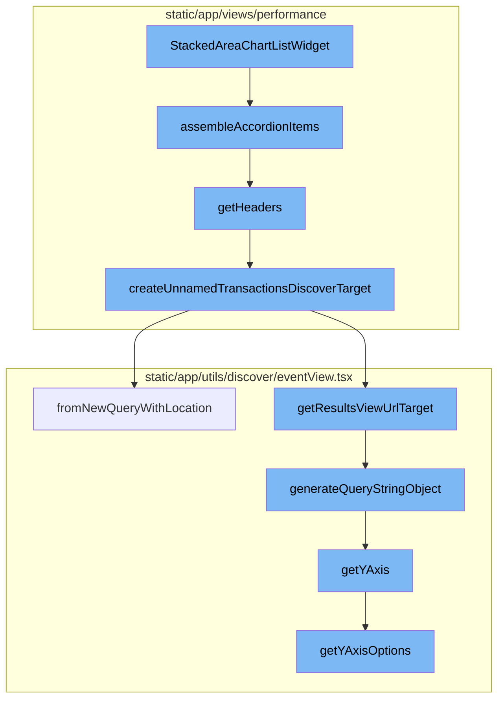
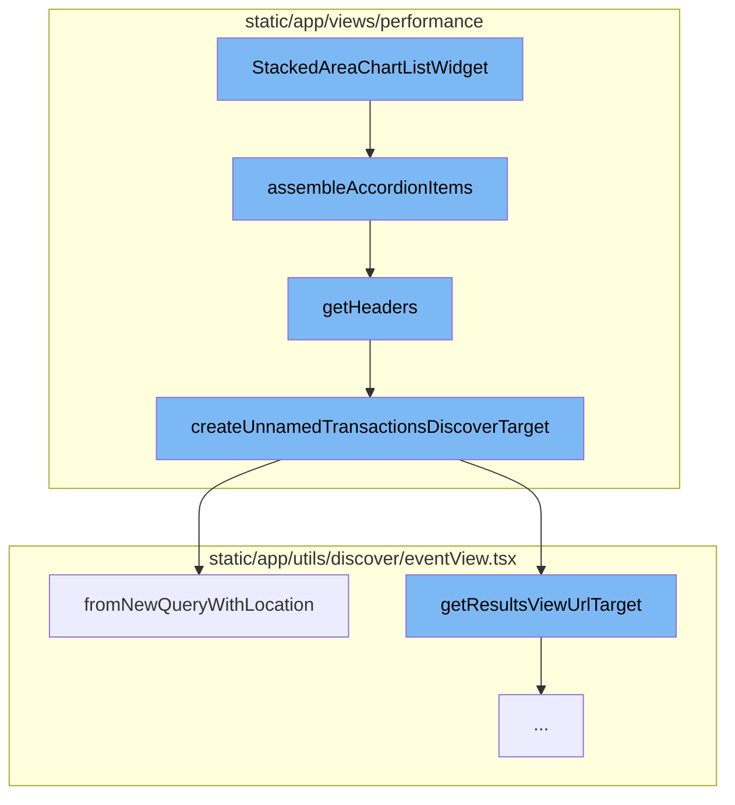
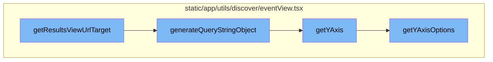

# StackedAreaChartListWidget Overview

The StackedAreaChartListWidget is a component that displays a stacked area chart. It is designed to visualize data in a way that allows for easy comparison of different data sets over time. The widget is composed of several parts, each responsible for a specific task.

## Data Fetching and Processing

The StackedAreaChartListWidget uses hooks and memoized queries to fetch and process the data needed for the widget. It uses the `useMemo` hook to define a query that fetches the necessary data fields.

## Accordion Items Assembly

The widget uses the `assembleAccordionItems` function to generate the accordion items. This function calls the `getHeaders` function to generate headers for the accordion items and maps these headers to their corresponding content.

## Headers Generation

The `getHeaders` function is used to generate headers for the accordion items. If the transaction is unparameterized, it calls `createUnnamedTransactionsDiscoverTarget` to generate the target for the transaction.

## Unnamed Transactions Target Creation

`createUnnamedTransactionsDiscoverTarget` is used to create a Discover target for unnamed transactions. It constructs a new query and uses `fromNewQueryWithLocation` to create an EventView from the new query.

## Query String Object Generation

The `generateQueryStringObject` function is responsible for creating the query string object. It gathers various properties of the current instance and combines them into an object. Notably, it sets the `yAxis` property by either using the existing `yAxis` or calling `getYAxis`.

## Y-Axis Retrieval

The `getYAxis` function retrieves the current `yAxis` value. If it doesn't exist, it defaults to the first option from `getYAxisOptions`. It also ensures that the current `yAxis` is a valid option from `getYAxisOptions`.

## Y-Axis Options Generation

Finally, `getYAxisOptions` generates a list of valid `yAxis` options. It filters out aggregates that are not graphable and maps them into a format suitable for a select input. It also includes some default options.



# Flow drill down

First, we'll zoom into this section of the flow:



<SwmSnippet path="/static/app/views/performance/landing/widgets/widgets/stackedAreaChartListWidget.tsx" line="54">

---

# StackedAreaChartListWidget Flow

The `StackedAreaChartListWidget` function is the entry point for this flow. It's responsible for rendering the widget and managing its state. It uses several hooks and memoized queries to fetch and process the data needed for the widget.

```tsx
export function StackedAreaChartListWidget(props: PerformanceWidgetProps) {
  const location = useLocation();
  const mepSetting = useMEPSettingContext();
  const [selectedListIndex, setSelectListIndex] = useState<number>(0);
  const {ContainerActions, organization, InteractiveTitle, fields} = props;
  const {setPageError} = usePageAlert();
  const theme = useTheme();

  const colors = [...theme.charts.getColorPalette(5)].reverse();

  const listQuery = useMemo<QueryDefinition<DataType, WidgetDataResult>>(
    () => ({
      fields,
      component: provided => {
        const eventView = provided.eventView.clone();

        eventView.fields = [
          {field: 'transaction'},
          {field: 'team_key_transaction'},
          {field: 'count()'},
          {field: 'project.id'},
```

---

</SwmSnippet>

<SwmSnippet path="/static/app/views/performance/landing/widgets/widgets/stackedAreaChartListWidget.tsx" line="181">

---

The `assembleAccordionItems` function is called within `StackedAreaChartListWidget`. It uses the `getHeaders` function to generate headers for the accordion items and maps these headers to their corresponding content.

```tsx
  const assembleAccordionItems = provided =>
    getHeaders(provided).map(header => ({header, content: getAreaChart(provided)}));
```

---

</SwmSnippet>

<SwmSnippet path="/static/app/views/performance/landing/widgets/widgets/stackedAreaChartListWidget.tsx" line="220">

---

The `getHeaders` function is used to generate headers for the accordion items. It maps over the data and creates a header for each item. If the transaction is unparameterized, it calls `createUnnamedTransactionsDiscoverTarget` to generate the target for the transaction.

```tsx
  const getHeaders = provided =>
    provided.widgetData.list.data.map((listItem, i) => {
      const transaction = (listItem.transaction as string | undefined) ?? '';

      const isUnparameterizedRow = transaction === UNPARAMETERIZED_TRANSACTION;
      const transactionTarget = isUnparameterizedRow
        ? createUnnamedTransactionsDiscoverTarget({
            organization,
            location,
          })
        : transactionSummaryRouteWithQuery({
            orgSlug: props.organization.slug,
            projectID: listItem['project.id'] as string,
            transaction,
            query: props.eventView.generateQueryStringObject(),
            subPath: 'spans',
          });

      const displayedField = 'count()';
      const rightValue = listItem[displayedField];

```

---

</SwmSnippet>

<SwmSnippet path="/static/app/views/performance/utils/index.tsx" line="51">

---

`createUnnamedTransactionsDiscoverTarget` is used to create a Discover target for unnamed transactions. It constructs a new query and uses `fromNewQueryWithLocation` to create an EventView from the new query.

```tsx
export function createUnnamedTransactionsDiscoverTarget(props: {
  location: Location;
  organization: Organization;
  source?: DiscoverQueryPageSource;
}) {
  const fields =
    props.source === DiscoverQueryPageSource.DISCOVER
      ? ['transaction', 'project', 'transaction.source', 'epm()']
      : ['transaction', 'project', 'transaction.source', 'epm()', 'p50()', 'p95()'];

  const query: NewQuery = {
    id: undefined,
    name:
      props.source === DiscoverQueryPageSource.DISCOVER
        ? t('Unparameterized Transactions')
        : t('Performance - Unparameterized Transactions'),
    query: 'event.type:transaction transaction.source:"url"',
    projects: [],
    fields,
    version: 2,
  };
```

---

</SwmSnippet>

<SwmSnippet path="/static/app/utils/discover/eventView.tsx" line="365">

---

`fromNewQueryWithLocation` is a method in the EventView class that creates an EventView from a new query and location. It applies global selection header values from the location whenever possible.

```tsx
  static fromNewQueryWithLocation(newQuery: NewQuery, location: Location): EventView {
    const query = location.query;

    // apply global selection header values from location whenever possible
    const environment: string[] =
      Array.isArray(newQuery.environment) && newQuery.environment.length > 0
        ? newQuery.environment
        : collectQueryStringByKey(query, 'environment');

    const project: number[] =
      Array.isArray(newQuery.projects) && newQuery.projects.length > 0
        ? newQuery.projects
        : decodeProjects(location);

    const saved: NewQuery = {
      ...newQuery,

      environment,
      projects: project,

      // datetime selection
```

---

</SwmSnippet>

Now, lets zoom into this section of the flow:



<SwmSnippet path="/static/app/utils/discover/eventView.tsx" line="1190">

---

# getResultsViewUrlTarget

The `getResultsViewUrlTarget` function is the starting point of our flow. It takes a slug and a boolean indicating if it's the homepage. It returns an object containing the pathname and a query. The query is generated by calling `generateQueryStringObject`.

```tsx
  getResultsViewUrlTarget(
    slug: string,
    isHomepage: boolean = false
  ): {pathname: string; query: Query} {
    const target = isHomepage ? 'homepage' : 'results';
    return {
      pathname: normalizeUrl(`/organizations/${slug}/discover/${target}/`),
      query: this.generateQueryStringObject(),
    };
  }
```

---

</SwmSnippet>

<SwmSnippet path="/static/app/utils/discover/eventView.tsx" line="672">

---

# generateQueryStringObject

The `generateQueryStringObject` function is responsible for creating the query string object. It gathers various properties of the current instance and combines them into an object. Notably, it sets the `yAxis` property by either using the existing `yAxis` or calling `getYAxis`.

```tsx
  generateQueryStringObject(): Query {
    const output = {
      id: this.id,
      name: this.name,
      field: this.getFields(),
      widths: this.getWidths(),
      sort: encodeSorts(this.sorts),
      environment: this.environment,
      project: this.project,
      query: this.query,
      yAxis: this.yAxis || this.getYAxis(),
      dataset: this.dataset,
      display: this.display,
      topEvents: this.topEvents,
      interval: this.interval,
    };

    for (const field of EXTERNAL_QUERY_STRING_KEYS) {
      if (this[field]?.length) {
        output[field] = this[field];
      }
```

---

</SwmSnippet>

<SwmSnippet path="/static/app/utils/discover/eventView.tsx" line="1319">

---

# getYAxis

The `getYAxis` function retrieves the current `yAxis` value. If it doesn't exist, it defaults to the first option from `getYAxisOptions`. It also ensures that the current `yAxis` is a valid option from `getYAxisOptions`.

```tsx
  getYAxis(): string {
    const yAxisOptions = this.getYAxisOptions();

    const yAxis = this.yAxis;
    const defaultOption = yAxisOptions[0].value;

    if (!yAxis) {
      return defaultOption;
    }

    // ensure current selected yAxis is one of the items in yAxisOptions
    const result = yAxisOptions.findIndex(
      (option: SelectValue<string>) => option.value === yAxis
    );

    if (result >= 0) {
      return typeof yAxis === 'string' ? yAxis : yAxis[0];
    }

    return defaultOption;
  }
```

---

</SwmSnippet>

<SwmSnippet path="/static/app/utils/discover/eventView.tsx" line="1300">

---

# getYAxisOptions

Finally, `getYAxisOptions` generates a list of valid `yAxis` options. It filters out aggregates that are not graphable and maps them into a format suitable for a select input. It also includes some default options.

```tsx
  getYAxisOptions(): SelectValue<string>[] {
    // Make option set and add the default options in.
    return uniqBy(
      this.getAggregateFields()
        // Only include aggregates that make sense to be graphable (eg. not string or date)
        .filter(
          (field: Field) =>
            isLegalYAxisType(aggregateOutputType(field.field)) ||
            isAggregateEquation(field.field)
        )
        .map((field: Field) => ({
          label: isEquation(field.field) ? getEquation(field.field) : field.field,
          value: field.field,
        }))
        .concat(CHART_AXIS_OPTIONS),
      'value'
    );
  }
```

---

</SwmSnippet>

&nbsp;

*This is an auto-generated document by Swimm AI 🌊 and has not yet been verified by a human*

<SwmMeta version="3.0.0" repo-id="Z2l0aHViJTNBJTNBc2VudHJ5LWRlbW8lM0ElM0FTd2ltbS1EZW1v" repo-name="sentry-demo" doc-type="flows"><sup>Powered by [Swimm](/)</sup></SwmMeta>
