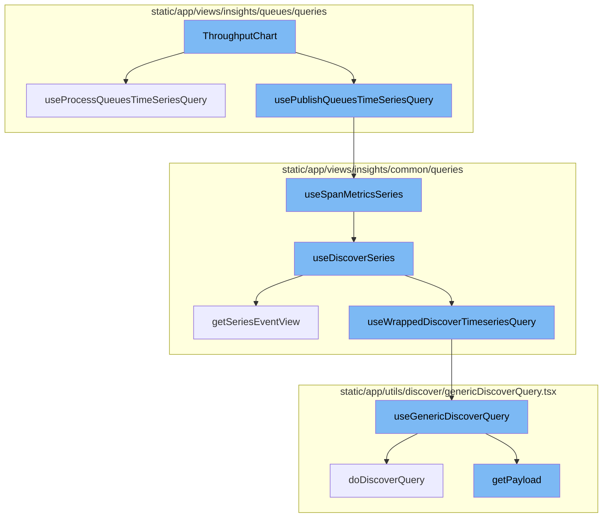
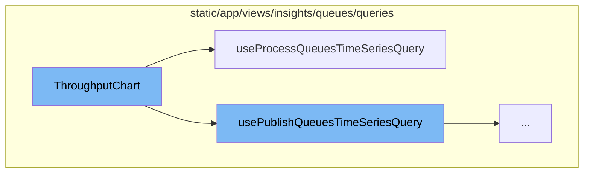
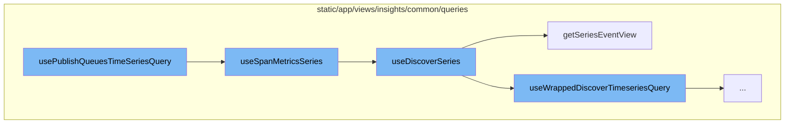
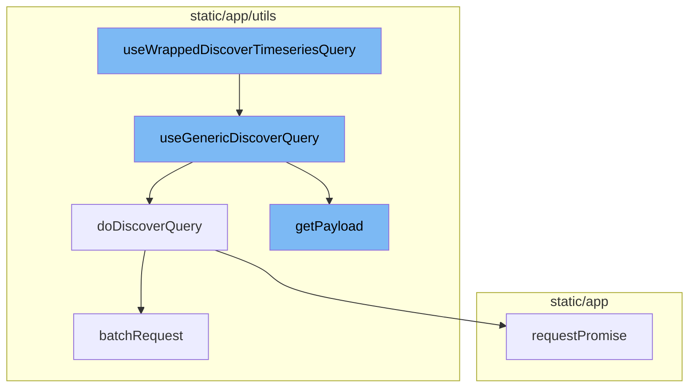

# ThroughputChart Overview

The `ThroughputChart` is a component that visualizes the throughput of published and processed data. It fetches the data for the chart using two hooks, `usePublishQueuesTimeSeriesQuery` and `useProcessQueuesTimeSeriesQuery`.

# Data Fetching Hooks

The `usePublishQueuesTimeSeriesQuery` and `useProcessQueuesTimeSeriesQuery` hooks are used to fetch the time series data for the published and processed queues respectively. The data fetched by these hooks is then used to populate the chart.

# Data Flow

The data flow begins with the `usePublishQueuesTimeSeriesQuery` function, which constructs a search query and calls the `useSpanMetricsSeries` function. This function wraps the `useDiscoverSeries` function, which constructs an `eventView` object and fetches the timeseries data. The `eventView` object is constructed using the `getSeriesEventView` function, which calculates the interval for the given yAxis selection and uses it along with other parameters to create the `eventView` object.

# API Request

The API request is made using the `useGenericDiscoverQuery` function, which uses the `useQuery` hook from the `react-query` library to fetch data from the Discover API. The API payload is prepared using the `getPayload` function and the API request is made using the `doDiscoverQuery` function. If the `queryBatching` option is provided, the `batchRequest` function is used to make the API request. Otherwise, the API request is made directly using the `requestPromise` method of the API client.



# Flow drill down

First, we'll zoom into this section of the flow:



<SwmSnippet path="/static/app/views/insights/queues/charts/throughputChart.tsx" line="18">

---

# ThroughputChart Function

The `ThroughputChart` function is a component that renders a chart displaying the throughput of published and processed data. It uses two hooks, `usePublishQueuesTimeSeriesQuery` and `useProcessQueuesTimeSeriesQuery`, to fetch the data for the chart.

```tsx
export function ThroughputChart({error, destination, referrer}: Props) {
  const {data: publishData, isLoading: isPublishDataLoading} =
    usePublishQueuesTimeSeriesQuery({
      destination,
      referrer,
    });
  const {data: processData, isLoading: isProcessDataLoading} =
    useProcessQueuesTimeSeriesQuery({
      destination,
      referrer,
    });
  return (
    <ChartPanel title={t('Published vs Processed')}>
      <Chart
        height={CHART_HEIGHT}
        grid={{
          left: '0',
          right: '0',
          top: '8px',
          bottom: '0',
        }}
```

---

</SwmSnippet>

<SwmSnippet path="/static/app/views/insights/queues/charts/throughputChart.tsx" line="19">

---

# usePublishQueuesTimeSeriesQuery Hook

The `usePublishQueuesTimeSeriesQuery` hook is used within the `ThroughputChart` function to fetch the time series data for the published queue. The data fetched by this hook is then used to populate the chart.

```tsx
  const {data: publishData, isLoading: isPublishDataLoading} =
    usePublishQueuesTimeSeriesQuery({
      destination,
      referrer,
    });
```

---

</SwmSnippet>

<SwmSnippet path="/static/app/views/insights/queues/charts/throughputChart.tsx" line="24">

---

# useProcessQueuesTimeSeriesQuery Hook

The `useProcessQueuesTimeSeriesQuery` hook is used within the `ThroughputChart` function to fetch the time series data for the processed queue. The data fetched by this hook is then used to populate the chart.

```tsx
  const {data: processData, isLoading: isProcessDataLoading} =
    useProcessQueuesTimeSeriesQuery({
      destination,
      referrer,
    });
```

---

</SwmSnippet>

Now, lets zoom into this section of the flow:



<SwmSnippet path="/static/app/views/insights/queues/queries/usePublishQueuesTimeSeriesQuery.tsx" line="14">

---

# ThroughputChart Data Flow

The `usePublishQueuesTimeSeriesQuery` function initiates the data flow. It constructs a search query based on the `destination` parameter and then calls the `useSpanMetricsSeries` function with the constructed search query and other parameters.

```tsx
export function usePublishQueuesTimeSeriesQuery({enabled, destination, referrer}: Props) {
  const search = new MutableSearch('span.op:queue.publish');
  if (destination) {
    search.addFilterValue('messaging.destination.name', destination, false);
  }

  return useSpanMetricsSeries(
    {
      yAxis,
      search,
      enabled,
    },
    referrer
  );
}
```

---

</SwmSnippet>

<SwmSnippet path="/static/app/views/insights/common/queries/useDiscoverSeries.ts" line="30">

---

The `useSpanMetricsSeries` function is a wrapper around the `useDiscoverSeries` function. It passes the options and referrer to `useDiscoverSeries` along with a constant `DiscoverDatasets.SPANS_METRICS`.

```typescript
export const useSpanMetricsSeries = <Fields extends SpanMetricsProperty[]>(
  options: UseMetricsSeriesOptions<Fields> = {},
  referrer: string
) => {
  return useDiscoverSeries<Fields>(options, DiscoverDatasets.SPANS_METRICS, referrer);
};
```

---

</SwmSnippet>

<SwmSnippet path="/static/app/views/insights/common/queries/useDiscoverSeries.ts" line="56">

---

The `useDiscoverSeries` function is where the main processing happens. It uses the `getSeriesEventView` function to construct an `eventView` object based on the search query, page filters, and other parameters. The `eventView` object is then passed to the `useWrappedDiscoverTimeseriesQuery` function to fetch the timeseries data. The data is then parsed and returned.

```typescript
const useDiscoverSeries = <T extends string[]>(
  options: UseMetricsSeriesOptions<T> = {},
  dataset: DiscoverDatasets,
  referrer: string
) => {
  const {search = undefined, yAxis = [], interval = undefined} = options;

  const pageFilters = usePageFilters();

  const eventView = getSeriesEventView(
    search,
    undefined,
    pageFilters.selection,
    yAxis,
    undefined,
    dataset
  );

  if (interval) {
    eventView.interval = interval;
  }
```

---

</SwmSnippet>

<SwmSnippet path="/static/app/views/insights/common/queries/getSeriesEventView.tsx" line="12">

---

The `getSeriesEventView` function constructs an `eventView` object based on the provided parameters. It calculates the interval for the given yAxis selection and uses it along with other parameters to create the `eventView` object.

```tsx
export function getSeriesEventView(
  search: MutableSearch | undefined,
  fields: string[] = [],
  pageFilters: PageFilters,
  yAxis: string[],
  topEvents?: number,
  dataset?: DiscoverDatasets
) {
  // Pick the highest possible interval for the given yAxis selection. Find the ideal interval for each function, then choose the largest one. This results in the lowest granularity, but best performance.
  const interval = sortBy(
    yAxis.map(yAxisFunctionName => {
      const parseResult = parseFunction(yAxisFunctionName);

      if (!parseResult) {
        return DEFAULT_INTERVAL;
      }

      return getIntervalForMetricFunction(parseResult.name, pageFilters.datetime);
    }),
    result => {
      return intervalToMilliseconds(result);
```

---

</SwmSnippet>

Now, lets zoom into this section of the flow:



<SwmSnippet path="/static/app/views/insights/common/queries/useSpansQuery.tsx" line="63">

---

# useWrappedDiscoverTimeseriesQuery

The `useWrappedDiscoverTimeseriesQuery` function is a custom hook that wraps the `useGenericDiscoverQuery` function. It takes in an object of parameters including `eventView`, `enabled`, `initialData`, `referrer`, `cursor`, and `overriddenRoute`. It uses these parameters to construct a request payload and options for the `useGenericDiscoverQuery` function. The result of this function is then processed and returned along with additional properties such as `pageLinks` and `meta`.

```tsx
export function useWrappedDiscoverTimeseriesQuery<T>({
  eventView,
  enabled,
  initialData,
  referrer,
  cursor,
  overriddenRoute,
}: {
  eventView: EventView;
  cursor?: string;
  enabled?: boolean;
  initialData?: any;
  overriddenRoute?: string;
  referrer?: string;
}) {
  const location = useLocation();
  const organization = useOrganization();
  const {isReady: pageFiltersReady} = usePageFilters();
  const result = useGenericDiscoverQuery<
    {
      data: any[];
```

---

</SwmSnippet>

<SwmSnippet path="/static/app/utils/discover/genericDiscoverQuery.tsx" line="419">

---

# useGenericDiscoverQuery

The `useGenericDiscoverQuery` function is a custom hook that uses the `useQuery` hook from the `react-query` library to fetch data from the Discover API. It takes in an object of properties, constructs the API URL, and prepares the API payload using the `getPayload` function. It then makes the API request using the `doDiscoverQuery` function and returns the result along with additional properties such as `data`, `error`, `statusCode`, and `response`.

```tsx
export function useGenericDiscoverQuery<T, P>(props: Props<T, P>) {
  const api = useApi();
  const {orgSlug, route, options} = props;
  const url = `/organizations/${orgSlug}/${route}/`;
  const apiPayload = getPayload<T, P>(props);

  const res = useQuery<[T, string | undefined, ResponseMeta<T> | undefined], QueryError>(
    [route, apiPayload],
    ({signal: _signal}) =>
      doDiscoverQuery<T>(api, url, apiPayload, {
        queryBatching: props.queryBatching,
        skipAbort: props.skipAbort,
      }),
    options
  );

  return {
    ...res,
    data: res.data?.[0] ?? undefined,
    error: parseError(res.error),
    statusCode: res.data?.[1] ?? undefined,
```

---

</SwmSnippet>

<SwmSnippet path="/static/app/utils/discover/genericDiscoverQuery.tsx" line="337">

---

# doDiscoverQuery

The `doDiscoverQuery` function is an asynchronous function that makes an API request to the Discover API. It takes in the API client, the API URL, the request parameters, and an options object. If the `queryBatching` option is provided, it uses the `batchRequest` function to make the API request. Otherwise, it makes the API request directly using the `requestPromise` method of the API client. It also implements a retry mechanism for failed requests.

```tsx
export async function doDiscoverQuery<T>(
  api: Client,
  url: string,
  params: DiscoverQueryRequestParams,
  options: {
    queryBatching?: QueryBatching;
    retry?: RetryOptions;
    skipAbort?: boolean;
  } = {}
): Promise<[T, string | undefined, ResponseMeta<T> | undefined]> {
  const {queryBatching, retry, skipAbort} = options;
  if (queryBatching?.batchRequest) {
    return queryBatching.batchRequest(api, url, {
      query: params,
      includeAllArgs: true,
    });
  }

  const baseTimeout = retry?.baseTimeout ?? BASE_TIMEOUT;
  const timeoutMultiplier = retry?.timeoutMultiplier ?? TIMEOUT_MULTIPLIER;
  const statusCodes = retry?.statusCodes ?? [];
```

---

</SwmSnippet>

<SwmSnippet path="/static/app/utils/discover/genericDiscoverQuery.tsx" line="386">

---

# getPayload

The `getPayload` function is used to construct the API payload for the Discover API request. It takes in the properties object and constructs the payload based on the provided properties. If the `getRequestPayload` property is provided, it uses this function to get the payload. Otherwise, it uses the `getEventsAPIPayload` method of the `eventView` object. It also adds additional properties to the payload such as `cursor`, `limit`, `noPagination`, and `referrer`.

```tsx
function getPayload<T, P>(props: Props<T, P>) {
  const {
    cursor,
    limit,
    noPagination,
    referrer,
    getRequestPayload,
    eventView,
    location,
    forceAppendRawQueryString,
  } = props;
  const payload = getRequestPayload
    ? getRequestPayload(props)
    : eventView.getEventsAPIPayload(location, forceAppendRawQueryString);

  if (cursor !== undefined) {
    payload.cursor = cursor;
  }
  if (limit) {
    payload.per_page = limit;
  }
```

---

</SwmSnippet>

&nbsp;

*This is an auto-generated document by Swimm AI 🌊 and has not yet been verified by a human*

<SwmMeta version="3.0.0" repo-id="Z2l0aHViJTNBJTNBc2VudHJ5LWRlbW8lM0ElM0FTd2ltbS1EZW1v" repo-name="sentry-demo" doc-type="flows"><sup>Powered by [Swimm](/)</sup></SwmMeta>
