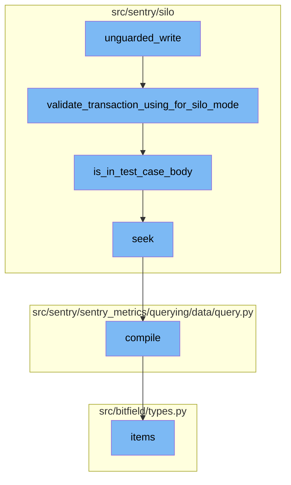
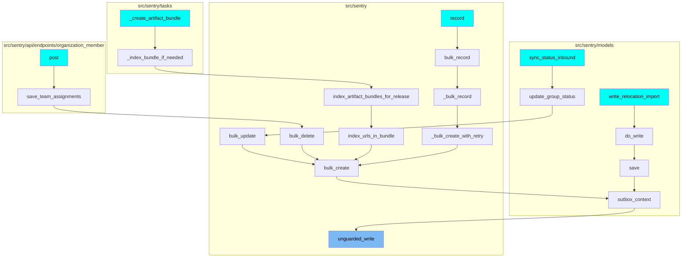

# Introduction

The `unguarded_write` function is a key component in the Sentry application. It is used to indicate that the wrapped block is safe to do mutations on outbox backed records. This function is particularly useful in test environments where it emits 'fencing' queries that are audited at the end of each test run.

# Flow Breakdown

The `unguarded_write` function initiates a sequence of operations involving several other functions. These include `validate_transaction_using_for_silo_mode`, `is_in_test_case_body`, `seek`, `compile`, and `items`. Each of these functions plays a specific role in the overall process.

# validate_transaction_using_for_silo_mode

The `validate_transaction_using_for_silo_mode` function is called within `unguarded_write`. It validates the transaction based on the silo mode. If the transaction is in a test environment and not in a test case body, it allows treating it as one DB. It also checks if both silos route to the same DB or if the current silo mode is MONOLITH.

# is_in_test_case_body

The `is_in_test_case_body` function is used within `validate_transaction_using_for_silo_mode` to determine whether the current execution stack is in a test case body. This is a best-effort, potentially brittle implementation that depends on private behavior of the current Pytest implementation.

# seek

The `seek` function is used within `is_in_test_case_body` to check whether the named function has been called in the current stack.

# compile

The `compile` function is used to compile the MQL query by replacing all variables inside the formulas with the corresponding queries. This allows for a more flexible structure and reuse of the same query across multiple formulas.

# items

The `items` function is used to return a list of items.

# Flow Usage

This flow is used multiple times in the codebase. Some of the entry points of this flow include functions like `sync_status_inbound`, `post`, `_create_artifact_bundle`, and `write_relocation_import`.

# Flow drill down



<SwmSnippet path="/src/sentry/silo/safety.py" line="25">

---

# unguarded_write

The `unguarded_write` function is used to indicate that the wrapped block is safe to do mutations on outbox backed records. In production, this context manager has no effect, but in tests, it emits 'fencing' queries that are audited at the end of each test run.

```python
def unguarded_write(using: str, *args: Any, **kwargs: Any):
    """
    Used to indicate that the wrapped block is safe to do
    mutations on outbox backed records.

    In production this context manager has no effect, but
    in tests it emits 'fencing' queries that are audited at the
    end of each test run by:

    sentry.testutils.silo.validate_protected_queries

    This code can't be co-located with the auditing logic because
    the testutils module cannot be used in production code.
    """
    if not in_test_environment():
        yield
        return

    validate_transaction_using_for_silo_mode(using)

    _fencing_counters[using] += 1
```

---

</SwmSnippet>

<SwmSnippet path="/src/sentry/silo/patches/silo_aware_transaction_patch.py" line="90">

---

## validate_transaction_using_for_silo_mode

The `validate_transaction_using_for_silo_mode` function is called within `unguarded_write`. It validates the transaction based on the silo mode. If the transaction is in a test environment and not in a test case body, it allows treating it as one DB. It also checks if both silos route to the same DB or if the current silo mode is MONOLITH.

```python
def validate_transaction_using_for_silo_mode(using: str | None):
    from sentry.models.outbox import ControlOutbox, RegionOutbox
    from sentry.silo.base import SiloMode

    if using is None:
        raise TransactionMissingDBException("'using' must be specified when creating a transaction")

    if in_test_environment() and not is_in_test_case_body():
        # During setup and teardown of a test environment, allow treating it as one
        # DB. But make sure we enforce as normal during the actual test case.
        return

    current_silo_mode = SiloMode.get_current_mode()
    control_db = _get_db_for_model_if_available(ControlOutbox)
    region_db = _get_db_for_model_if_available(RegionOutbox)

    both_silos_route_to_same_db = control_db == region_db

    if both_silos_route_to_same_db or current_silo_mode == SiloMode.MONOLITH:
        return

```

---

</SwmSnippet>

<SwmSnippet path="/src/sentry/silo/patches/silo_aware_transaction_patch.py" line="54">

---

## is_in_test_case_body

The `is_in_test_case_body` function is used within `validate_transaction_using_for_silo_mode` to determine whether the current execution stack is in a test case body. This is a best-effort, potentially brittle implementation that depends on private behavior of the current Pytest implementation.

```python
def is_in_test_case_body() -> bool:
    """Determine whether the current execution stack is in a test case body.

    This is a best-effort, potentially brittle implementation that depends on private
    behavior of the current Pytest implementation. We can't necessarily rely on
    underscore-prefixed method names being used in a stable way.

    Are you landing here because test cases regressed mysteriously after a Pytest
    upgrade? Check the list of frames and tweak the condition logic to make this
    function return false as needed. The case `test_is_in_test_case_body` should
    ensure that you aren't making `validate_transaction_using_for_silo_mode` too
    permissive.

    An attempt was also made using Pytest fixtures. We can add state changes around
    the `django_db_setup` fixture, but post-test teardown seems to be too tightly
    coupled to the test run to insert a fixture between them. Adding something to the
    `tearDown()` override in Sentry's BaseTestCase may have worked, but would not
    have helped with standalone test functions. A better solution may nonetheless
    exist; refactoring is encouraged if you find one.

    This should not be used as a general-purpose utility function. Avoid calling it
```

---

</SwmSnippet>

<SwmSnippet path="/src/sentry/silo/patches/silo_aware_transaction_patch.py" line="79">

---

## seek

The `seek` function is used within `is_in_test_case_body` to check whether the named function has been called in the current stack.

```python
    def seek(module_path: str, function_name: str) -> bool:
        """Check whether the named function has been called in the current stack."""
        pattern = re.compile(rf"/{re.escape(module_path)}\b.*\b{re.escape(function_name)}>$")
        return any(pattern.search(frame) for frame in frames)
```

---

</SwmSnippet>

<SwmSnippet path="/src/sentry/sentry_metrics/querying/data/query.py" line="44">

---

## compile

The `compile` function is used to compile the MQL query by replacing all variables inside the formulas with the corresponding queries. This allows for a more flexible structure and reuse of the same query across multiple formulas.

```python
    def compile(self) -> "MQLQuery":
        """
        Compiles the MQL query by replacing all variables inside the formulas with the corresponding queries.

        For example, a formula in the form "$a + $b" with queries "a: max(mri_1), b: min(mri_2)" will become
        "max(mri_1) + min(mri_2)".

        The rationale for having queries being defined as variables in formulas is to have a structure which is more
        flexible and allows reuse of the same query across multiple formulas.

        Returns:
            A new MQLQuery with the MQL string containing the replaced formula.
        """
        sub_queries = {name: query.compile() for name, query in self.sub_queries.items()}
        replaced_mql_formula = self.mql

        # We sort query names by length and content with the goal of trying to always match the longest queries first.
        sorted_query_names = sorted(sub_queries.keys(), key=lambda q: (len(q), q), reverse=True)
        for query_name in sorted_query_names:
            replaced_mql_formula = replaced_mql_formula.replace(
                f"${query_name}", sub_queries[query_name].mql
```

---

</SwmSnippet>

<SwmSnippet path="/src/bitfield/types.py" line="225">

---

## items

The `items` function is used to return a list of items.

```python
    def items(self):
        return list(self.iteritems())
```

---

</SwmSnippet>

# Where is this flow used?

This flow is used multiple times in the codebase as represented in the following diagram:

(Note - these are only some of the entry points of this flow)



&nbsp;

*This is an auto-generated document by Swimm AI 🌊 and has not yet been verified by a human*

<SwmMeta version="3.0.0" repo-id="Z2l0aHViJTNBJTNBc2VudHJ5LWRlbW8lM0ElM0FTd2ltbS1EZW1v" repo-name="sentry-demo" doc-type="flows"><sup>Powered by [Swimm](/)</sup></SwmMeta>
