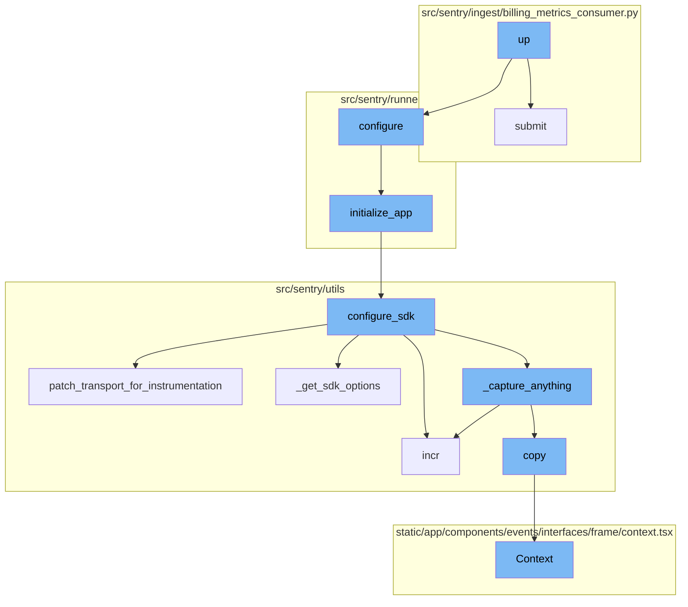
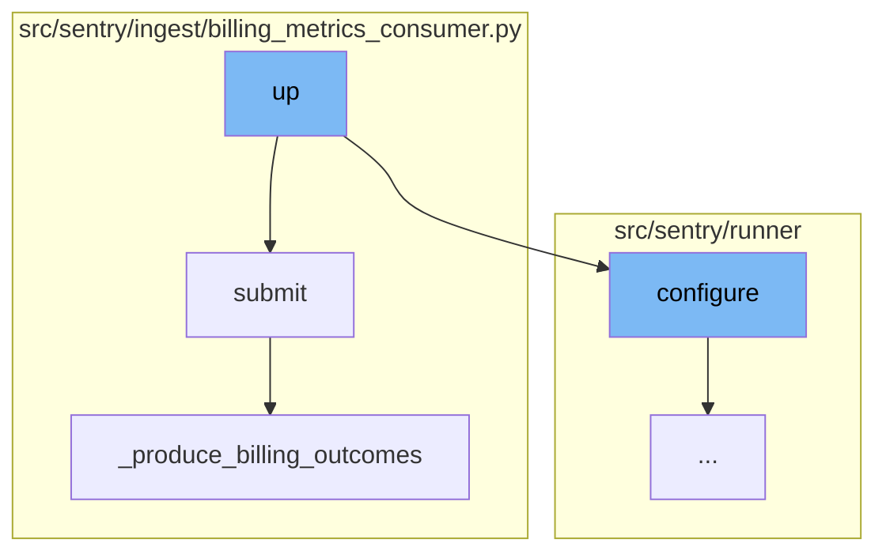
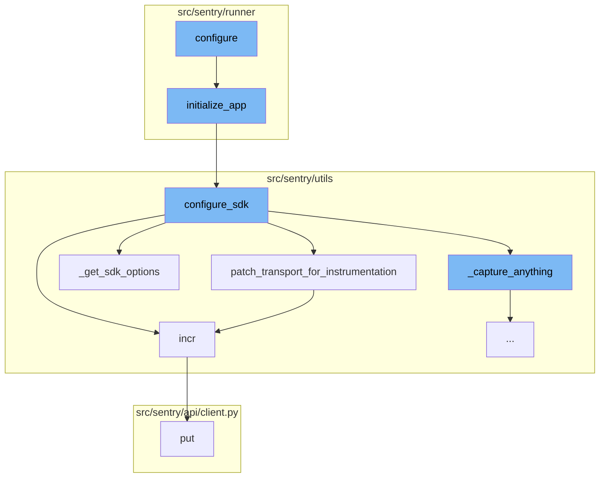
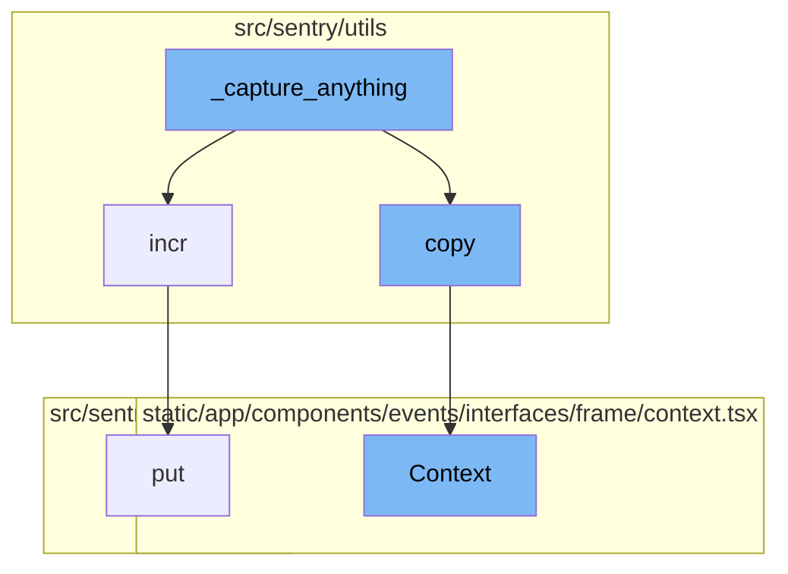

# Overview of 'up' Functionality

The 'up' functionality in the Sentry-Demo repository is a multi-step process that involves several functions and components. It is primarily responsible for running or updating all devservices in the background, configuring the environment, preparing the containers, and starting each service in a separate thread. After all services are started, it checks their health.

# Detailed Flow of 'up'

The 'up' functionality begins with the 'up' function, which calls the 'submit' function. The 'submit' function takes a message as input, extracts the payload from the message, and then produces billing outcomes and flags metrics for the project. It then submits the message to the next step in the process. The 'up' function also calls the 'configure' function, which sets up the environment based on two different config files. It ensures warnings are always displayed and adds additional mimetypes for static files. If the configuration file does not exist, it raises an exception. It also sets the 'DJANGO_SETTINGS_MODULE' environment variable and initializes the application with the 'initialize_app' function.

# SDK Configuration

The 'up' functionality also involves configuring the Sentry SDK. The 'configure_sdk' function sets up the SDK options and initializes the SDK with these options. It also patches the transport for instrumentation and increments the internal metrics. The 'patch_transport_for_instrumentation' function patches transport functions to add metrics for improving resolution around events sent to Sentry's ingest. It increments the internal metrics for each sent request.

# Event Capturing

The '\_capture_anything' function is the starting point of the flow. It's responsible for capturing events and metrics. It checks if the 'SENTRY_SDK_UPSTREAM_METRICS_ENABLED' setting is enabled and the method name is 'capture_envelope'. If these conditions are met, it filters out all the statsd envelope items, which contain custom metrics sent by the SDK, unless they are allowed via a separate sample rate. It then sends these metrics to the 'sentry4sentry_transport'.

# Context Copying

The 'copy' function creates a copy of the current context, which includes the request and backends. This is used to ensure that the original context is not modified when processing events.

# Context Display

The 'Context' function is a React component that displays the context of a frame in the Sentry UI. It shows source code, variables, registers, and assembly information for a frame. It also handles the display of code coverage data if available.



# Flow drill down

First, we'll zoom into this section of the flow:



<SwmSnippet path="/src/sentry/runner/commands/devservices.py" line="271">

---

# The 'up' Function

The 'up' function is responsible for running or updating all devservices in the background. It takes a list of services, a project, a list of services to exclude, and some other parameters. It first configures the environment, prepares the containers, and then starts each service in a separate thread. After all services are started, it checks their health.

```python
def up(
    services: list[str],
    project: str,
    exclude: list[str],
    skip_only_if: bool,
    recreate: bool,
) -> None:
    """
    Run/update all devservices in the background.

    The default is everything, however you may pass positional arguments to specify
    an explicit list of services to bring up.

    You may also exclude services, for example: --exclude redis --exclude postgres.
    """
    from sentry.runner import configure

    configure()

    containers = _prepare_containers(
        project, skip_only_if=(skip_only_if or len(services) > 0), silent=True
```

---

</SwmSnippet>

<SwmSnippet path="/src/sentry/ingest/billing_metrics_consumer.py" line="77">

---

# The 'submit' Function

The 'submit' function is called by the 'up' function. It takes a message as input, extracts the payload from the message, and then produces billing outcomes and flags metrics for the project. It then submits the message to the next step in the process.

```python
    def submit(self, message: Message[KafkaPayload]) -> None:
        assert not self.__closed

        payload = self._get_payload(message)

        self._produce_billing_outcomes(payload)
        self._flag_metric_received_for_project(payload)

        self.__next_step.submit(message)
```

---

</SwmSnippet>

<SwmSnippet path="/src/sentry/ingest/billing_metrics_consumer.py" line="124">

---

# The '\_produce_billing_outcomes' Function

The '\_produce_billing_outcomes' function is called by the 'submit' function. It takes a generic metric as input, counts the processed items, and then produces a billing outcome for each category of items.

```python
    def _produce_billing_outcomes(self, generic_metric: GenericMetric) -> None:
        for category, quantity in self._count_processed_items(generic_metric).items():
            self._produce_billing_outcome(
                org_id=generic_metric["org_id"],
                project_id=generic_metric["project_id"],
                category=category,
                quantity=quantity,
            )
```

---

</SwmSnippet>

Now, lets zoom into this section of the flow:



<SwmSnippet path="/src/sentry/runner/settings.py" line="53">

---

# The 'up' Flow

The 'up' flow begins with the 'configure' function. This function sets up the environment based on two different config files. It ensures warnings are always displayed and adds additional mimetypes for static files. If the configuration file does not exist, it raises an exception. It also sets the 'DJANGO_SETTINGS_MODULE' environment variable and initializes the application with the 'initialize_app' function.

```python
def configure(
    ctx: click.Context | None, py: str, yaml: str | None, skip_service_validation: bool = False
) -> None:
    """
    Given the two different config files, set up the environment.

    NOTE: Will only execute once, so it's safe to call multiple times.
    """
    global __installed
    if __installed:
        return

    # Make sure that our warnings are always displayed.
    warnings.filterwarnings("default", "", Warning, r"^sentry")

    # Add in additional mimetypes that are useful for our static files
    # which aren't common in default system registries
    import mimetypes

    for type, ext in (
        ("application/json", "map"),
```

---

</SwmSnippet>

<SwmSnippet path="/src/sentry/runner/initializer.py" line="306">

---

The 'initialize_app' function is the next step in the 'up' flow. It sets up the application based on the provided configuration. It configures settings, validates configurations, and sets up services. It also calls the 'configure_sdk' function to configure the Sentry SDK.

```python
def initialize_app(config: dict[str, Any], skip_service_validation: bool = False) -> None:
    settings = config["settings"]

    # Just reuse the integration app for Single Org / Self-Hosted as
    # it doesn't make much sense to use 2 separate apps for SSO and
    # integration.
    if settings.SENTRY_SINGLE_ORGANIZATION:
        options_mapper.update(
            {
                "github-app.client-id": "GITHUB_APP_ID",
                "github-app.client-secret": "GITHUB_API_SECRET",
            }
        )

    bootstrap_options(settings, config["options"])

    logging.raiseExceptions = settings.DEBUG

    configure_structlog()

    # Commonly setups don't correctly configure themselves for production envs
```

---

</SwmSnippet>

<SwmSnippet path="/src/sentry/utils/sdk.py" line="275">

---

The 'configure_sdk' function is responsible for configuring the Sentry SDK. It sets up the SDK options and initializes the SDK with these options. It also patches the transport for instrumentation and increments the internal metrics.

```python
def configure_sdk():
    """
    Setup and initialize the Sentry SDK.
    """
    sdk_options, dsns = _get_sdk_options()

    internal_project_key = get_project_key()

    if dsns.sentry4sentry:
        transport = make_transport(get_options(dsn=dsns.sentry4sentry, **sdk_options))
        sentry4sentry_transport = patch_transport_for_instrumentation(transport, "upstream")
    else:
        sentry4sentry_transport = None

    if dsns.sentry_saas:
        transport = make_transport(get_options(dsn=dsns.sentry_saas, **sdk_options))
        sentry_saas_transport = patch_transport_for_instrumentation(transport, "relay")
    elif settings.IS_DEV and not settings.SENTRY_USE_RELAY:
        sentry_saas_transport = None
    elif internal_project_key and internal_project_key.dsn_private:
        transport = make_transport(get_options(dsn=internal_project_key.dsn_private, **sdk_options))
```

---

</SwmSnippet>

<SwmSnippet path="/src/sentry/utils/sdk.py" line="237">

---

The 'patch_transport_for_instrumentation' function patches transport functions to add metrics for improving resolution around events sent to Sentry's ingest. It increments the internal metrics for each sent request.

```python
# Patches transport functions to add metrics to improve resolution around events sent to our ingest.
# Leaving this in to keep a permanent measurement of sdk requests vs ingest.
def patch_transport_for_instrumentation(transport, transport_name):
    _send_request = transport._send_request
    if _send_request:

        def patched_send_request(*args, **kwargs):
            metrics.incr(f"internal.sent_requests.{transport_name}.events")
            return _send_request(*args, **kwargs)

        transport._send_request = patched_send_request
    return transport
```

---

</SwmSnippet>

<SwmSnippet path="/src/sentry/utils/metrics.py" line="101">

---

The 'incr' function increments a metric. It is used in the 'up' flow to increment internal metrics for monitoring purposes.

```python
    def incr(
        self,
        key: str,
        instance: str | None = None,
        tags: Tags | None = None,
        amount: int = 1,
        sample_rate: float = settings.SENTRY_METRICS_SAMPLE_RATE,
    ) -> None:
        if not self._started:
            self._start()
        self.q.put((key, instance, tags, amount, sample_rate))
```

---

</SwmSnippet>

<SwmSnippet path="/src/sentry/utils/sdk.py" line="256">

---

The '\_get_sdk_options' function retrieves the SDK options for configuring the Sentry SDK. It is used in the 'up' flow to get the SDK options before initializing the SDK.

```python
def _get_sdk_options() -> tuple[SdkConfig, Dsns]:
    sdk_options = settings.SENTRY_SDK_CONFIG.copy()
    sdk_options["send_client_reports"] = True
    sdk_options["traces_sampler"] = traces_sampler
    sdk_options["before_send_transaction"] = before_send_transaction
    sdk_options["before_send"] = before_send
    sdk_options["release"] = (
        f"backend@{sdk_options['release']}" if "release" in sdk_options else None
    )

    # Modify SENTRY_SDK_CONFIG in your deployment scripts to specify your desired DSN
    dsns = Dsns(
        sentry4sentry=sdk_options.pop("dsn", None),
        sentry_saas=sdk_options.pop("relay_dsn", None),
    )

    return sdk_options, dsns
```

---

</SwmSnippet>

<SwmSnippet path="/src/sentry/api/client.py" line="119">

---

The 'put' function is used to make a PUT request. It is used in the 'up' flow to send requests.

```python
    def put(self, *args, **kwargs):
        return self.request("PUT", *args, **kwargs)
```

---

</SwmSnippet>

Now, lets zoom into this section of the flow:



<SwmSnippet path="/src/sentry/utils/sdk.py" line="334">

---

# \_capture_anything Function

The `_capture_anything` function is the starting point of the flow. It's responsible for capturing events and metrics. It checks if the `SENTRY_SDK_UPSTREAM_METRICS_ENABLED` setting is enabled and the method name is `capture_envelope`. If these conditions are met, it filters out all the statsd envelope items, which contain custom metrics sent by the SDK, unless they are allowed via a separate sample rate. It then sends these metrics to the `sentry4sentry_transport`.

```python
        def _capture_anything(self, method_name, *args, **kwargs):
            # Sentry4Sentry (upstream) should get the event first because
            # it is most isolated from the sentry installation.
            if sentry4sentry_transport:
                metrics.incr("internal.captured.events.upstream")
                # TODO(mattrobenolt): Bring this back safely.
                # from sentry import options
                # install_id = options.get('sentry:install-id')
                # if install_id:
                #     event.setdefault('tags', {})['install-id'] = install_id
                s4s_args = args
                # We want to control whether we want to send metrics at the s4s upstream.
                if (
                    not settings.SENTRY_SDK_UPSTREAM_METRICS_ENABLED
                    and method_name == "capture_envelope"
                ):
                    args_list = list(args)
                    envelope = args_list[0]
                    # We filter out all the statsd envelope items, which contain custom metrics sent by the SDK.
                    # unless we allow them via a separate sample rate.
                    safe_items = [
```

---

</SwmSnippet>

<SwmSnippet path="/src/sentry/utils/metrics.py" line="101">

---

# incr Function

The `incr` function is called within `_capture_anything`. It increments a metric counter for the given key. The key, instance, tags, amount, and sample rate are passed as parameters. This function is used to track the number of captured and uncaptured events.

```python
    def incr(
        self,
        key: str,
        instance: str | None = None,
        tags: Tags | None = None,
        amount: int = 1,
        sample_rate: float = settings.SENTRY_METRICS_SAMPLE_RATE,
    ) -> None:
        if not self._started:
            self._start()
        self.q.put((key, instance, tags, amount, sample_rate))
```

---

</SwmSnippet>

<SwmSnippet path="/src/sentry/utils/services.py" line="42">

---

# copy Function

The `copy` function is also called within `_capture_anything`. It creates a copy of the current context, which includes the request and backends. This is used to ensure that the original context is not modified when processing events.

```python
        self.backends = backends

    def copy(self) -> Context:
        return Context(self.request, self.backends.copy())
```

---

</SwmSnippet>

<SwmSnippet path="/static/app/components/events/interfaces/frame/context.tsx" line="66">

---

# Context Function

The `Context` function is a React component that displays the context of a frame in the Sentry UI. It shows source code, variables, registers, and assembly information for a frame. It also handles the display of code coverage data if available.

```tsx
function Context({
  hasContextVars = false,
  hasContextSource = false,
  hasContextRegisters = false,
  isExpanded = false,
  hasAssembly = false,
  emptySourceNotation = false,
  registers,
  frame,
  event,
  className,
  frameMeta,
  registersMeta,
  platform,
}: Props) {
  const organization = useOrganization();

  const {projects} = useProjects();
  const project = useMemo(
    () => projects.find(p => p.id === event.projectID),
    [projects, event]
```

---

</SwmSnippet>

<SwmSnippet path="/src/sentry/api/client.py" line="119">

---

# put Function

The `put` function is used to make a PUT request. It's not directly called in this flow, but it's part of the API client that could be used to update resources in Sentry.

```python
    def put(self, *args, **kwargs):
        return self.request("PUT", *args, **kwargs)
```

---

</SwmSnippet>

&nbsp;

*This is an auto-generated document by Swimm AI 🌊 and has not yet been verified by a human*

<SwmMeta version="3.0.0" repo-id="Z2l0aHViJTNBJTNBc2VudHJ5LWRlbW8lM0ElM0FTd2ltbS1EZW1v" repo-name="sentry-demo" doc-type="flows"><sup>Powered by [Swimm](/)</sup></SwmMeta>
