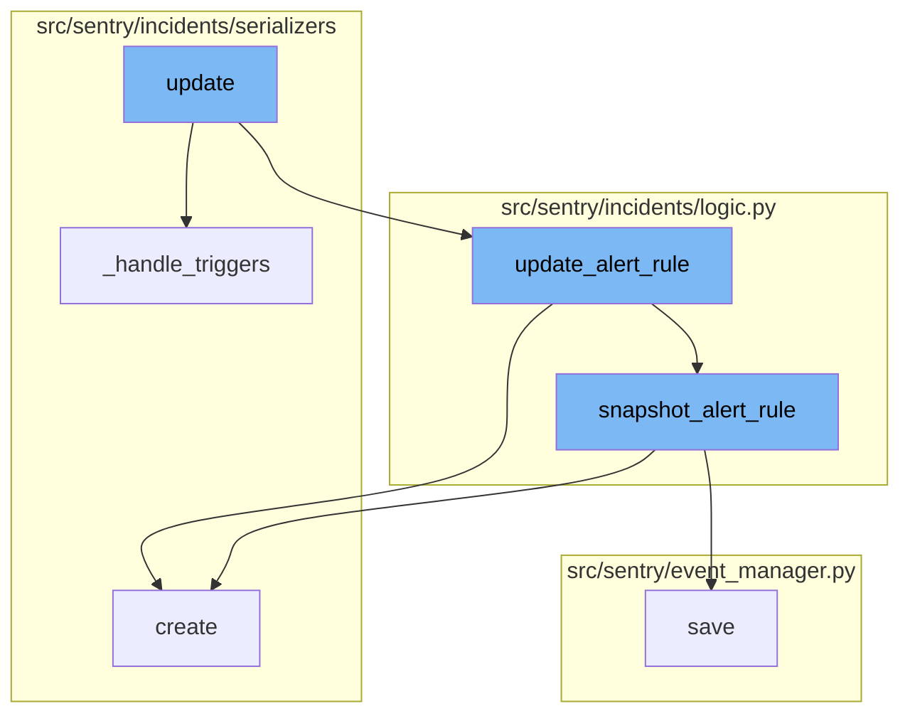
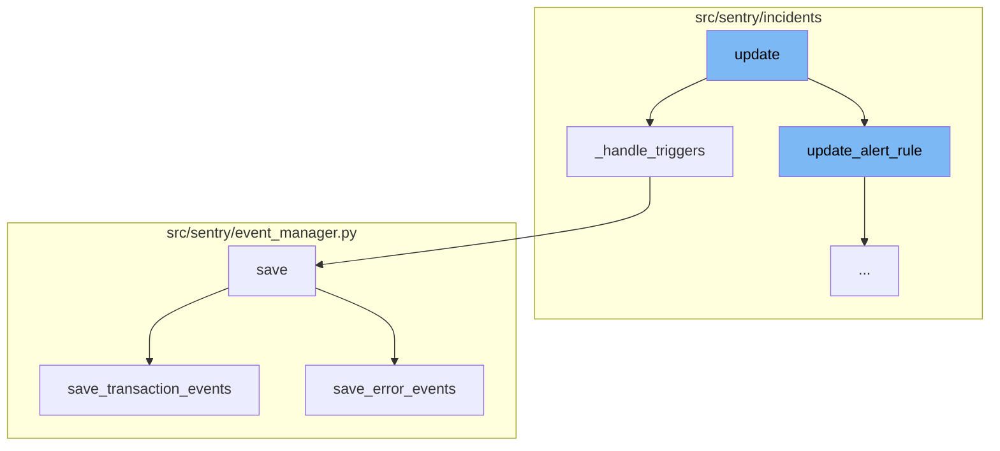
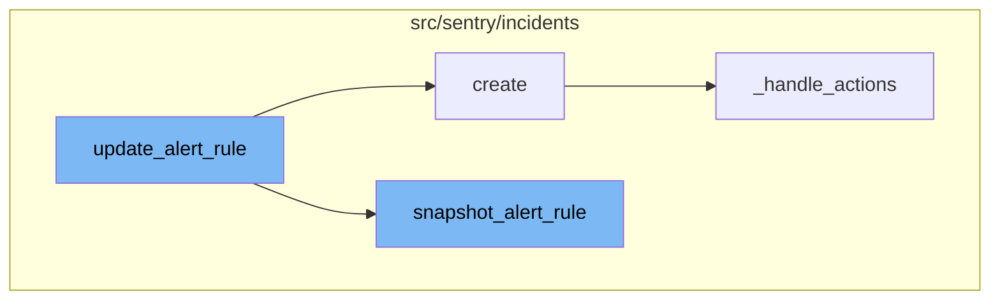

<SwmSnippet path="/src/sentry/incidents/serializers/alert_rule.py" line="492">

---

# Update Flow

The `update` function is the entry point of the update flow. It takes an instance and validated data as arguments. It pops 'triggers' from the validated data and checks for 'id' and 'monitor_type' keys. If found, these keys are popped from the validated data. The function then calls `update_alert_rule` and `_handle_triggers` functions.

```python
    def update(self, instance, validated_data):
        triggers = validated_data.pop("triggers")
        if "id" in validated_data:
            validated_data.pop("id")
        if "monitor_type" in validated_data:
            """
            TODO: enable monitor type editing
            requires creating/disabling activations accordingly
            """
            validated_data.pop("monitor_type")
        with transaction.atomic(router.db_for_write(AlertRule)):
            alert_rule = update_alert_rule(
                instance,
                user=self.context.get("user", None),
                ip_address=self.context.get("ip_address"),
                **validated_data,
            )
            self._handle_triggers(alert_rule, triggers)
            return alert_rule
```

---

</SwmSnippet>

<SwmSnippet path="/src/sentry/incidents/serializers/alert_rule.py" line="512">

---

# Handling Triggers

The `_handle_triggers` function is responsible for managing the triggers associated with an alert rule. It checks if triggers are not None, and if so, it deletes triggers not present in the incoming data and updates or creates new ones. It uses the `AlertRuleTriggerSerializer` to validate and save the trigger data.

```python
    def _handle_triggers(self, alert_rule, triggers):
        channel_lookup_timeout_error = None
        if triggers is not None:
            # Delete triggers we don't have present in the incoming data
            trigger_ids = [x["id"] for x in triggers if "id" in x]
            triggers_to_delete = AlertRuleTrigger.objects.filter(alert_rule=alert_rule).exclude(
                id__in=trigger_ids
            )
            for trigger in triggers_to_delete:
                delete_alert_rule_trigger(trigger)

            for trigger_data in triggers:
                if "id" in trigger_data:
                    trigger_instance = AlertRuleTrigger.objects.get(
                        alert_rule=alert_rule, id=trigger_data["id"]
                    )
                else:
                    trigger_instance = None

                trigger_serializer = AlertRuleTriggerSerializer(
                    context={
```

---

</SwmSnippet>

<SwmSnippet path="/src/sentry/event_manager.py" line="442">

---

# Saving Events

The `save` function is responsible for saving an event after it has been normalized and processed. It saves adjacent models such as releases and environments to postgres and writes the event into the eventstream. Depending on the event type, it calls either `save_transaction_events` or `save_error_events`.

```python
    def save(
        self,
        project_id: int | None,
        raw: bool = False,
        assume_normalized: bool = False,
        start_time: float | None = None,
        cache_key: str | None = None,
        skip_send_first_transaction: bool = False,
        has_attachments: bool = False,
    ) -> Event:
        """
        After normalizing and processing an event, save adjacent models such as
        releases and environments to postgres and write the event into
        eventstream. From there it will be picked up by Snuba and
        post-processing.

        We re-insert events with duplicate IDs into Snuba, which is responsible
        for deduplicating events. Since deduplication in Snuba is on the primary
        key (based on event ID, project ID and day), events with same IDs are only
        deduplicated if their timestamps fall on the same day. The latest event
        always wins and overwrites the value of events received earlier in that day.
```

---

</SwmSnippet>

<SwmSnippet path="/src/sentry/event_manager.py" line="3042">

---

# Saving Transaction Events

The `save_transaction_events` function is responsible for saving transaction events. It performs several operations such as getting or creating releases, getting event users, deriving plugin tags, calculating span grouping, and inserting the event into the eventstream.

```python
def save_transaction_events(jobs: Sequence[Job], projects: ProjectsMapping) -> Sequence[Job]:
    organization_ids = {project.organization_id for project in projects.values()}
    organizations = {o.id: o for o in Organization.objects.get_many_from_cache(organization_ids)}

    for project in projects.values():
        try:
            project.set_cached_field_value("organization", organizations[project.organization_id])
        except KeyError:
            continue

    set_measurement(measurement_name="jobs", value=len(jobs))
    set_measurement(measurement_name="projects", value=len(projects))

    _get_or_create_release_many(jobs, projects)
    _get_event_user_many(jobs, projects)
    _derive_plugin_tags_many(jobs, projects)
    _derive_interface_tags_many(jobs)
    _calculate_span_grouping(jobs, projects)
    _materialize_metadata_many(jobs)
    _get_or_create_environment_many(jobs, projects)
    _get_or_create_release_associated_models(jobs, projects)
```

---

</SwmSnippet>

<SwmSnippet path="/src/sentry/event_manager.py" line="538">

---

# Saving Error Events

The `save_error_events` function is responsible for saving error events. It performs several operations such as getting or creating releases, environments, and associated models, incrementing release associated counts, recording all metrics, saving the event to nodestore, inserting the event into the eventstream, and tracking the outcome.

```python
    def save_error_events(
        self,
        project: Project,
        job: Job,
        projects: ProjectsMapping,
        metric_tags: MutableTags,
        raw: bool = False,
        cache_key: str | None = None,
        has_attachments: bool = False,
    ) -> Event:
        jobs = [job]

        if is_sample_event(job):
            logger.info(
                "save_error_events: processing sample event",
                extra={
                    "event.id": job["event"].event_id,
                    "project_id": project.id,
                    "sample_event": True,
                },
            )
```

---

</SwmSnippet>

<SwmSnippet path="/src/sentry/incidents/logic.py" line="678">

---

# Update Alert Rule

The `update_alert_rule` function is the main entry point for the update flow. It takes an alert rule and a set of parameters to update the alert rule. The function first prepares the updated fields and then applies them to the alert rule. If any incidents are associated with the alert rule, it snapshots the alert rule and updates the incidents to point to the snapshot. It also handles changes to the alert rule's projects and subscriptions.

```python
def update_alert_rule(
    alert_rule,
    query_type=None,
    dataset=None,
    projects=None,
    name=None,
    owner: Actor | None | object = NOT_SET,
    query=None,
    aggregate=None,
    time_window=None,
    environment=None,
    threshold_type=None,
    threshold_period=None,
    resolve_threshold=NOT_SET,
    include_all_projects=None,
    excluded_projects=None,
    user=None,
    event_types=None,
    comparison_delta=NOT_SET,
    monitor_type: AlertRuleMonitorTypeInt | None = None,
    description: str | None = None,
```

---

</SwmSnippet>

<SwmSnippet path="/src/sentry/incidents/serializers/alert_rule_trigger.py" line="39">

---

# Creating Alert Rule Triggers

The `create` function in the `AlertRuleTriggerSerializer` class is called within the `update_alert_rule` function. It creates an alert rule trigger based on the validated data. If any actions are associated with the alert rule trigger, it handles them using the `_handle_actions` function.

```python
    def create(self, validated_data):
        try:
            actions = validated_data.pop("actions", None)
            alert_rule_trigger = create_alert_rule_trigger(
                alert_rule=self.context["alert_rule"], **validated_data
            )
            self._handle_actions(alert_rule_trigger, actions)

            return alert_rule_trigger
        except AlertRuleTriggerLabelAlreadyUsedError:
            raise serializers.ValidationError("This label is already in use for this alert rule")
```

---

</SwmSnippet>

<SwmSnippet path="/src/sentry/incidents/logic.py" line="636">

---

# Snapshotting Alert Rules

The `snapshot_alert_rule` function is called within the `update_alert_rule` function when there are incidents associated with the alert rule. It creates an archived copy of the alert rule and resolves any incidents attached to the rule. The snapshot includes the same properties as the original alert rule.

```python
def snapshot_alert_rule(alert_rule, user=None):
    # Creates an archived alert_rule using the same properties as the passed rule
    # It will also resolve any incidents attached to this rule.
    with transaction.atomic(router.db_for_write(AlertRuleActivity)):
        triggers = AlertRuleTrigger.objects.filter(alert_rule=alert_rule)
        incidents = Incident.objects.filter(alert_rule=alert_rule)
        snuba_query_snapshot = deepcopy(alert_rule.snuba_query)
        snuba_query_snapshot.id = None
        snuba_query_snapshot.save()
        alert_rule_snapshot = deepcopy(alert_rule)
        alert_rule_snapshot.id = None
        alert_rule_snapshot.status = AlertRuleStatus.SNAPSHOT.value
        alert_rule_snapshot.snuba_query = snuba_query_snapshot
        if alert_rule.user_id or alert_rule.team_id:
            alert_rule_snapshot.user_id = alert_rule.user_id
            alert_rule_snapshot.team_id = alert_rule.team_id
        alert_rule_snapshot.save()
        AlertRuleActivity.objects.create(
            alert_rule=alert_rule_snapshot,
            previous_alert_rule=alert_rule,
            user_id=user.id if user else None,
```

---

</SwmSnippet>

<SwmSnippet path="/src/sentry/incidents/serializers/alert_rule_trigger.py" line="62">

---

# Handling Actions

The `_handle_actions` function is called within the `create` function of the `AlertRuleTriggerSerializer` class. It handles the actions associated with an alert rule trigger. If any actions are not present in the updated data, they are deleted. For each action in the updated data, it either updates the existing action or creates a new one.

```python
    def _handle_actions(self, alert_rule_trigger, actions):
        channel_lookup_timeout_error = None
        if actions is not None:
            # Delete actions we don't have present in the updated data.
            action_ids = [x["id"] for x in actions if "id" in x]
            actions_to_delete = AlertRuleTriggerAction.objects.filter(
                alert_rule_trigger=alert_rule_trigger
            ).exclude(id__in=action_ids)
            for action in actions_to_delete:
                delete_alert_rule_trigger_action(action)

            for action_data in actions:
                action_data = rewrite_trigger_action_fields(action_data)
                if "id" in action_data:
                    action_instance = AlertRuleTriggerAction.objects.get(
                        alert_rule_trigger=alert_rule_trigger, id=action_data["id"]
                    )
                else:
                    action_instance = None

                action_serializer = AlertRuleTriggerActionSerializer(
```

---

</SwmSnippet>



# Flow drill down

First, we'll zoom into this section of the flow:



<SwmSnippet path="/src/sentry/incidents/serializers/alert_rule.py" line="492">

---

# Update Flow

The `update` function is the entry point of the update flow. It takes an instance and validated data as arguments. It pops 'triggers' from the validated data and checks for 'id' and 'monitor_type' keys. If found, these keys are popped from the validated data. The function then calls `update_alert_rule` and `_handle_triggers` functions.

```python
    def update(self, instance, validated_data):
        triggers = validated_data.pop("triggers")
        if "id" in validated_data:
            validated_data.pop("id")
        if "monitor_type" in validated_data:
            """
            TODO: enable monitor type editing
            requires creating/disabling activations accordingly
            """
            validated_data.pop("monitor_type")
        with transaction.atomic(router.db_for_write(AlertRule)):
            alert_rule = update_alert_rule(
                instance,
                user=self.context.get("user", None),
                ip_address=self.context.get("ip_address"),
                **validated_data,
            )
            self._handle_triggers(alert_rule, triggers)
            return alert_rule
```

---

</SwmSnippet>

<SwmSnippet path="/src/sentry/incidents/serializers/alert_rule.py" line="512">

---

# Handling Triggers

The `_handle_triggers` function is responsible for managing the triggers associated with an alert rule. It checks if triggers are not None, and if so, it deletes triggers not present in the incoming data and updates or creates new ones. It uses the `AlertRuleTriggerSerializer` to validate and save the trigger data.

```python
    def _handle_triggers(self, alert_rule, triggers):
        channel_lookup_timeout_error = None
        if triggers is not None:
            # Delete triggers we don't have present in the incoming data
            trigger_ids = [x["id"] for x in triggers if "id" in x]
            triggers_to_delete = AlertRuleTrigger.objects.filter(alert_rule=alert_rule).exclude(
                id__in=trigger_ids
            )
            for trigger in triggers_to_delete:
                delete_alert_rule_trigger(trigger)

            for trigger_data in triggers:
                if "id" in trigger_data:
                    trigger_instance = AlertRuleTrigger.objects.get(
                        alert_rule=alert_rule, id=trigger_data["id"]
                    )
                else:
                    trigger_instance = None

                trigger_serializer = AlertRuleTriggerSerializer(
                    context={
```

---

</SwmSnippet>

<SwmSnippet path="/src/sentry/event_manager.py" line="442">

---

# Saving Events

The `save` function is responsible for saving an event after it has been normalized and processed. It saves adjacent models such as releases and environments to postgres and writes the event into the eventstream. Depending on the event type, it calls either `save_transaction_events` or `save_error_events`.

```python
    def save(
        self,
        project_id: int | None,
        raw: bool = False,
        assume_normalized: bool = False,
        start_time: float | None = None,
        cache_key: str | None = None,
        skip_send_first_transaction: bool = False,
        has_attachments: bool = False,
    ) -> Event:
        """
        After normalizing and processing an event, save adjacent models such as
        releases and environments to postgres and write the event into
        eventstream. From there it will be picked up by Snuba and
        post-processing.

        We re-insert events with duplicate IDs into Snuba, which is responsible
        for deduplicating events. Since deduplication in Snuba is on the primary
        key (based on event ID, project ID and day), events with same IDs are only
        deduplicated if their timestamps fall on the same day. The latest event
        always wins and overwrites the value of events received earlier in that day.
```

---

</SwmSnippet>

<SwmSnippet path="/src/sentry/event_manager.py" line="3042">

---

# Saving Transaction Events

The `save_transaction_events` function is responsible for saving transaction events. It performs several operations such as getting or creating releases, getting event users, deriving plugin tags, calculating span grouping, and inserting the event into the eventstream.

```python
def save_transaction_events(jobs: Sequence[Job], projects: ProjectsMapping) -> Sequence[Job]:
    organization_ids = {project.organization_id for project in projects.values()}
    organizations = {o.id: o for o in Organization.objects.get_many_from_cache(organization_ids)}

    for project in projects.values():
        try:
            project.set_cached_field_value("organization", organizations[project.organization_id])
        except KeyError:
            continue

    set_measurement(measurement_name="jobs", value=len(jobs))
    set_measurement(measurement_name="projects", value=len(projects))

    _get_or_create_release_many(jobs, projects)
    _get_event_user_many(jobs, projects)
    _derive_plugin_tags_many(jobs, projects)
    _derive_interface_tags_many(jobs)
    _calculate_span_grouping(jobs, projects)
    _materialize_metadata_many(jobs)
    _get_or_create_environment_many(jobs, projects)
    _get_or_create_release_associated_models(jobs, projects)
```

---

</SwmSnippet>

<SwmSnippet path="/src/sentry/event_manager.py" line="538">

---

# Saving Error Events

The `save_error_events` function is responsible for saving error events. It performs several operations such as getting or creating releases, environments, and associated models, incrementing release associated counts, recording all metrics, saving the event to nodestore, inserting the event into the eventstream, and tracking the outcome.

```python
    def save_error_events(
        self,
        project: Project,
        job: Job,
        projects: ProjectsMapping,
        metric_tags: MutableTags,
        raw: bool = False,
        cache_key: str | None = None,
        has_attachments: bool = False,
    ) -> Event:
        jobs = [job]

        if is_sample_event(job):
            logger.info(
                "save_error_events: processing sample event",
                extra={
                    "event.id": job["event"].event_id,
                    "project_id": project.id,
                    "sample_event": True,
                },
            )
```

---

</SwmSnippet>

Now, lets zoom into this section of the flow:



<SwmSnippet path="/src/sentry/incidents/logic.py" line="678">

---

# Update Flow

The `update_alert_rule` function is the main entry point for the update flow. It takes an alert rule and a set of parameters to update the alert rule. The function first prepares the updated fields and then applies them to the alert rule. If any incidents are associated with the alert rule, it snapshots the alert rule and updates the incidents to point to the snapshot. It also handles changes to the alert rule's projects and subscriptions.

```python
def update_alert_rule(
    alert_rule,
    query_type=None,
    dataset=None,
    projects=None,
    name=None,
    owner: Actor | None | object = NOT_SET,
    query=None,
    aggregate=None,
    time_window=None,
    environment=None,
    threshold_type=None,
    threshold_period=None,
    resolve_threshold=NOT_SET,
    include_all_projects=None,
    excluded_projects=None,
    user=None,
    event_types=None,
    comparison_delta=NOT_SET,
    monitor_type: AlertRuleMonitorTypeInt | None = None,
    description: str | None = None,
```

---

</SwmSnippet>

<SwmSnippet path="/src/sentry/incidents/serializers/alert_rule_trigger.py" line="39">

---

# Creating Alert Rule Triggers

The `create` function in the `AlertRuleTriggerSerializer` class is called within the `update_alert_rule` function. It creates an alert rule trigger based on the validated data. If any actions are associated with the alert rule trigger, it handles them using the `_handle_actions` function.

```python
    def create(self, validated_data):
        try:
            actions = validated_data.pop("actions", None)
            alert_rule_trigger = create_alert_rule_trigger(
                alert_rule=self.context["alert_rule"], **validated_data
            )
            self._handle_actions(alert_rule_trigger, actions)

            return alert_rule_trigger
        except AlertRuleTriggerLabelAlreadyUsedError:
            raise serializers.ValidationError("This label is already in use for this alert rule")
```

---

</SwmSnippet>

<SwmSnippet path="/src/sentry/incidents/logic.py" line="636">

---

# Snapshotting Alert Rules

The `snapshot_alert_rule` function is called within the `update_alert_rule` function when there are incidents associated with the alert rule. It creates an archived copy of the alert rule and resolves any incidents attached to the rule. The snapshot includes the same properties as the original alert rule.

```python
def snapshot_alert_rule(alert_rule, user=None):
    # Creates an archived alert_rule using the same properties as the passed rule
    # It will also resolve any incidents attached to this rule.
    with transaction.atomic(router.db_for_write(AlertRuleActivity)):
        triggers = AlertRuleTrigger.objects.filter(alert_rule=alert_rule)
        incidents = Incident.objects.filter(alert_rule=alert_rule)
        snuba_query_snapshot = deepcopy(alert_rule.snuba_query)
        snuba_query_snapshot.id = None
        snuba_query_snapshot.save()
        alert_rule_snapshot = deepcopy(alert_rule)
        alert_rule_snapshot.id = None
        alert_rule_snapshot.status = AlertRuleStatus.SNAPSHOT.value
        alert_rule_snapshot.snuba_query = snuba_query_snapshot
        if alert_rule.user_id or alert_rule.team_id:
            alert_rule_snapshot.user_id = alert_rule.user_id
            alert_rule_snapshot.team_id = alert_rule.team_id
        alert_rule_snapshot.save()
        AlertRuleActivity.objects.create(
            alert_rule=alert_rule_snapshot,
            previous_alert_rule=alert_rule,
            user_id=user.id if user else None,
```

---

</SwmSnippet>

<SwmSnippet path="/src/sentry/incidents/serializers/alert_rule_trigger.py" line="62">

---

# Handling Actions

The `_handle_actions` function is called within the `create` function of the `AlertRuleTriggerSerializer` class. It handles the actions associated with an alert rule trigger. If any actions are not present in the updated data, they are deleted. For each action in the updated data, it either updates the existing action or creates a new one.

```python
    def _handle_actions(self, alert_rule_trigger, actions):
        channel_lookup_timeout_error = None
        if actions is not None:
            # Delete actions we don't have present in the updated data.
            action_ids = [x["id"] for x in actions if "id" in x]
            actions_to_delete = AlertRuleTriggerAction.objects.filter(
                alert_rule_trigger=alert_rule_trigger
            ).exclude(id__in=action_ids)
            for action in actions_to_delete:
                delete_alert_rule_trigger_action(action)

            for action_data in actions:
                action_data = rewrite_trigger_action_fields(action_data)
                if "id" in action_data:
                    action_instance = AlertRuleTriggerAction.objects.get(
                        alert_rule_trigger=alert_rule_trigger, id=action_data["id"]
                    )
                else:
                    action_instance = None

                action_serializer = AlertRuleTriggerActionSerializer(
```

---

</SwmSnippet>

&nbsp;

*This is an auto-generated document by Swimm AI 🌊 and has not yet been verified by a human*

<SwmMeta version="3.0.0" repo-id="Z2l0aHViJTNBJTNBc2VudHJ5LWRlbW8lM0ElM0FTd2ltbS1EZW1v" repo-name="sentry-demo" doc-type="flows"><sup>Powered by [Swimm](/)</sup></SwmMeta>
