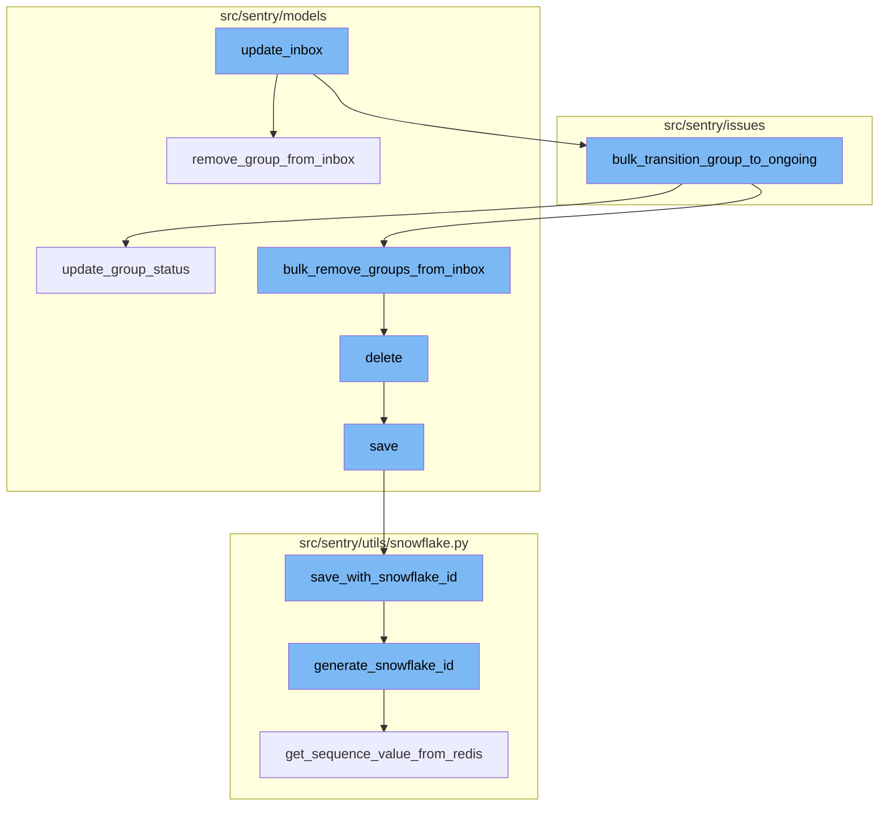
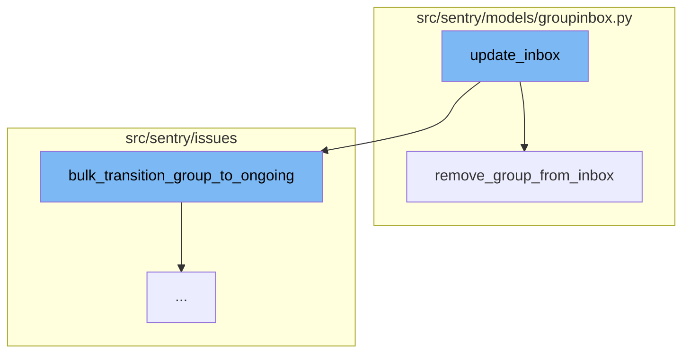
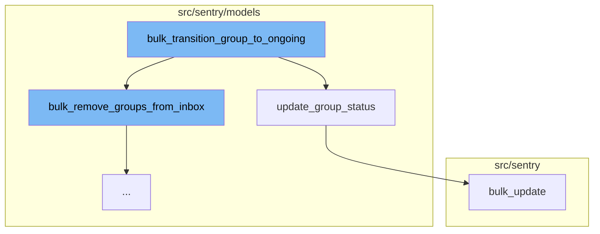
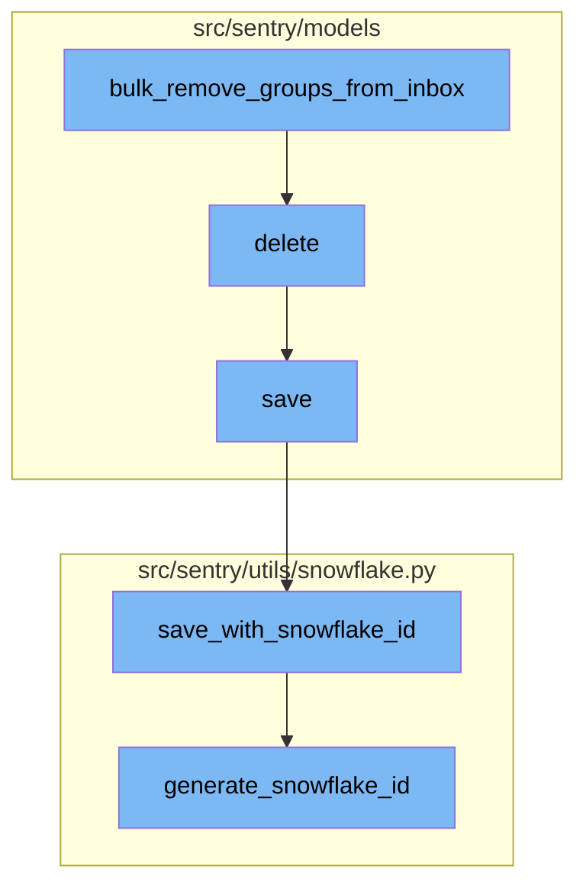

# Overview of update_inbox

The `update_inbox` function is a key part of the Sentry application's issue management system. It is responsible for moving groups of issues in or out of the inbox, depending on the user's actions. This function is designed to handle bulk operations, making it efficient and effective in managing large numbers of issues.

# The update_inbox Flow

The `update_inbox` function begins its process by determining whether the groups of issues should be in the inbox or not. If the groups should be in the inbox, it adds each group to the inbox. If the groups should not be in the inbox, it removes each group from the inbox and transitions the group to ongoing if its status is unresolved and its substatus is not ongoing.

# Transitioning Groups to Ongoing

The `bulk_transition_group_to_ongoing` function is called within `update_inbox` when the groups need to be transitioned to ongoing. This function filters the groups that need to be transitioned based on their id, status, and substatus. Then, it updates the status and substatus of these groups to 'unresolved' and 'ongoing' respectively.

# Removing Groups from Inbox

The `bulk_remove_groups_from_inbox` function is called within `bulk_transition_group_to_ongoing`. This function removes the groups from the inbox by filtering the `GroupInbox` objects that are in the groups and then deleting them.

# Saving the Changes

The `save` function is called within `delete` to save the changes made to the groups. If the `SENTRY_USE_SNOWFLAKE` setting is true, it calls the `save_with_snowflake_id` function, otherwise it just saves the project and updates the revision for the option.

# Generating a Snowflake ID

The `generate_snowflake_id` function is called within `save_with_snowflake_id` to generate a unique ID for the instance. This function creates a dictionary of segment values and then uses these values to create the snowflake ID. The function validates the ID before returning it.



# Flow drill down

First, we'll zoom into this section of the flow:



<SwmSnippet path="/src/sentry/issues/update_inbox.py" line="19">

---

# update_inbox Function

The `update_inbox` function is responsible for moving groups in or out of the inbox. It takes a boolean `in_inbox` to determine whether the groups should be in the inbox or not. If `in_inbox` is true, it adds each group in the `group_list` to the inbox. If `in_inbox` is false, it removes each group from the inbox and if the group's status is unresolved and substatus is not ongoing, it transitions the group to ongoing.

```python
def update_inbox(
    in_inbox: bool,
    group_list: list[Group],
    project_lookup: dict[int, Project],
    acting_user: User | None,
    http_referrer: str,
    sender: Any,
) -> bool:
    """
    Support moving groups in or out of the inbox via the Mark Reviewed button.

    Returns a boolean indicating whether or not the groups are now in the inbox.
    """
    if not group_list:
        return in_inbox

    if in_inbox:
        for group in group_list:
            add_group_to_inbox(group, GroupInboxReason.MANUAL)
    elif not in_inbox:
        for group in group_list:
```

---

</SwmSnippet>

<SwmSnippet path="/src/sentry/models/groupinbox.py" line="96">

---

# remove_group_from_inbox Function

The `remove_group_from_inbox` function is called within `update_inbox` when `in_inbox` is false. It removes a specific group from the inbox. If the action is `MARK_REVIEWED` and a user is provided, it creates an activity of type `MARK_REVIEWED` for the group and records the group history as `REVIEWED`.

```python
def remove_group_from_inbox(group, action=None, user=None, referrer=None):
    try:
        group_inbox = GroupInbox.objects.get(group=group)
        group_inbox.delete()

        if action is GroupInboxRemoveAction.MARK_REVIEWED and user is not None:
            Activity.objects.create(
                project_id=group_inbox.group.project_id,
                group_id=group_inbox.group_id,
                type=ActivityType.MARK_REVIEWED.value,
                user_id=user.id,
            )
            record_group_history(group, GroupHistoryStatus.REVIEWED, actor=user)
    except GroupInbox.DoesNotExist:
        pass
```

---

</SwmSnippet>

Now, lets zoom into this section of the flow:



<SwmSnippet path="/src/sentry/issues/ongoing.py" line="17">

---

# Update Inbox Flow

The `update_inbox` flow begins with the `bulk_transition_group_to_ongoing` function. This function is responsible for transitioning a group of issues from their current status to an ongoing status. It does this by first filtering the groups that need to be transitioned based on their id, status, and substatus. Then, it updates the status and substatus of these groups to 'unresolved' and 'ongoing' respectively. This function also triggers the `bulk_remove_groups_from_inbox` function which removes these groups from the inbox.

```python
def bulk_transition_group_to_ongoing(
    from_status: int,
    from_substatus: int,
    group_ids: list[int],
    activity_data: Mapping[str, Any] | None = None,
) -> None:
    with sentry_sdk.start_span(description="groups_to_transistion") as span:
        # make sure we don't update the Group when its already updated by conditionally updating the Group
        groups_to_transistion = Group.objects.filter(
            id__in=group_ids, status=from_status, substatus=from_substatus
        )
        span.set_tag("group_ids", group_ids)
        span.set_tag("groups_to_transistion count", len(groups_to_transistion))

    with sentry_sdk.start_span(description="update_group_status"):
        Group.objects.update_group_status(
            groups=groups_to_transistion,
            status=GroupStatus.UNRESOLVED,
            substatus=GroupSubStatus.ONGOING,
            activity_type=ActivityType.AUTO_SET_ONGOING,
            activity_data=activity_data,
```

---

</SwmSnippet>

<SwmSnippet path="/src/sentry/models/group.py" line="418">

---

The `update_group_status` function is called within `bulk_transition_group_to_ongoing`. This function updates the status and substatus of each group in the provided list. It also creates an activity for each group and records the group history. If the group's priority needs to be updated, it does so and creates an activity for it.

```python
    def update_group_status(
        self,
        groups: Iterable[Group],
        status: int,
        substatus: int | None,
        activity_type: ActivityType,
        activity_data: Mapping[str, Any] | None = None,
        send_activity_notification: bool = True,
        from_substatus: int | None = None,
    ) -> None:
        """For each groups, update status to `status` and create an Activity."""
        from sentry.models.activity import Activity

        modified_groups_list = []
        selected_groups = Group.objects.filter(id__in=[g.id for g in groups]).exclude(
            status=status, substatus=substatus
        )

        should_update_priority = (
            from_substatus == GroupSubStatus.ESCALATING
            and activity_type == ActivityType.AUTO_SET_ONGOING
```

---

</SwmSnippet>

<SwmSnippet path="/src/sentry/db/models/outboxes.py" line="111">

---

The `bulk_update` function is used to update multiple objects in the database at once. This function is used in the `update_group_status` function to update the status, substatus, and priority of the groups. It does this within an outbox context to ensure that all updates are made atomically.

```python
    def bulk_update(
        self, objs: Iterable[_RM], fields: Sequence[str], *args: Any, **kwds: Any
    ) -> Any:
        from sentry.models.outbox import outbox_context

        tuple_of_objs: tuple[_RM, ...] = tuple(objs)
        if not tuple_of_objs:
            return super().bulk_update(tuple_of_objs, fields, *args, **kwds)

        model: type[_RM] = type(tuple_of_objs[0])
        using = router.db_for_write(model)
        with outbox_context(transaction.atomic(using=using), flush=False):
            outboxes: list[RegionOutboxBase] = []
            for obj in tuple_of_objs:
                outboxes.append(obj.outbox_for_update())

            type(outboxes[0]).objects.bulk_create(outboxes)
            return super().bulk_update(tuple_of_objs, fields, *args, **kwds)
```

---

</SwmSnippet>

Now, lets zoom into this section of the flow:



<SwmSnippet path="/src/sentry/models/groupinbox.py" line="113">

---

# Bulk Removal of Groups from Inbox

The `bulk_remove_groups_from_inbox` function is the first step in the flow. It is responsible for removing a group of messages from the inbox. It does this by filtering the `GroupInbox` objects that are in the groups and then calling the `delete` method on the result.

```python
def bulk_remove_groups_from_inbox(groups, action=None, user=None, referrer=None):
    with sentry_sdk.start_span(description="bulk_remove_groups_from_inbox"):
        try:
            group_inbox = GroupInbox.objects.filter(group__in=groups)
            group_inbox.delete()

            if action is GroupInboxRemoveAction.MARK_REVIEWED and user is not None:
                Activity.objects.bulk_create(
                    [
                        Activity(
                            project_id=group_inbox_item.group.project_id,
                            group_id=group_inbox_item.group.id,
                            type=ActivityType.MARK_REVIEWED.value,
                            user_id=user.id,
                        )
                        for group_inbox_item in group_inbox
                    ]
                )

                bulk_record_group_history(groups, GroupHistoryStatus.REVIEWED, actor=user)
        except GroupInbox.DoesNotExist:
```

---

</SwmSnippet>

<SwmSnippet path="/src/sentry/models/project.py" line="722">

---

# Deleting a Project

The `delete` function is the next step in the flow. It is responsible for deleting a project. Before the project is deleted, it removes the notification settings for the project. Then it saves the project's outbox for update and finally calls the `delete` method of the superclass.

```python
    def delete(self, **kwargs):
        # There is no foreign key relationship so we have to manually cascade.
        notifications_service.remove_notification_settings_for_project(project_id=self.id)

        with outbox_context(transaction.atomic(router.db_for_write(Project))):
            Project.outbox_for_update(self.id, self.organization_id).save()
            return super().delete(**kwargs)
```

---

</SwmSnippet>

<SwmSnippet path="/src/sentry/models/project.py" line="365">

---

# Saving a Project

The `save` function is the third step in the flow. It is responsible for saving a project. If the project does not have a slug, it generates one. If the `SENTRY_USE_SNOWFLAKE` setting is true, it calls the `save_with_snowflake_id` function, otherwise it just saves the project and updates the revision for the option.

```python
    def save(self, *args, **kwargs):
        if not self.slug:
            lock = locks.get(
                f"slug:project:{self.organization_id}", duration=5, name="project_slug"
            )
            with TimedRetryPolicy(10)(lock.acquire):
                slugify_instance(
                    self,
                    self.name,
                    organization=self.organization,
                    reserved=RESERVED_PROJECT_SLUGS,
                    max_length=50,
                )

        if SENTRY_USE_SNOWFLAKE:
            snowflake_redis_key = "project_snowflake_key"
            save_with_snowflake_id(
                instance=self,
                snowflake_redis_key=snowflake_redis_key,
                save_callback=lambda: super(Project, self).save(*args, **kwargs),
            )
```

---

</SwmSnippet>

<SwmSnippet path="/src/sentry/utils/snowflake.py" line="47">

---

# Saving with Snowflake ID

The `save_with_snowflake_id` function is the fourth step in the flow. It is responsible for saving an instance with a snowflake ID. If the instance does not have an ID, it generates one using the `generate_snowflake_id` function. Then it tries to save the instance. If an `IntegrityError` occurs, it sets the instance's ID to None and raises a `MaxSnowflakeRetryError`.

```python
def save_with_snowflake_id(
    instance: BaseModel, snowflake_redis_key: str, save_callback: Callable[[], object]
) -> None:
    assert uses_snowflake_id(
        instance.__class__
    ), "Only models decorated with uses_snowflake_id can be saved with save_with_snowflake_id()"

    for _ in range(settings.MAX_REDIS_SNOWFLAKE_RETRY_COUNTER):
        if not instance.id:
            instance.id = generate_snowflake_id(snowflake_redis_key)
        try:
            with enforce_constraints(transaction.atomic(using=router.db_for_write(type(instance)))):
                save_callback()
            return
        except IntegrityError:
            instance.id = None  # type: ignore[assignment]  # see typeddjango/django-stubs#2014
    raise MaxSnowflakeRetryError
```

---

</SwmSnippet>

<SwmSnippet path="/src/sentry/utils/snowflake.py" line="113">

---

# Generating a Snowflake ID

The `generate_snowflake_id` function is the final step in the flow. It is responsible for generating a snowflake ID. It does this by creating a dictionary of segment values and then using these values to create the snowflake ID. The function validates the ID before returning it.

```python
def generate_snowflake_id(redis_key: str) -> int:
    segment_values = {}

    segment_values[VERSION_ID] = msb_0_ordering(settings.SNOWFLAKE_VERSION_ID, VERSION_ID.length)

    try:
        segment_values[REGION_ID] = get_local_region().snowflake_id
    except RegionContextError:  # expected if running in monolith mode
        segment_values[REGION_ID] = NULL_REGION_ID

    current_time = datetime.now().timestamp()
    # supports up to 130 years
    segment_values[TIME_DIFFERENCE] = int(current_time - settings.SENTRY_SNOWFLAKE_EPOCH_START)

    snowflake_id = 0
    (
        segment_values[TIME_DIFFERENCE],
        segment_values[REGION_SEQUENCE],
    ) = get_sequence_value_from_redis(redis_key, segment_values[TIME_DIFFERENCE])

    for segment in BIT_SEGMENT_SCHEMA:
```

---

</SwmSnippet>

&nbsp;

*This is an auto-generated document by Swimm AI 🌊 and has not yet been verified by a human*

<SwmMeta version="3.0.0" repo-id="Z2l0aHViJTNBJTNBc2VudHJ5LWRlbW8lM0ElM0FTd2ltbS1EZW1v" repo-name="sentry-demo" doc-type="flows"><sup>Powered by [Swimm](/)</sup></SwmMeta>
