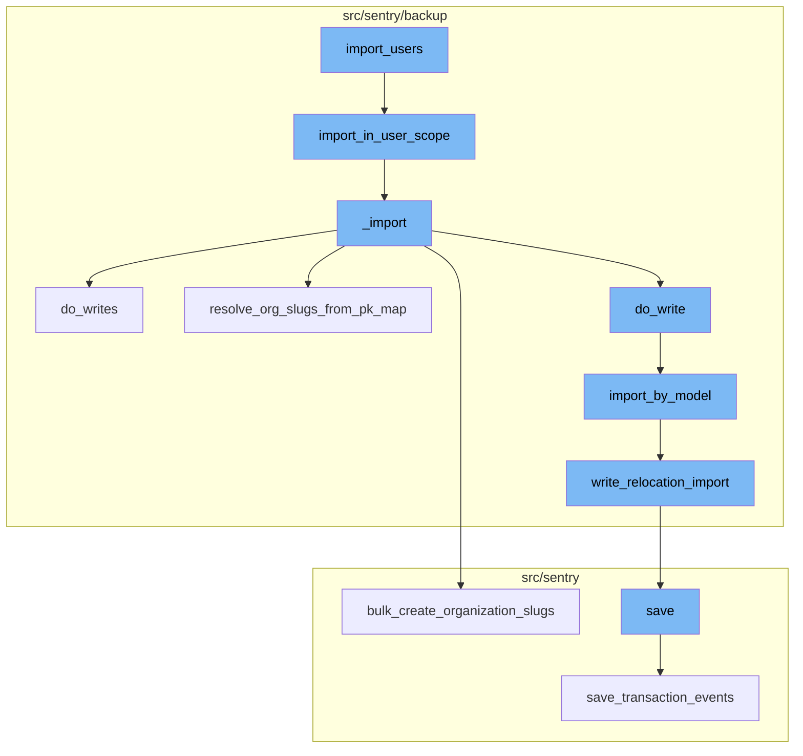
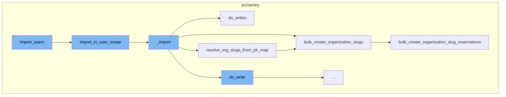
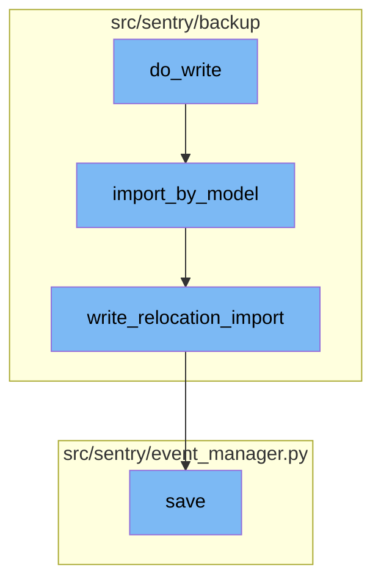

# User Import Process

The user import process in Sentry is a multi-step operation that involves reading user data from a source file, processing the data, and writing it to the database. The process begins with the `import_users` function, which is the entry point for the user import process. It takes in various parameters including the source file, decryption keys, and user filters. It then calls the `import_in_user_scope` function to start the import process.

<SwmSnippet path="/src/sentry/runner/commands/backup.py" line="671">

---

# User Import Process

The `import_users` function is the entry point for the user import process. It takes in various parameters including the source file, decryption keys, and user filters. It then calls the `import_in_user_scope` function to start the import process.

```python
def import_users(
    src: IO[bytes],
    decrypt_with: IO[bytes],
    decrypt_with_gcp_kms: IO[bytes],
    filter_usernames: str,
    filter_usernames_file: IO[str],
    findings_file: IO[str],
    merge_users: bool,
    no_prompt: bool,
    silent: bool,
) -> None:
    """
    Import the Sentry users from an exported JSON file.
    """

    from sentry.backup.imports import import_in_user_scope

    printer = get_printer(silent=silent, no_prompt=no_prompt)
    with write_import_findings(findings_file, printer):
        import_in_user_scope(
            src,
```

---

</SwmSnippet>

<SwmSnippet path="/src/sentry/backup/imports.py" line="491">

---

The `import_in_user_scope` function performs an import in the `User` scope, meaning that only models with `RelocationScope.User` will be imported from the provided `src` file. The `user_filter` argument allows imports to be filtered by username. If the argument is set to `None`, there is no filtering, meaning all encountered users are imported. This function then calls the `_import` function.

```python
def import_in_user_scope(
    src: IO[bytes],
    *,
    decryptor: Decryptor | None = None,
    flags: ImportFlags | None = None,
    user_filter: set[str] | None = None,
    printer: Printer,
):
    """
    Perform an import in the `User` scope, meaning that only models with `RelocationScope.User` will
    be imported from the provided `src` file.

    The `user_filter` argument allows imports to be filtered by username. If the argument is set to
    `None`, there is no filtering, meaning all encountered users are imported.
    """

    # Import here to prevent circular module resolutions.
    from sentry.models.user import User

    return _import(
        src,
```

---

</SwmSnippet>

<SwmSnippet path="/src/sentry/backup/imports.py" line="86">

---

The `_import` function is responsible for the actual import process. It reads the content from the source file, processes the JSON models, and writes them to the database. It also resolves organization slugs from the primary key map and creates organization slugs in bulk.

```python
def _import(
    src: IO[bytes],
    scope: ImportScope,
    *,
    decryptor: Decryptor | None = None,
    flags: ImportFlags | None = None,
    filter_by: Filter | None = None,
    printer: Printer,
):
    """
    Imports core data for a Sentry installation.

    It is generally preferable to avoid calling this function directly, as there are certain
    combinations of input parameters that should not be used together. Instead, use one of the other
    wrapper functions in this file, named `import_in_XXX_scope()`.
    """

    # Import here to prevent circular module resolutions.
    from sentry.models.email import Email
    from sentry.models.organization import Organization
    from sentry.models.organizationmember import OrganizationMember
```

---

</SwmSnippet>

<SwmSnippet path="/src/sentry/backup/imports.py" line="392">

---

The `do_writes` function is responsible for writing the imported data to the database. It iterates over the JSON models and writes each one to the database.

```python
    # Extract some write logic into its own internal function, so that we may call it irrespective
    # of how we do atomicity: on a per-model (if using multiple dbs) or global (if using a single
    # db) basis.
    def do_writes(pk_map: PrimaryKeyMap) -> None:
        nonlocal deferred_org_auth_tokens, import_write_context

        for model_name, json_data, offset in yield_json_models(content):
            if model_name == org_auth_token_model_name:
                deferred_org_auth_tokens.append(json_data)
                continue

            do_write(import_write_context, pk_map, model_name, json_data, offset)
```

---

</SwmSnippet>

<SwmSnippet path="/src/sentry/backup/imports.py" line="405">

---

The `resolve_org_slugs_from_pk_map` function resolves slugs for all imported organization models via the PrimaryKeyMap and reconciles their slug globally via control silo by issuing a slug update. It then calls the `bulk_create_organization_slugs` function.

```python
    # Resolves slugs for all imported organization models via the PrimaryKeyMap and reconciles
    # their slug globally via control silo by issuing a slug update.
    def resolve_org_slugs_from_pk_map(pk_map: PrimaryKeyMap):
        from sentry.services.organization import organization_provisioning_service

        org_pk_mapping = pk_map.mapping[str(org_model_name)]
        if not org_pk_mapping:
            return

        slug_mapping: dict[int, str] = {}
        for old_primary_key in org_pk_mapping:
            org_id, _, org_slug = org_pk_mapping[old_primary_key]
            slug_mapping[org_id] = org_slug or ""

        if len(slug_mapping) > 0:
            # HACK(azaslavsky): Okay, this gets a bit complicated, but bear with me: the following
            # `bulk_create...` calls will result in some actions on the control silo that call back
            # into this region. So the client (this region) calls the server (the control silo)
            # which may need to make one or more calls back into the client (this region). Because
            # some of our `OrganizationMemberTeam` outboxes may not be drained due to the HACK we
            # performed in `import_export/impl.py` (see that file for more details), there may be a
```

---

</SwmSnippet>

<SwmSnippet path="/src/sentry/services/organization/provisioning.py" line="141">

---

The `bulk_create_organization_slugs` function bulk creates slug reservations for imported organizations that already exist on the region. Each target organization is provided as a tuple of Organization ID (int) and base slug (str).

```python
    def bulk_create_organization_slugs(
        self, slug_mapping: dict[int, str], region_name: str | None = None
    ):
        """
        CAUTION: DO NOT USE THIS OUTSIDE OF THE IMPORT/RELOCATION CONTEXT

        Organizations are meant to be provisioned via the
         `provision_organization_in_region` method, which handles both slug
         reservation and organization creation.

        Bulk creates slug reservations for imported organizations that already
        exist on the region. Each target organization is provided as a tuple of
        Organization ID (int) and base slug (str).

        :param org_ids_and_slugs: A set of tuples containing an organization ID
        and base slug.
        :param region_name: The region where the imported organizations exist
        :return:
        """
        destination_region_name = self._validate_or_default_region(region_name=region_name)

```

---

</SwmSnippet>

<SwmSnippet path="/src/sentry/hybridcloud/services/control_organization_provisioning/impl.py" line="256">

---

The `bulk_create_organization_slug_reservations` function is called by `bulk_create_organization_slugs` to create slug reservations for the imported organizations in the control silo.

```python
    def bulk_create_organization_slug_reservations(
        self,
        *,
        region_name: str,
        slug_mapping: dict[int, str],
    ) -> None:
        slug_reservations_to_create: list[OrganizationSlugReservation] = []

        with outbox_context(transaction.atomic(router.db_for_write(OrganizationSlugReservation))):
            for org_id, slug in slug_mapping.items():
                slug_reservation = OrganizationSlugReservation(
                    slug=self._generate_org_slug(slug=slug, region_name=region_name),
                    organization_id=org_id,
                    reservation_type=OrganizationSlugReservationType.TEMPORARY_RENAME_ALIAS.value,
                    user_id=-1,
                    region_name=region_name,
                )
                slug_reservation.save(unsafe_write=True)

                slug_reservations_to_create.append(slug_reservation)

```

---

</SwmSnippet>

<SwmSnippet path="/src/sentry/backup/imports.py" line="295">

---

The `do_write` function is the starting point of the flow. It prepares the data for import, including the model relations and dependencies. It then calls the `import_by_model` function, passing the necessary parameters such as model name, scope, flags, and primary key map.

```python
    # Perform the write of a single model.
    def do_write(
        import_write_context: ImportWriteContext,
        pk_map: PrimaryKeyMap,
        model_name: NormalizedModelName,
        json_data: Any,
        offset: int,
    ) -> None:
        model_relations = import_write_context.dependencies.get(model_name)
        if not model_relations:
            return

        dep_models = {get_model_name(d) for d in model_relations.get_dependencies_for_relocation()}
        import_by_model = ImportExportService.get_importer_for_model(model_relations.model)
        model_name_str = str(model_name)
        min_ordinal = offset + 1

        extra = {
            "model_name": model_name_str,
            "import_uuid": flags.import_uuid,
            "min_ordinal": min_ordinal,
```

---

</SwmSnippet>

<SwmSnippet path="/src/sentry/backup/services/import_export/impl.py" line="104">

---

The `import_by_model` function is responsible for importing a specific model. It validates the input, checks for existing data, and handles potential errors. If the data is valid and there are no conflicts, it proceeds to write the data into the database by calling the `write_relocation_import` function.

```python
    """

    def import_by_model(
        self,
        *,
        model_name: str,
        scope: RpcImportScope | None = None,
        flags: RpcImportFlags,
        filter_by: list[RpcFilter],
        pk_map: RpcPrimaryKeyMap,
        json_data: str,
        min_ordinal: int,
    ) -> RpcImportResult:
        if min_ordinal < 1:
            return RpcImportError(
                kind=RpcImportErrorKind.InvalidMinOrdinal,
                on=InstanceID(model_name),
                reason=f"The model `{model_name}` was offset with an invalid `min_ordinal` of `{min_ordinal}`",
            )

        batch_model_name = NormalizedModelName(model_name)
```

---

</SwmSnippet>

<SwmSnippet path="/src/sentry/backup/mixins.py" line="13">

---

The `write_relocation_import` function is a mixin used by models to handle the actual writing of data into the database. It checks for potential collisions and handles them appropriately. If there are no collisions, it saves the data into the database.

```python
    """

    # TODO(getsentry/team-ospo#190): Clean up the type checking in this method.
    def write_relocation_import(
        self, scope: ImportScope, flags: ImportFlags
    ) -> tuple[int, ImportKind] | None:
        # Get all unique sets that will potentially cause collisions.
        uniq_sets = dependencies()[get_model_name(self)].get_uniques_without_foreign_keys()  # type: ignore[arg-type]

        # Don't use this mixin for models with multiple unique sets; write custom logic instead.
        assert len(uniq_sets) <= 1

        # Must set `__relocation_custom_ordinal__` on models that use this mixin.
        assert getattr(self.__class__, "__relocation_custom_ordinal__", None) is not None

        if self.get_relocation_scope() == RelocationScope.Config:  # type: ignore[attr-defined]
            if len(uniq_sets) == 1:
                uniq_set = uniq_sets[0]
                query = dict()
                for uniq_field_name in uniq_set:
                    if getattr(self, uniq_field_name, None) is not None:
```

---

</SwmSnippet>

<SwmSnippet path="/src/sentry/event_manager.py" line="442">

---

Finally, the `save` function in the event manager is called. This function is responsible for saving the event into the eventstream after normalizing and processing it. It also handles the saving of adjacent models such as releases and environments to the database.

```python
    def save(
        self,
        project_id: int | None,
        raw: bool = False,
        assume_normalized: bool = False,
        start_time: float | None = None,
        cache_key: str | None = None,
        skip_send_first_transaction: bool = False,
        has_attachments: bool = False,
    ) -> Event:
        """
        After normalizing and processing an event, save adjacent models such as
        releases and environments to postgres and write the event into
        eventstream. From there it will be picked up by Snuba and
        post-processing.

        We re-insert events with duplicate IDs into Snuba, which is responsible
        for deduplicating events. Since deduplication in Snuba is on the primary
        key (based on event ID, project ID and day), events with same IDs are only
        deduplicated if their timestamps fall on the same day. The latest event
        always wins and overwrites the value of events received earlier in that day.
```

---

</SwmSnippet>



# Flow drill down

First, we'll zoom into this section of the flow:



<SwmSnippet path="/src/sentry/runner/commands/backup.py" line="671">

---

# Importing Users

The `import_users` function is the entry point for the user import process. It takes in various parameters including the source file, decryption keys, and user filters. It then calls the `import_in_user_scope` function to start the import process.

```python
def import_users(
    src: IO[bytes],
    decrypt_with: IO[bytes],
    decrypt_with_gcp_kms: IO[bytes],
    filter_usernames: str,
    filter_usernames_file: IO[str],
    findings_file: IO[str],
    merge_users: bool,
    no_prompt: bool,
    silent: bool,
) -> None:
    """
    Import the Sentry users from an exported JSON file.
    """

    from sentry.backup.imports import import_in_user_scope

    printer = get_printer(silent=silent, no_prompt=no_prompt)
    with write_import_findings(findings_file, printer):
        import_in_user_scope(
            src,
```

---

</SwmSnippet>

<SwmSnippet path="/src/sentry/backup/imports.py" line="491">

---

The `import_in_user_scope` function performs an import in the `User` scope, meaning that only models with `RelocationScope.User` will be imported from the provided `src` file. The `user_filter` argument allows imports to be filtered by username. If the argument is set to `None`, there is no filtering, meaning all encountered users are imported. This function then calls the `_import` function.

```python
def import_in_user_scope(
    src: IO[bytes],
    *,
    decryptor: Decryptor | None = None,
    flags: ImportFlags | None = None,
    user_filter: set[str] | None = None,
    printer: Printer,
):
    """
    Perform an import in the `User` scope, meaning that only models with `RelocationScope.User` will
    be imported from the provided `src` file.

    The `user_filter` argument allows imports to be filtered by username. If the argument is set to
    `None`, there is no filtering, meaning all encountered users are imported.
    """

    # Import here to prevent circular module resolutions.
    from sentry.models.user import User

    return _import(
        src,
```

---

</SwmSnippet>

<SwmSnippet path="/src/sentry/backup/imports.py" line="86">

---

The `_import` function is responsible for the actual import process. It reads the content from the source file, processes the JSON models, and writes them to the database. It also resolves organization slugs from the primary key map and creates organization slugs in bulk.

```python
def _import(
    src: IO[bytes],
    scope: ImportScope,
    *,
    decryptor: Decryptor | None = None,
    flags: ImportFlags | None = None,
    filter_by: Filter | None = None,
    printer: Printer,
):
    """
    Imports core data for a Sentry installation.

    It is generally preferable to avoid calling this function directly, as there are certain
    combinations of input parameters that should not be used together. Instead, use one of the other
    wrapper functions in this file, named `import_in_XXX_scope()`.
    """

    # Import here to prevent circular module resolutions.
    from sentry.models.email import Email
    from sentry.models.organization import Organization
    from sentry.models.organizationmember import OrganizationMember
```

---

</SwmSnippet>

<SwmSnippet path="/src/sentry/backup/imports.py" line="392">

---

The `do_writes` function is responsible for writing the imported data to the database. It iterates over the JSON models and writes each one to the database.

```python
    # Extract some write logic into its own internal function, so that we may call it irrespective
    # of how we do atomicity: on a per-model (if using multiple dbs) or global (if using a single
    # db) basis.
    def do_writes(pk_map: PrimaryKeyMap) -> None:
        nonlocal deferred_org_auth_tokens, import_write_context

        for model_name, json_data, offset in yield_json_models(content):
            if model_name == org_auth_token_model_name:
                deferred_org_auth_tokens.append(json_data)
                continue

            do_write(import_write_context, pk_map, model_name, json_data, offset)
```

---

</SwmSnippet>

<SwmSnippet path="/src/sentry/backup/imports.py" line="405">

---

The `resolve_org_slugs_from_pk_map` function resolves slugs for all imported organization models via the PrimaryKeyMap and reconciles their slug globally via control silo by issuing a slug update. It then calls the `bulk_create_organization_slugs` function.

```python
    # Resolves slugs for all imported organization models via the PrimaryKeyMap and reconciles
    # their slug globally via control silo by issuing a slug update.
    def resolve_org_slugs_from_pk_map(pk_map: PrimaryKeyMap):
        from sentry.services.organization import organization_provisioning_service

        org_pk_mapping = pk_map.mapping[str(org_model_name)]
        if not org_pk_mapping:
            return

        slug_mapping: dict[int, str] = {}
        for old_primary_key in org_pk_mapping:
            org_id, _, org_slug = org_pk_mapping[old_primary_key]
            slug_mapping[org_id] = org_slug or ""

        if len(slug_mapping) > 0:
            # HACK(azaslavsky): Okay, this gets a bit complicated, but bear with me: the following
            # `bulk_create...` calls will result in some actions on the control silo that call back
            # into this region. So the client (this region) calls the server (the control silo)
            # which may need to make one or more calls back into the client (this region). Because
            # some of our `OrganizationMemberTeam` outboxes may not be drained due to the HACK we
            # performed in `import_export/impl.py` (see that file for more details), there may be a
```

---

</SwmSnippet>

<SwmSnippet path="/src/sentry/services/organization/provisioning.py" line="141">

---

The `bulk_create_organization_slugs` function bulk creates slug reservations for imported organizations that already exist on the region. Each target organization is provided as a tuple of Organization ID (int) and base slug (str).

```python
    def bulk_create_organization_slugs(
        self, slug_mapping: dict[int, str], region_name: str | None = None
    ):
        """
        CAUTION: DO NOT USE THIS OUTSIDE OF THE IMPORT/RELOCATION CONTEXT

        Organizations are meant to be provisioned via the
         `provision_organization_in_region` method, which handles both slug
         reservation and organization creation.

        Bulk creates slug reservations for imported organizations that already
        exist on the region. Each target organization is provided as a tuple of
        Organization ID (int) and base slug (str).

        :param org_ids_and_slugs: A set of tuples containing an organization ID
        and base slug.
        :param region_name: The region where the imported organizations exist
        :return:
        """
        destination_region_name = self._validate_or_default_region(region_name=region_name)

```

---

</SwmSnippet>

<SwmSnippet path="/src/sentry/hybridcloud/services/control_organization_provisioning/impl.py" line="256">

---

The `bulk_create_organization_slug_reservations` function is called by `bulk_create_organization_slugs` to create slug reservations for the imported organizations in the control silo.

```python
    def bulk_create_organization_slug_reservations(
        self,
        *,
        region_name: str,
        slug_mapping: dict[int, str],
    ) -> None:
        slug_reservations_to_create: list[OrganizationSlugReservation] = []

        with outbox_context(transaction.atomic(router.db_for_write(OrganizationSlugReservation))):
            for org_id, slug in slug_mapping.items():
                slug_reservation = OrganizationSlugReservation(
                    slug=self._generate_org_slug(slug=slug, region_name=region_name),
                    organization_id=org_id,
                    reservation_type=OrganizationSlugReservationType.TEMPORARY_RENAME_ALIAS.value,
                    user_id=-1,
                    region_name=region_name,
                )
                slug_reservation.save(unsafe_write=True)

                slug_reservations_to_create.append(slug_reservation)

```

---

</SwmSnippet>

Now, lets zoom into this section of the flow:



<SwmSnippet path="/src/sentry/backup/imports.py" line="295">

---

# Import Users Flow

The `do_write` function is the starting point of the flow. It prepares the data for import, including the model relations and dependencies. It then calls the `import_by_model` function, passing the necessary parameters such as model name, scope, flags, and primary key map.

```python
    # Perform the write of a single model.
    def do_write(
        import_write_context: ImportWriteContext,
        pk_map: PrimaryKeyMap,
        model_name: NormalizedModelName,
        json_data: Any,
        offset: int,
    ) -> None:
        model_relations = import_write_context.dependencies.get(model_name)
        if not model_relations:
            return

        dep_models = {get_model_name(d) for d in model_relations.get_dependencies_for_relocation()}
        import_by_model = ImportExportService.get_importer_for_model(model_relations.model)
        model_name_str = str(model_name)
        min_ordinal = offset + 1

        extra = {
            "model_name": model_name_str,
            "import_uuid": flags.import_uuid,
            "min_ordinal": min_ordinal,
```

---

</SwmSnippet>

<SwmSnippet path="/src/sentry/backup/services/import_export/impl.py" line="104">

---

The `import_by_model` function is responsible for importing a specific model. It validates the input, checks for existing data, and handles potential errors. If the data is valid and there are no conflicts, it proceeds to write the data into the database by calling the `write_relocation_import` function.

```python
    """

    def import_by_model(
        self,
        *,
        model_name: str,
        scope: RpcImportScope | None = None,
        flags: RpcImportFlags,
        filter_by: list[RpcFilter],
        pk_map: RpcPrimaryKeyMap,
        json_data: str,
        min_ordinal: int,
    ) -> RpcImportResult:
        if min_ordinal < 1:
            return RpcImportError(
                kind=RpcImportErrorKind.InvalidMinOrdinal,
                on=InstanceID(model_name),
                reason=f"The model `{model_name}` was offset with an invalid `min_ordinal` of `{min_ordinal}`",
            )

        batch_model_name = NormalizedModelName(model_name)
```

---

</SwmSnippet>

<SwmSnippet path="/src/sentry/backup/mixins.py" line="13">

---

The `write_relocation_import` function is a mixin used by models to handle the actual writing of data into the database. It checks for potential collisions and handles them appropriately. If there are no collisions, it saves the data into the database.

```python
    """

    # TODO(getsentry/team-ospo#190): Clean up the type checking in this method.
    def write_relocation_import(
        self, scope: ImportScope, flags: ImportFlags
    ) -> tuple[int, ImportKind] | None:
        # Get all unique sets that will potentially cause collisions.
        uniq_sets = dependencies()[get_model_name(self)].get_uniques_without_foreign_keys()  # type: ignore[arg-type]

        # Don't use this mixin for models with multiple unique sets; write custom logic instead.
        assert len(uniq_sets) <= 1

        # Must set `__relocation_custom_ordinal__` on models that use this mixin.
        assert getattr(self.__class__, "__relocation_custom_ordinal__", None) is not None

        if self.get_relocation_scope() == RelocationScope.Config:  # type: ignore[attr-defined]
            if len(uniq_sets) == 1:
                uniq_set = uniq_sets[0]
                query = dict()
                for uniq_field_name in uniq_set:
                    if getattr(self, uniq_field_name, None) is not None:
```

---

</SwmSnippet>

<SwmSnippet path="/src/sentry/event_manager.py" line="442">

---

Finally, the `save` function in the event manager is called. This function is responsible for saving the event into the eventstream after normalizing and processing it. It also handles the saving of adjacent models such as releases and environments to the database.

```python
    def save(
        self,
        project_id: int | None,
        raw: bool = False,
        assume_normalized: bool = False,
        start_time: float | None = None,
        cache_key: str | None = None,
        skip_send_first_transaction: bool = False,
        has_attachments: bool = False,
    ) -> Event:
        """
        After normalizing and processing an event, save adjacent models such as
        releases and environments to postgres and write the event into
        eventstream. From there it will be picked up by Snuba and
        post-processing.

        We re-insert events with duplicate IDs into Snuba, which is responsible
        for deduplicating events. Since deduplication in Snuba is on the primary
        key (based on event ID, project ID and day), events with same IDs are only
        deduplicated if their timestamps fall on the same day. The latest event
        always wins and overwrites the value of events received earlier in that day.
```

---

</SwmSnippet>

&nbsp;

*This is an auto-generated document by Swimm AI 🌊 and has not yet been verified by a human*

<SwmMeta version="3.0.0" repo-id="Z2l0aHViJTNBJTNBc2VudHJ5LWRlbW8lM0ElM0FTd2ltbS1EZW1v" repo-name="sentry-demo" doc-type="flows"><sup>Powered by [Swimm](/)</sup></SwmMeta>
