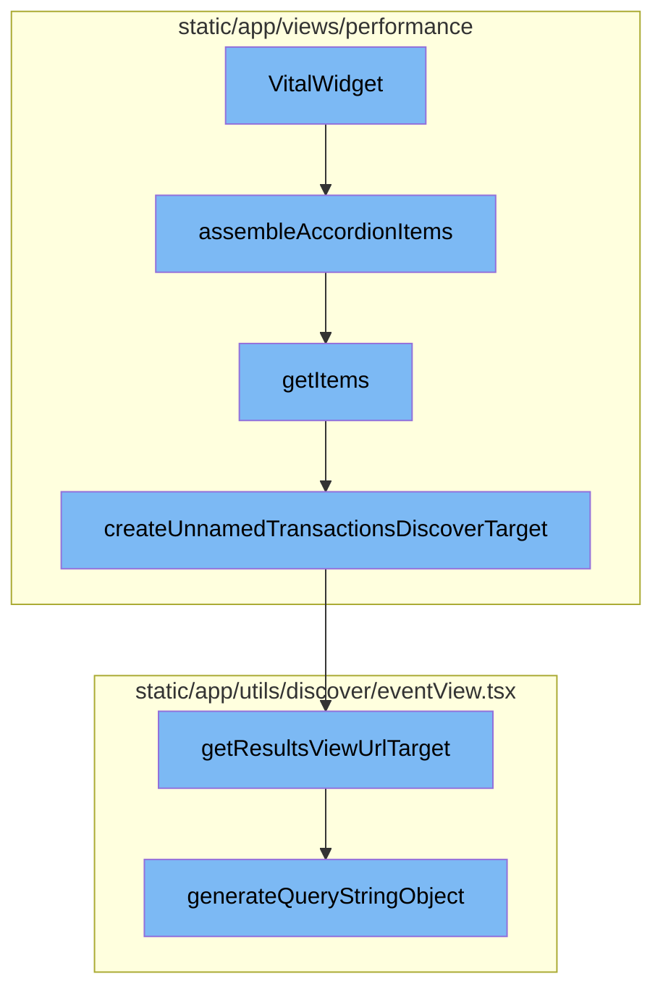

<SwmSnippet path="/static/app/views/performance/landing/widgets/widgets/vitalWidget.tsx" line="109">

---

# VitalWidget

The `VitalWidget` function is the starting point of the flow. It is responsible for setting up the widget's state and defining several helper functions and components. It also defines the `Queries` object which contains the logic for fetching the data needed for the widget.

```tsx
export function VitalWidget(props: PerformanceWidgetProps) {
  const location = useLocation();
  const mepSetting = useMEPSettingContext();
  const {ContainerActions, eventView, organization, InteractiveTitle} = props;
  const [selectedListIndex, setSelectListIndex] = useState<number>(0);
  const field = props.fields[0];
  const {setPageError} = usePageAlert();

  const {fieldsList, vitalFields, sortField} = transformFieldsWithStops({
    field,
    fields: props.fields,
    vitalStops: props.chartDefinition.vitalStops,
  });

  const Queries = {
    list: useMemo<QueryDefinition<DataType, WidgetDataResult>>(
      () => ({
        fields: sortField,
        component: provided => {
          const _eventView = provided.eventView.clone();

```

---

</SwmSnippet>

<SwmSnippet path="/static/app/views/performance/landing/widgets/widgets/vitalWidget.tsx" line="234">

---

## assembleAccordionItems

The `assembleAccordionItems` function is called within `VitalWidget`. It uses the `getItems` function to generate a list of items, and for each item, it creates an object with a header and content. The content is generated by the `getChart` function.

```tsx
  const assembleAccordionItems = provided =>
    getItems(provided).map(item => ({header: item, content: getChart(provided)}));
```

---

</SwmSnippet>

<SwmSnippet path="/static/app/views/performance/landing/widgets/widgets/vitalWidget.tsx" line="247">

---

### getItems

The `getItems` function is used to generate a list of items for the accordion. It takes the widget data and maps it to a list of items. Each item is a transaction with additional data and a target URL. The target URL is generated by either `transactionSummaryRouteWithQuery` or `createUnnamedTransactionsDiscoverTarget` depending on whether the transaction is unparameterized.

```tsx
  const getItems = provided =>
    provided.widgetData.list.data.slice(0, QUERY_LIMIT_PARAM).map((listItem, i) => {
      const transaction = (listItem?.transaction as string | undefined) ?? '';
      const _eventView = eventView.clone();

      const initialConditions = new MutableSearch(_eventView.query);
      initialConditions.addFilterValues('transaction', [transaction]);

      const vital = settingToVital[props.chartSetting];

      _eventView.query = initialConditions.formatString();

      const isUnparameterizedRow = transaction === UNPARAMETERIZED_TRANSACTION;
      const transactionTarget = transactionSummaryRouteWithQuery({
        orgSlug: props.organization.slug,
        projectID: listItem['project.id'],
        transaction: listItem.transaction,
        query: _eventView.generateQueryStringObject(),
        display: DisplayModes.VITALS,
      });

```

---

</SwmSnippet>

<SwmSnippet path="/static/app/views/performance/utils/index.tsx" line="51">

---

#### createUnnamedTransactionsDiscoverTarget

The `createUnnamedTransactionsDiscoverTarget` function is used to create a target URL for unparameterized transactions. It creates a new `EventView` with a specific query and then generates a URL target for the results view.

```tsx
export function createUnnamedTransactionsDiscoverTarget(props: {
  location: Location;
  organization: Organization;
  source?: DiscoverQueryPageSource;
}) {
  const fields =
    props.source === DiscoverQueryPageSource.DISCOVER
      ? ['transaction', 'project', 'transaction.source', 'epm()']
      : ['transaction', 'project', 'transaction.source', 'epm()', 'p50()', 'p95()'];

  const query: NewQuery = {
    id: undefined,
    name:
      props.source === DiscoverQueryPageSource.DISCOVER
        ? t('Unparameterized Transactions')
        : t('Performance - Unparameterized Transactions'),
    query: 'event.type:transaction transaction.source:"url"',
    projects: [],
    fields,
    version: 2,
  };
```

---

</SwmSnippet>

<SwmSnippet path="/static/app/utils/discover/eventView.tsx" line="1190">

---

##### getResultsViewUrlTarget

The `getResultsViewUrlTarget` method is used to generate a URL target for the results view of an `EventView`. It takes the organization slug and a flag indicating whether it's the homepage.

```tsx
  getResultsViewUrlTarget(
    slug: string,
    isHomepage: boolean = false
  ): {pathname: string; query: Query} {
    const target = isHomepage ? 'homepage' : 'results';
    return {
      pathname: normalizeUrl(`/organizations/${slug}/discover/${target}/`),
      query: this.generateQueryStringObject(),
    };
  }
```

---

</SwmSnippet>

<SwmSnippet path="/static/app/utils/discover/eventView.tsx" line="672">

---

###### generateQueryStringObject

The `generateQueryStringObject` method is used to generate a query string object from the `EventView`. This object includes all the necessary parameters for the results view URL.

```tsx
  generateQueryStringObject(): Query {
    const output = {
      id: this.id,
      name: this.name,
      field: this.getFields(),
      widths: this.getWidths(),
      sort: encodeSorts(this.sorts),
      environment: this.environment,
      project: this.project,
      query: this.query,
      yAxis: this.yAxis || this.getYAxis(),
      dataset: this.dataset,
      display: this.display,
      topEvents: this.topEvents,
      interval: this.interval,
    };

    for (const field of EXTERNAL_QUERY_STRING_KEYS) {
      if (this[field]?.length) {
        output[field] = this[field];
      }
```

---

</SwmSnippet>

# Flow drill down



<SwmSnippet path="/static/app/views/performance/landing/widgets/widgets/vitalWidget.tsx" line="109">

---

# VitalWidget

The `VitalWidget` function is the starting point of the flow. It is responsible for setting up the widget's state and defining several helper functions and components. It also defines the `Queries` object which contains the logic for fetching the data needed for the widget.

```tsx
export function VitalWidget(props: PerformanceWidgetProps) {
  const location = useLocation();
  const mepSetting = useMEPSettingContext();
  const {ContainerActions, eventView, organization, InteractiveTitle} = props;
  const [selectedListIndex, setSelectListIndex] = useState<number>(0);
  const field = props.fields[0];
  const {setPageError} = usePageAlert();

  const {fieldsList, vitalFields, sortField} = transformFieldsWithStops({
    field,
    fields: props.fields,
    vitalStops: props.chartDefinition.vitalStops,
  });

  const Queries = {
    list: useMemo<QueryDefinition<DataType, WidgetDataResult>>(
      () => ({
        fields: sortField,
        component: provided => {
          const _eventView = provided.eventView.clone();

```

---

</SwmSnippet>

<SwmSnippet path="/static/app/views/performance/landing/widgets/widgets/vitalWidget.tsx" line="234">

---

## assembleAccordionItems

The `assembleAccordionItems` function is called within `VitalWidget`. It uses the `getItems` function to generate a list of items, and for each item, it creates an object with a header and content. The content is generated by the `getChart` function.

```tsx
  const assembleAccordionItems = provided =>
    getItems(provided).map(item => ({header: item, content: getChart(provided)}));
```

---

</SwmSnippet>

<SwmSnippet path="/static/app/views/performance/landing/widgets/widgets/vitalWidget.tsx" line="247">

---

### getItems

The `getItems` function is used to generate a list of items for the accordion. It takes the widget data and maps it to a list of items. Each item is a transaction with additional data and a target URL. The target URL is generated by either `transactionSummaryRouteWithQuery` or `createUnnamedTransactionsDiscoverTarget` depending on whether the transaction is unparameterized.

```tsx
  const getItems = provided =>
    provided.widgetData.list.data.slice(0, QUERY_LIMIT_PARAM).map((listItem, i) => {
      const transaction = (listItem?.transaction as string | undefined) ?? '';
      const _eventView = eventView.clone();

      const initialConditions = new MutableSearch(_eventView.query);
      initialConditions.addFilterValues('transaction', [transaction]);

      const vital = settingToVital[props.chartSetting];

      _eventView.query = initialConditions.formatString();

      const isUnparameterizedRow = transaction === UNPARAMETERIZED_TRANSACTION;
      const transactionTarget = transactionSummaryRouteWithQuery({
        orgSlug: props.organization.slug,
        projectID: listItem['project.id'],
        transaction: listItem.transaction,
        query: _eventView.generateQueryStringObject(),
        display: DisplayModes.VITALS,
      });

```

---

</SwmSnippet>

<SwmSnippet path="/static/app/views/performance/utils/index.tsx" line="51">

---

#### createUnnamedTransactionsDiscoverTarget

The `createUnnamedTransactionsDiscoverTarget` function is used to create a target URL for unparameterized transactions. It creates a new `EventView` with a specific query and then generates a URL target for the results view.

```tsx
export function createUnnamedTransactionsDiscoverTarget(props: {
  location: Location;
  organization: Organization;
  source?: DiscoverQueryPageSource;
}) {
  const fields =
    props.source === DiscoverQueryPageSource.DISCOVER
      ? ['transaction', 'project', 'transaction.source', 'epm()']
      : ['transaction', 'project', 'transaction.source', 'epm()', 'p50()', 'p95()'];

  const query: NewQuery = {
    id: undefined,
    name:
      props.source === DiscoverQueryPageSource.DISCOVER
        ? t('Unparameterized Transactions')
        : t('Performance - Unparameterized Transactions'),
    query: 'event.type:transaction transaction.source:"url"',
    projects: [],
    fields,
    version: 2,
  };
```

---

</SwmSnippet>

<SwmSnippet path="/static/app/utils/discover/eventView.tsx" line="1190">

---

##### getResultsViewUrlTarget

The `getResultsViewUrlTarget` method is used to generate a URL target for the results view of an `EventView`. It takes the organization slug and a flag indicating whether it's the homepage.

```tsx
  getResultsViewUrlTarget(
    slug: string,
    isHomepage: boolean = false
  ): {pathname: string; query: Query} {
    const target = isHomepage ? 'homepage' : 'results';
    return {
      pathname: normalizeUrl(`/organizations/${slug}/discover/${target}/`),
      query: this.generateQueryStringObject(),
    };
  }
```

---

</SwmSnippet>

<SwmSnippet path="/static/app/utils/discover/eventView.tsx" line="672">

---

###### generateQueryStringObject

The `generateQueryStringObject` method is used to generate a query string object from the `EventView`. This object includes all the necessary parameters for the results view URL.

```tsx
  generateQueryStringObject(): Query {
    const output = {
      id: this.id,
      name: this.name,
      field: this.getFields(),
      widths: this.getWidths(),
      sort: encodeSorts(this.sorts),
      environment: this.environment,
      project: this.project,
      query: this.query,
      yAxis: this.yAxis || this.getYAxis(),
      dataset: this.dataset,
      display: this.display,
      topEvents: this.topEvents,
      interval: this.interval,
    };

    for (const field of EXTERNAL_QUERY_STRING_KEYS) {
      if (this[field]?.length) {
        output[field] = this[field];
      }
```

---

</SwmSnippet>

&nbsp;

*This is an auto-generated document by Swimm AI 🌊 and has not yet been verified by a human*

<SwmMeta version="3.0.0" repo-id="Z2l0aHViJTNBJTNBc2VudHJ5LWRlbW8lM0ElM0FTd2ltbS1EZW1v" repo-name="sentry-demo" doc-type="flows"><sup>Powered by [Swimm](/)</sup></SwmMeta>
