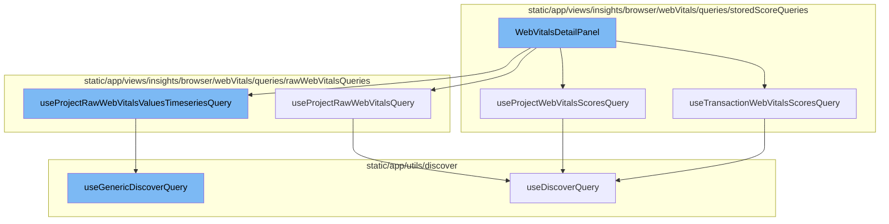

<SwmSnippet path="/static/app/views/insights/browser/webVitals/components/webVitalsDetailPanel.tsx" line="53">

---

# WebVitalsDetailPanel

The `WebVitalsDetailPanel` function is a component that displays detailed information about web vitals. It uses several hooks and queries to fetch and process the necessary data. It takes in a `webVital` parameter, which specifies the type of web vital to display details for, and an `onClose` callback function, which is called when the panel is closed.

```tsx
export function WebVitalsDetailPanel({
  webVital,
  onClose,
}: {
  onClose: () => void;
  webVital: WebVitals | null;
}) {
  const location = useLocation();
  const organization = useOrganization();
  const browserTypes = decodeBrowserTypes(location.query[SpanIndexedField.BROWSER_NAME]);

  const {data: projectData} = useProjectRawWebVitalsQuery({browserTypes});
  const {data: projectScoresData} = useProjectWebVitalsScoresQuery({
    weightWebVital: webVital ?? 'total',
    browserTypes,
  });

  const projectScore = calculatePerformanceScoreFromStoredTableDataRow(
    projectScoresData?.data?.[0]
  );
  const {data, isLoading} = useTransactionWebVitalsScoresQuery({
```

---

</SwmSnippet>

<SwmSnippet path="/static/app/views/insights/browser/webVitals/queries/storedScoreQueries/useTransactionWebVitalsScoresQuery.tsx" line="32">

---

# useTransactionWebVitalsScoresQuery

The `useTransactionWebVitalsScoresQuery` function is a custom hook that fetches the web vitals scores for a specific transaction. It constructs a search query based on the provided parameters and uses the `useDiscoverQuery` hook to execute the query. The returned data is then processed and returned in a specific format.

```tsx
export const useTransactionWebVitalsScoresQuery = ({
  limit,
  transaction,
  defaultSort,
  sortName = 'sort',
  enabled = true,
  webVital = 'total',
  query,
  shouldEscapeFilters = true,
  browserTypes,
}: Props) => {
  const organization = useOrganization();
  const pageFilters = usePageFilters();
  const location = useLocation();
  const shouldUseStaticWeights = useStaticWeightsSetting();

  const sort = useWebVitalsSort({sortName, defaultSort});
  if (sort !== undefined && shouldUseStaticWeights) {
    if (sort.field === 'avg(measurements.score.total)') {
      sort.field = 'performance_score(measurements.score.total)';
    }
```

---

</SwmSnippet>

<SwmSnippet path="/static/app/views/insights/browser/webVitals/queries/storedScoreQueries/useProjectWebVitalsScoresQuery.tsx" line="24">

---

# useProjectWebVitalsScoresQuery

The `useProjectWebVitalsScoresQuery` function is a custom hook that fetches the web vitals scores for a specific project. It constructs a search query based on the provided parameters and uses the `useDiscoverQuery` hook to execute the query. The returned data is then processed and returned in a specific format.

```tsx
export const useProjectWebVitalsScoresQuery = ({
  transaction,
  tag,
  dataset,
  enabled = true,
  weightWebVital = 'total',
  browserTypes,
}: Props = {}) => {
  const organization = useOrganization();
  const pageFilters = usePageFilters();
  const location = useLocation();
  const shouldUseStaticWeights = useStaticWeightsSetting();

  const search = new MutableSearch([]);
  if (transaction) {
    search.addFilterValue('transaction', transaction);
  }
  if (tag) {
    search.addFilterValue(tag.key, tag.name);
  }
  if (browserTypes) {
```

---

</SwmSnippet>

<SwmSnippet path="/static/app/views/insights/browser/webVitals/queries/rawWebVitalsQueries/useProjectRawWebVitalsQuery.tsx" line="20">

---

# useProjectRawWebVitalsQuery

The `useProjectRawWebVitalsQuery` function is a custom hook that fetches the raw web vitals data for a specific project. It constructs a search query based on the provided parameters and uses the `useDiscoverQuery` hook to execute the query. The returned data is then processed and returned in a specific format.

```tsx
export const useProjectRawWebVitalsQuery = ({
  transaction,
  tag,
  dataset,
  browserTypes,
}: Props = {}) => {
  const organization = useOrganization();
  const pageFilters = usePageFilters();
  const location = useLocation();
  const search = new MutableSearch([]);
  if (transaction) {
    search.addFilterValue('transaction', transaction);
  }
  if (tag) {
    search.addFilterValue(tag.key, tag.name);
  }
  if (browserTypes) {
    search.addDisjunctionFilterValues(SpanIndexedField.BROWSER_NAME, browserTypes);
  }

  const projectEventView = EventView.fromNewQueryWithPageFilters(
```

---

</SwmSnippet>

<SwmSnippet path="/static/app/views/insights/browser/webVitals/queries/rawWebVitalsQueries/useProjectRawWebVitalsValuesTimeseriesQuery.tsx" line="23">

---

# useProjectRawWebVitalsValuesTimeseriesQuery

The `useProjectRawWebVitalsValuesTimeseriesQuery` function is a custom hook that fetches the raw web vitals data for a specific project in a time series format. It constructs a search query based on the provided parameters and uses the `useGenericDiscoverQuery` hook to execute the query. The returned data is then processed and returned in a specific format.

```tsx
export const useProjectRawWebVitalsValuesTimeseriesQuery = ({
  transaction,
  datetime,
  browserTypes,
}: Props) => {
  const pageFilters = usePageFilters();
  const location = useLocation();
  const organization = useOrganization();
  const search = new MutableSearch([]);
  if (transaction) {
    search.addFilterValue('transaction', transaction);
  }
  if (browserTypes) {
    search.addDisjunctionFilterValues(SpanIndexedField.BROWSER_NAME, browserTypes);
  }
  const projectTimeSeriesEventView = EventView.fromNewQueryWithPageFilters(
    {
      yAxis: [
        'p75(measurements.lcp)',
        'p75(measurements.fcp)',
        'p75(measurements.cls)',
```

---

</SwmSnippet>

<SwmSnippet path="/static/app/utils/discover/genericDiscoverQuery.tsx" line="419">

---

# useGenericDiscoverQuery

The `useGenericDiscoverQuery` function is a custom hook that executes a generic discover query. It takes in a set of properties that define the query and options for the query execution. It uses the `useQuery` hook from the `react-query` library to execute the query and returns the result.

```tsx
export function useGenericDiscoverQuery<T, P>(props: Props<T, P>) {
  const api = useApi();
  const {orgSlug, route, options} = props;
  const url = `/organizations/${orgSlug}/${route}/`;
  const apiPayload = getPayload<T, P>(props);

  const res = useQuery<[T, string | undefined, ResponseMeta<T> | undefined], QueryError>(
    [route, apiPayload],
    ({signal: _signal}) =>
      doDiscoverQuery<T>(api, url, apiPayload, {
        queryBatching: props.queryBatching,
        skipAbort: props.skipAbort,
      }),
    options
  );

  return {
    ...res,
    data: res.data?.[0] ?? undefined,
    error: parseError(res.error),
    statusCode: res.data?.[1] ?? undefined,
```

---

</SwmSnippet>



# Flow drill down


<SwmSnippet path="/static/app/views/insights/browser/webVitals/components/webVitalsDetailPanel.tsx" line="53">

---

# WebVitalsDetailPanel

The `WebVitalsDetailPanel` function is a component that displays detailed information about web vitals. It uses several hooks and queries to fetch and process the necessary data. It takes in a `webVital` parameter, which specifies the type of web vital to display details for, and an `onClose` callback function, which is called when the panel is closed.

```tsx
export function WebVitalsDetailPanel({
  webVital,
  onClose,
}: {
  onClose: () => void;
  webVital: WebVitals | null;
}) {
  const location = useLocation();
  const organization = useOrganization();
  const browserTypes = decodeBrowserTypes(location.query[SpanIndexedField.BROWSER_NAME]);

  const {data: projectData} = useProjectRawWebVitalsQuery({browserTypes});
  const {data: projectScoresData} = useProjectWebVitalsScoresQuery({
    weightWebVital: webVital ?? 'total',
    browserTypes,
  });

  const projectScore = calculatePerformanceScoreFromStoredTableDataRow(
    projectScoresData?.data?.[0]
  );
  const {data, isLoading} = useTransactionWebVitalsScoresQuery({
```

---

</SwmSnippet>

<SwmSnippet path="/static/app/views/insights/browser/webVitals/queries/storedScoreQueries/useTransactionWebVitalsScoresQuery.tsx" line="32">

---

# useTransactionWebVitalsScoresQuery

The `useTransactionWebVitalsScoresQuery` function is a custom hook that fetches the web vitals scores for a specific transaction. It constructs a search query based on the provided parameters and uses the `useDiscoverQuery` hook to execute the query. The returned data is then processed and returned in a specific format.

```tsx
export const useTransactionWebVitalsScoresQuery = ({
  limit,
  transaction,
  defaultSort,
  sortName = 'sort',
  enabled = true,
  webVital = 'total',
  query,
  shouldEscapeFilters = true,
  browserTypes,
}: Props) => {
  const organization = useOrganization();
  const pageFilters = usePageFilters();
  const location = useLocation();
  const shouldUseStaticWeights = useStaticWeightsSetting();

  const sort = useWebVitalsSort({sortName, defaultSort});
  if (sort !== undefined && shouldUseStaticWeights) {
    if (sort.field === 'avg(measurements.score.total)') {
      sort.field = 'performance_score(measurements.score.total)';
    }
```

---

</SwmSnippet>

<SwmSnippet path="/static/app/views/insights/browser/webVitals/queries/storedScoreQueries/useProjectWebVitalsScoresQuery.tsx" line="24">

---

# useProjectWebVitalsScoresQuery

The `useProjectWebVitalsScoresQuery` function is a custom hook that fetches the web vitals scores for a specific project. It constructs a search query based on the provided parameters and uses the `useDiscoverQuery` hook to execute the query. The returned data is then processed and returned in a specific format.

```tsx
export const useProjectWebVitalsScoresQuery = ({
  transaction,
  tag,
  dataset,
  enabled = true,
  weightWebVital = 'total',
  browserTypes,
}: Props = {}) => {
  const organization = useOrganization();
  const pageFilters = usePageFilters();
  const location = useLocation();
  const shouldUseStaticWeights = useStaticWeightsSetting();

  const search = new MutableSearch([]);
  if (transaction) {
    search.addFilterValue('transaction', transaction);
  }
  if (tag) {
    search.addFilterValue(tag.key, tag.name);
  }
  if (browserTypes) {
```

---

</SwmSnippet>

<SwmSnippet path="/static/app/views/insights/browser/webVitals/queries/rawWebVitalsQueries/useProjectRawWebVitalsQuery.tsx" line="20">

---

# useProjectRawWebVitalsQuery

The `useProjectRawWebVitalsQuery` function is a custom hook that fetches the raw web vitals data for a specific project. It constructs a search query based on the provided parameters and uses the `useDiscoverQuery` hook to execute the query. The returned data is then processed and returned in a specific format.

```tsx
export const useProjectRawWebVitalsQuery = ({
  transaction,
  tag,
  dataset,
  browserTypes,
}: Props = {}) => {
  const organization = useOrganization();
  const pageFilters = usePageFilters();
  const location = useLocation();
  const search = new MutableSearch([]);
  if (transaction) {
    search.addFilterValue('transaction', transaction);
  }
  if (tag) {
    search.addFilterValue(tag.key, tag.name);
  }
  if (browserTypes) {
    search.addDisjunctionFilterValues(SpanIndexedField.BROWSER_NAME, browserTypes);
  }

  const projectEventView = EventView.fromNewQueryWithPageFilters(
```

---

</SwmSnippet>

<SwmSnippet path="/static/app/views/insights/browser/webVitals/queries/rawWebVitalsQueries/useProjectRawWebVitalsValuesTimeseriesQuery.tsx" line="23">

---

# useProjectRawWebVitalsValuesTimeseriesQuery

The `useProjectRawWebVitalsValuesTimeseriesQuery` function is a custom hook that fetches the raw web vitals data for a specific project in a time series format. It constructs a search query based on the provided parameters and uses the `useGenericDiscoverQuery` hook to execute the query. The returned data is then processed and returned in a specific format.

```tsx
export const useProjectRawWebVitalsValuesTimeseriesQuery = ({
  transaction,
  datetime,
  browserTypes,
}: Props) => {
  const pageFilters = usePageFilters();
  const location = useLocation();
  const organization = useOrganization();
  const search = new MutableSearch([]);
  if (transaction) {
    search.addFilterValue('transaction', transaction);
  }
  if (browserTypes) {
    search.addDisjunctionFilterValues(SpanIndexedField.BROWSER_NAME, browserTypes);
  }
  const projectTimeSeriesEventView = EventView.fromNewQueryWithPageFilters(
    {
      yAxis: [
        'p75(measurements.lcp)',
        'p75(measurements.fcp)',
        'p75(measurements.cls)',
```

---

</SwmSnippet>

<SwmSnippet path="/static/app/utils/discover/genericDiscoverQuery.tsx" line="419">

---

# useGenericDiscoverQuery

The `useGenericDiscoverQuery` function is a custom hook that executes a generic discover query. It takes in a set of properties that define the query and options for the query execution. It uses the `useQuery` hook from the `react-query` library to execute the query and returns the result.

```tsx
export function useGenericDiscoverQuery<T, P>(props: Props<T, P>) {
  const api = useApi();
  const {orgSlug, route, options} = props;
  const url = `/organizations/${orgSlug}/${route}/`;
  const apiPayload = getPayload<T, P>(props);

  const res = useQuery<[T, string | undefined, ResponseMeta<T> | undefined], QueryError>(
    [route, apiPayload],
    ({signal: _signal}) =>
      doDiscoverQuery<T>(api, url, apiPayload, {
        queryBatching: props.queryBatching,
        skipAbort: props.skipAbort,
      }),
    options
  );

  return {
    ...res,
    data: res.data?.[0] ?? undefined,
    error: parseError(res.error),
    statusCode: res.data?.[1] ?? undefined,
```

---

</SwmSnippet>

&nbsp;

*This is an auto-generated document by Swimm AI 🌊 and has not yet been verified by a human*

<SwmMeta version="3.0.0" repo-id="Z2l0aHViJTNBJTNBc2VudHJ5LWRlbW8lM0ElM0FTd2ltbS1EZW1v" repo-name="sentry-demo" doc-type="flows"><sup>Powered by [Swimm](/)</sup></SwmMeta>
