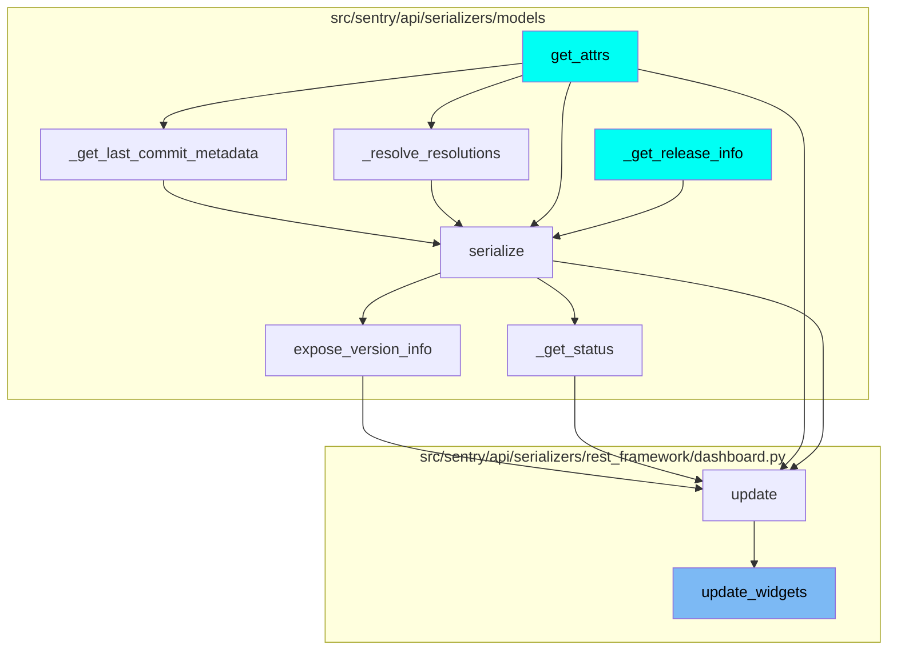
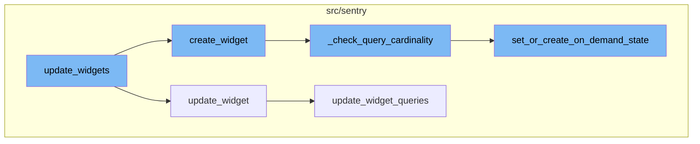

# Overview

The `update_widgets` function is a key part of the widget management system in Sentry. It is responsible for updating the state of widgets on a dashboard. This involves identifying existing widgets, removing any that are not in the current request, and updating or creating widgets based on the provided data.

<SwmSnippet path="/src/sentry/api/serializers/rest_framework/dashboard.py" line="556">

---

# update_widgets Function

The `update_widgets` function is the entry point of the flow. It takes an instance and widget data as parameters. It first identifies existing widgets and removes any that are not in the current request. Then, it iterates over the widget data. If the widget already exists, it updates it using the `update_widget` function. If the widget does not exist, it creates a new one using the `create_widget` function.

```python
    def update_widgets(self, instance, widget_data):
        widget_ids = [widget["id"] for widget in widget_data if "id" in widget]

        existing_widgets = DashboardWidget.objects.filter(dashboard=instance, id__in=widget_ids)
        existing_map = {widget.id: widget for widget in existing_widgets}

        # Remove widgets that are not in the current request.
        self.remove_missing_widgets(instance.id, widget_ids)

        # Get new ordering start point to avoid constraint errors
        next_order = get_next_dashboard_order(instance.id)

        for i, data in enumerate(widget_data):
            widget_id = data.get("id")
            if widget_id and widget_id in existing_map:
                # Update existing widget.
                self.update_widget(existing_map[widget_id], data, next_order + i)
            elif not widget_id:
                # Create a new widget.
                self.create_widget(instance, data, next_order + i)
            else:
```

---

</SwmSnippet>

<SwmSnippet path="/src/sentry/api/serializers/rest_framework/dashboard.py" line="644">

---

# update_widget Function

The `update_widget` function updates the properties of an existing widget. If the 'queries' property is present in the data, it calls the `update_widget_queries` function to update the widget's queries.

```python
    def update_widget(self, widget, data, order):
        prev_layout = widget.detail.get("layout") if widget.detail else None
        widget.title = data.get("title", widget.title)
        widget.description = data.get("description", widget.description)
        widget.thresholds = data.get("thresholds", widget.thresholds)
        widget.display_type = data.get("display_type", widget.display_type)
        widget.interval = data.get("interval", widget.interval)
        widget.widget_type = data.get("widget_type", widget.widget_type)
        widget.discover_widget_split = data.get(
            "discover_widget_split", widget.discover_widget_split
        )
        widget.order = order
        widget.limit = data.get("limit", widget.limit)
        widget.detail = {"layout": data.get("layout", prev_layout)}
        widget.save()

        if "queries" in data:
            self.update_widget_queries(widget, data["queries"])
```

---

</SwmSnippet>

<SwmSnippet path="/src/sentry/api/serializers/rest_framework/dashboard.py" line="587">

---

# create_widget Function

The `create_widget` function creates a new widget and its associated queries. If the widget type is 'DISCOVER', it checks the cardinality of the queries using the `_check_query_cardinality` function.

```python
    def create_widget(self, dashboard, widget_data, order):
        widget = DashboardWidget.objects.create(
            dashboard=dashboard,
            display_type=widget_data["display_type"],
            title=widget_data["title"],
            description=widget_data.get("description", None),
            thresholds=widget_data.get("thresholds", None),
            interval=widget_data.get("interval", "5m"),
            widget_type=widget_data.get("widget_type", DashboardWidgetTypes.DISCOVER),
            discover_widget_split=widget_data.get("discover_widget_split", None),
            order=order,
            limit=widget_data.get("limit", None),
            detail={"layout": widget_data.get("layout")},
        )

        new_queries = []
        for i, query in enumerate(widget_data.pop("queries")):
            new_queries.append(
                DashboardWidgetQuery(
                    widget=widget,
                    fields=query["fields"],
```

---

</SwmSnippet>

<SwmSnippet path="/src/sentry/api/serializers/rest_framework/dashboard.py" line="624">

---

# \_check_query_cardinality Function

The `_check_query_cardinality` function checks the cardinality of the queries. If the cardinality is within the allowed limit, it sets or creates the on-demand state of the queries using the `set_or_create_on_demand_state` function.

```python
    def _check_query_cardinality(self, new_queries: Sequence[DashboardWidgetQuery]):
        organization = self.context["organization"]

        max_cardinality_allowed = options.get("on_demand.max_widget_cardinality.on_query_count")
        # To match the format of the extraction state function in ondemand
        ondemand_feature = features.has(
            "organizations:on-demand-metrics-extraction-widgets", organization
        )
        current_widget_specs = get_current_widget_specs(organization)

        for new_query in new_queries:
            query_cardinality = all(
                check_field_cardinality(
                    new_query.columns, organization, max_cardinality_allowed
                ).values()
            )
            set_or_create_on_demand_state(
                new_query, organization, query_cardinality, ondemand_feature, current_widget_specs
            )
```

---

</SwmSnippet>

<SwmSnippet path="/src/sentry/tasks/on_demand_metrics.py" line="313">

---

# set_or_create_on_demand_state Function

The `set_or_create_on_demand_state` function sets or creates the on-demand state of the queries based on various conditions such as the number of specs, cardinality, and whether the feature is enabled.

```python
def set_or_create_on_demand_state(
    widget_query: DashboardWidgetQuery,
    organization: Organization,
    is_low_cardinality: bool,
    feature_enabled: bool,
    current_widget_specs: set[str],
) -> None:
    specs = _get_widget_on_demand_specs(widget_query, organization)

    specs_per_version: dict[int, list[HashedMetricSpec]] = {}
    for hash, spec, spec_version in specs:
        specs_per_version.setdefault(spec_version.version, [])
        specs_per_version[spec_version.version].append((hash, spec, spec_version))

    for spec_version in OnDemandMetricSpecVersioning.get_spec_versions():
        version = spec_version.version
        specs_for_version = specs_per_version.get(version, [])
        if not specs:
            extraction_state = OnDemandExtractionState.DISABLED_NOT_APPLICABLE
        elif widget_exceeds_max_specs(specs, current_widget_specs, organization):
            extraction_state = OnDemandExtractionState.DISABLED_SPEC_LIMIT
```

---

</SwmSnippet>

# Flow Usage

This flow is used multiple times in the codebase. Some of the entry points include functions like `get_attrs`, `_get_last_commit_metadata`, `serialize`, `expose_version_info`, and `update`.



# Flow drill down



<SwmSnippet path="/src/sentry/api/serializers/rest_framework/dashboard.py" line="556">

---

# update_widgets Function

The `update_widgets` function is the entry point of the flow. It takes an instance and widget data as parameters. It first identifies existing widgets and removes any that are not in the current request. Then, it iterates over the widget data. If the widget already exists, it updates it using the `update_widget` function. If the widget does not exist, it creates a new one using the `create_widget` function.

```python
    def update_widgets(self, instance, widget_data):
        widget_ids = [widget["id"] for widget in widget_data if "id" in widget]

        existing_widgets = DashboardWidget.objects.filter(dashboard=instance, id__in=widget_ids)
        existing_map = {widget.id: widget for widget in existing_widgets}

        # Remove widgets that are not in the current request.
        self.remove_missing_widgets(instance.id, widget_ids)

        # Get new ordering start point to avoid constraint errors
        next_order = get_next_dashboard_order(instance.id)

        for i, data in enumerate(widget_data):
            widget_id = data.get("id")
            if widget_id and widget_id in existing_map:
                # Update existing widget.
                self.update_widget(existing_map[widget_id], data, next_order + i)
            elif not widget_id:
                # Create a new widget.
                self.create_widget(instance, data, next_order + i)
            else:
```

---

</SwmSnippet>

<SwmSnippet path="/src/sentry/api/serializers/rest_framework/dashboard.py" line="644">

---

# update_widget Function

The `update_widget` function updates the properties of an existing widget. If the 'queries' property is present in the data, it calls the `update_widget_queries` function to update the widget's queries.

```python
    def update_widget(self, widget, data, order):
        prev_layout = widget.detail.get("layout") if widget.detail else None
        widget.title = data.get("title", widget.title)
        widget.description = data.get("description", widget.description)
        widget.thresholds = data.get("thresholds", widget.thresholds)
        widget.display_type = data.get("display_type", widget.display_type)
        widget.interval = data.get("interval", widget.interval)
        widget.widget_type = data.get("widget_type", widget.widget_type)
        widget.discover_widget_split = data.get(
            "discover_widget_split", widget.discover_widget_split
        )
        widget.order = order
        widget.limit = data.get("limit", widget.limit)
        widget.detail = {"layout": data.get("layout", prev_layout)}
        widget.save()

        if "queries" in data:
            self.update_widget_queries(widget, data["queries"])
```

---

</SwmSnippet>

<SwmSnippet path="/src/sentry/api/serializers/rest_framework/dashboard.py" line="587">

---

# create_widget Function

The `create_widget` function creates a new widget and its associated queries. If the widget type is 'DISCOVER', it checks the cardinality of the queries using the `_check_query_cardinality` function.

```python
    def create_widget(self, dashboard, widget_data, order):
        widget = DashboardWidget.objects.create(
            dashboard=dashboard,
            display_type=widget_data["display_type"],
            title=widget_data["title"],
            description=widget_data.get("description", None),
            thresholds=widget_data.get("thresholds", None),
            interval=widget_data.get("interval", "5m"),
            widget_type=widget_data.get("widget_type", DashboardWidgetTypes.DISCOVER),
            discover_widget_split=widget_data.get("discover_widget_split", None),
            order=order,
            limit=widget_data.get("limit", None),
            detail={"layout": widget_data.get("layout")},
        )

        new_queries = []
        for i, query in enumerate(widget_data.pop("queries")):
            new_queries.append(
                DashboardWidgetQuery(
                    widget=widget,
                    fields=query["fields"],
```

---

</SwmSnippet>

<SwmSnippet path="/src/sentry/api/serializers/rest_framework/dashboard.py" line="624">

---

# \_check_query_cardinality Function

The `_check_query_cardinality` function checks the cardinality of the queries. If the cardinality is within the allowed limit, it sets or creates the on-demand state of the queries using the `set_or_create_on_demand_state` function.

```python
    def _check_query_cardinality(self, new_queries: Sequence[DashboardWidgetQuery]):
        organization = self.context["organization"]

        max_cardinality_allowed = options.get("on_demand.max_widget_cardinality.on_query_count")
        # To match the format of the extraction state function in ondemand
        ondemand_feature = features.has(
            "organizations:on-demand-metrics-extraction-widgets", organization
        )
        current_widget_specs = get_current_widget_specs(organization)

        for new_query in new_queries:
            query_cardinality = all(
                check_field_cardinality(
                    new_query.columns, organization, max_cardinality_allowed
                ).values()
            )
            set_or_create_on_demand_state(
                new_query, organization, query_cardinality, ondemand_feature, current_widget_specs
            )
```

---

</SwmSnippet>

<SwmSnippet path="/src/sentry/tasks/on_demand_metrics.py" line="313">

---

# set_or_create_on_demand_state Function

The `set_or_create_on_demand_state` function sets or creates the on-demand state of the queries based on various conditions such as the number of specs, cardinality, and whether the feature is enabled.

```python
def set_or_create_on_demand_state(
    widget_query: DashboardWidgetQuery,
    organization: Organization,
    is_low_cardinality: bool,
    feature_enabled: bool,
    current_widget_specs: set[str],
) -> None:
    specs = _get_widget_on_demand_specs(widget_query, organization)

    specs_per_version: dict[int, list[HashedMetricSpec]] = {}
    for hash, spec, spec_version in specs:
        specs_per_version.setdefault(spec_version.version, [])
        specs_per_version[spec_version.version].append((hash, spec, spec_version))

    for spec_version in OnDemandMetricSpecVersioning.get_spec_versions():
        version = spec_version.version
        specs_for_version = specs_per_version.get(version, [])
        if not specs:
            extraction_state = OnDemandExtractionState.DISABLED_NOT_APPLICABLE
        elif widget_exceeds_max_specs(specs, current_widget_specs, organization):
            extraction_state = OnDemandExtractionState.DISABLED_SPEC_LIMIT
```

---

</SwmSnippet>

# Where is this flow used?

This flow is used multiple times in the codebase as represented in the following diagram:

(Note - these are only some of the entry points of this flow)


&nbsp;

*This is an auto-generated document by Swimm AI 🌊 and has not yet been verified by a human*

<SwmMeta version="3.0.0" repo-id="Z2l0aHViJTNBJTNBc2VudHJ5LWRlbW8lM0ElM0FTd2ltbS1EZW1v" repo-name="sentry-demo" doc-type="flows"><sup>Powered by [Swimm](/)</sup></SwmMeta>
