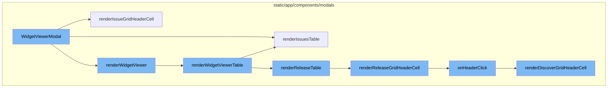
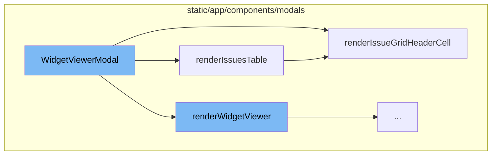
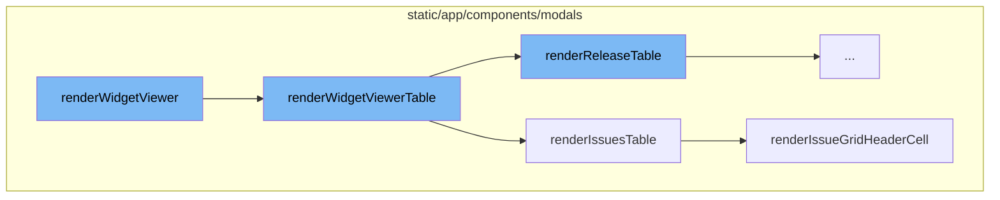
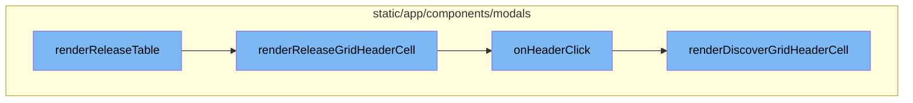

<SwmSnippet path="/static/app/components/modals/widgetViewerModal.tsx" line="167">

---

# WidgetViewerModal

The `WidgetViewerModal` function is the main entry point for the widget viewer modal. It takes in various properties and uses them to set up the state and behavior of the modal. It also sets up various hooks and state variables that are used throughout the modal's lifecycle.

```tsx
function WidgetViewerModal(props: Props) {
  const {
    organization,
    widget,
    selection,
    Footer,
    Body,
    Header,
    closeModal,
    onEdit,
    seriesData,
    tableData,
    totalIssuesCount,
    pageLinks: defaultPageLinks,
    seriesResultsType,
    dashboardFilters,
  } = props;
  const location = useLocation();
  const {projects} = useProjects();
  const router = useRouter();
  const shouldShowSlider = organization.features.includes('widget-viewer-modal-minimap');
```

---

</SwmSnippet>

<SwmSnippet path="/static/app/components/modals/widgetViewerModal.tsx" line="553">

---

## renderIssuesTable

`renderIssuesTable` is a function that renders the issues table in the widget viewer modal. It takes in the table results, loading state, page links, and total count as parameters. It sets up the grid editable component and handles pagination.

```tsx
  const renderIssuesTable = ({
    tableResults,
    loading,
    pageLinks,
    totalCount,
  }: GenericWidgetQueriesChildrenProps) => {
    if (totalResults === undefined && totalCount) {
      setTotalResults(totalCount);
    }
    const links = parseLinkHeader(pageLinks ?? null);
    return (
      <Fragment>
        <GridEditable
          isLoading={loading}
          data={tableResults?.[0]?.data ?? []}
          columnOrder={columnOrder}
          columnSortBy={columnSortBy}
          grid={{
            renderHeadCell: renderIssueGridHeaderCell({
              location,
              organization,
```

---

</SwmSnippet>

<SwmSnippet path="/static/app/components/modals/widgetViewerModal/widgetViewerTableCell.tsx" line="63">

---

## renderIssueGridHeaderCell

`renderIssueGridHeaderCell` is a function that renders the header cell of the issues grid. It takes in the location, widget, table data, organization, and a callback function for when the header is clicked. It returns a function that generates the header cell for each column in the grid.

```tsx
export const renderIssueGridHeaderCell = ({
  location,
  widget,
  tableData,
  organization,
  onHeaderClick,
}: Props) =>
  function (
    column: TableColumn<keyof TableDataRow>,
    _columnIndex: number
  ): React.ReactNode {
    const tableMeta = tableData?.meta;
    const align = fieldAlignment(column.name, column.type, tableMeta);
    const sortField = getSortField(String(column.key));

    return (
      <SortLink
        align={align}
        title={<StyledTooltip title={column.name}>{column.name}</StyledTooltip>}
        direction={widget.queries[0].orderby === sortField ? 'desc' : undefined}
        canSort={!!sortField}
```

---

</SwmSnippet>

<SwmSnippet path="/static/app/components/modals/widgetViewerModal.tsx" line="832">

---

# WidgetViewerModal Flow

The `renderWidgetViewer` function is the starting point of the flow. It is responsible for rendering the widget viewer, which is a modal that displays the data of a specific widget in a detailed view.

```tsx
  function renderWidgetViewer() {
    return (
      <Fragment>
        {hasSessionDuration && SESSION_DURATION_ALERT}
        {widget.displayType !== DisplayType.TABLE && (
          <Container
            height={
              widget.displayType !== DisplayType.BIG_NUMBER
                ? HALF_CONTAINER_HEIGHT +
                  (shouldShowSlider &&
                  [
                    DisplayType.AREA,
                    DisplayType.LINE,
                    DisplayType.BAR,
                    DisplayType.TOP_N,
                  ].includes(widget.displayType)
                    ? SLIDER_HEIGHT
                    : 0)
                : null
            }
          >
```

---

</SwmSnippet>

<SwmSnippet path="/static/app/components/modals/widgetViewerModal.tsx" line="736">

---

The `renderWidgetViewer` function calls `renderWidgetViewerTable` which is responsible for rendering the table view of the widget. It checks the widget type and based on that, it decides which table to render. For instance, if the widget type is 'ISSUE', it calls `renderIssuesTable`.

```tsx
  function renderWidgetViewerTable() {
    switch (widget.widgetType) {
      case WidgetType.ISSUE:
        if (tableData && chartUnmodified && widget.displayType === DisplayType.TABLE) {
          return renderIssuesTable({
            tableResults: tableData,
            loading: false,
            errorMessage: undefined,
            pageLinks: defaultPageLinks,
            totalCount: totalIssuesCount,
          });
        }
        return (
          <IssueWidgetQueries
            api={api}
            organization={organization}
            widget={tableWidget}
            selection={modalTableSelection}
            limit={
              widget.displayType === DisplayType.TABLE
                ? FULL_TABLE_ITEM_LIMIT
```

---

</SwmSnippet>

<SwmSnippet path="/static/app/components/modals/widgetViewerModal.tsx" line="553">

---

`renderIssuesTable` is a function that renders the issues table. It takes in the table results, loading status, page links, and total count as parameters. It also sets up pagination and tracks analytics for pagination events.

```tsx
  const renderIssuesTable = ({
    tableResults,
    loading,
    pageLinks,
    totalCount,
  }: GenericWidgetQueriesChildrenProps) => {
    if (totalResults === undefined && totalCount) {
      setTotalResults(totalCount);
    }
    const links = parseLinkHeader(pageLinks ?? null);
    return (
      <Fragment>
        <GridEditable
          isLoading={loading}
          data={tableResults?.[0]?.data ?? []}
          columnOrder={columnOrder}
          columnSortBy={columnSortBy}
          grid={{
            renderHeadCell: renderIssueGridHeaderCell({
              location,
              organization,
```

---

</SwmSnippet>

<SwmSnippet path="/static/app/components/modals/widgetViewerModal/widgetViewerTableCell.tsx" line="63">

---

The `renderIssueGridHeaderCell` function is used to render the header cell of the issues grid. It sets up the sorting functionality for the columns and tracks analytics for sort events.

```tsx
export const renderIssueGridHeaderCell = ({
  location,
  widget,
  tableData,
  organization,
  onHeaderClick,
}: Props) =>
  function (
    column: TableColumn<keyof TableDataRow>,
    _columnIndex: number
  ): React.ReactNode {
    const tableMeta = tableData?.meta;
    const align = fieldAlignment(column.name, column.type, tableMeta);
    const sortField = getSortField(String(column.key));

    return (
      <SortLink
        align={align}
        title={<StyledTooltip title={column.name}>{column.name}</StyledTooltip>}
        direction={widget.queries[0].orderby === sortField ? 'desc' : undefined}
        canSort={!!sortField}
```

---

</SwmSnippet>

<SwmSnippet path="/static/app/components/modals/widgetViewerModal.tsx" line="627">

---

# WidgetViewerModal Flow

The `renderReleaseTable` function is the starting point of the flow. It is responsible for rendering the table of releases. It uses the `GridEditable` component to display the data and passes the `renderReleaseGridHeaderCell` function as a prop to render the header cells of the table.

```tsx
  const renderReleaseTable: ReleaseWidgetQueries['props']['children'] = ({
    tableResults,
    loading,
    pageLinks,
  }) => {
    const links = parseLinkHeader(pageLinks ?? null);
    const isFirstPage = links.previous?.results === false;
    return (
      <Fragment>
        <GridEditable
          isLoading={loading}
          data={tableResults?.[0]?.data ?? []}
          columnOrder={columnOrder}
          columnSortBy={columnSortBy}
          grid={{
            renderHeadCell: renderReleaseGridHeaderCell({
              ...props,
              location,
              widget: tableWidget,
              tableData: tableResults?.[0],
              onHeaderClick: () => {
```

---

</SwmSnippet>

<SwmSnippet path="/static/app/components/modals/widgetViewerModal/widgetViewerTableCell.tsx" line="308">

---

The `renderReleaseGridHeaderCell` function is used to render the header cells of the release table. It creates a `SortLink` component for each cell, which allows the user to sort the table by clicking on the header cell. The `onHeaderClick` function is called when the header cell is clicked.

```tsx
export const renderReleaseGridHeaderCell = ({
  location,
  widget,
  tableData,
  organization,
  onHeaderClick,
}: Props) =>
  function (
    column: TableColumn<keyof TableDataRow>,
    _columnIndex: number
  ): React.ReactNode {
    const tableMeta = tableData?.meta;
    const align = fieldAlignment(column.name, column.type, tableMeta);
    const widgetOrderBy = widget.queries[0].orderby;
    const sort: Sort = {
      kind: widgetOrderBy.startsWith('-') ? 'desc' : 'asc',
      field: widgetOrderBy.startsWith('-') ? widgetOrderBy.slice(1) : widgetOrderBy,
    };
    const canSort = isAggregateField(column.name);
    const titleText = column.name;

```

---

</SwmSnippet>

<SwmSnippet path="/static/app/components/modals/widgetViewerModal.tsx" line="504">

---

The `onHeaderClick` function is triggered when a header cell is clicked. It checks if the widget's display type is either `TOP_N` or `TABLE`, or if the widget has a limit defined. If any of these conditions are met, it sets the chart to be modifiable.

```tsx
              onHeaderClick: () => {
                if (
                  [DisplayType.TOP_N, DisplayType.TABLE].includes(widget.displayType) ||
                  defined(widget.limit)
                ) {
                  setChartUnmodified(false);
                }
              },
```

---

</SwmSnippet>

<SwmSnippet path="/static/app/components/modals/widgetViewerModal/widgetViewerTableCell.tsx" line="107">

---

Finally, the `renderDiscoverGridHeaderCell` function is used to render the header cells for the Discover table. Similar to the `renderReleaseGridHeaderCell` function, it creates a `SortLink` component for each cell, allowing the user to sort the table by clicking on the header cell. The `onHeaderClick` function is also called when the header cell is clicked.

```tsx
export const renderDiscoverGridHeaderCell = ({
  location,
  selection,
  widget,
  tableData,
  organization,
  onHeaderClick,
  isMetricsData,
}: Props) =>
  function (
    column: TableColumn<keyof TableDataRow>,
    _columnIndex: number
  ): React.ReactNode {
    const {orderby} = widget.queries[0];
    // Need to convert orderby to aggregate alias because eventView still uses aggregate alias format
    const aggregateAliasOrderBy = `${
      orderby.startsWith('-') ? '-' : ''
    }${getAggregateAlias(trimStart(orderby, '-'))}`;
    const eventView = eventViewFromWidget(
      widget.title,
      {...widget.queries[0], orderby: aggregateAliasOrderBy},
```

---

</SwmSnippet>



# Flow drill down

First, we'll zoom into this section of the flow:



<SwmSnippet path="/static/app/components/modals/widgetViewerModal.tsx" line="167">

---

# WidgetViewerModal

The `WidgetViewerModal` function is the main entry point for the widget viewer modal. It takes in various properties and uses them to set up the state and behavior of the modal. It also sets up various hooks and state variables that are used throughout the modal's lifecycle.

```tsx
function WidgetViewerModal(props: Props) {
  const {
    organization,
    widget,
    selection,
    Footer,
    Body,
    Header,
    closeModal,
    onEdit,
    seriesData,
    tableData,
    totalIssuesCount,
    pageLinks: defaultPageLinks,
    seriesResultsType,
    dashboardFilters,
  } = props;
  const location = useLocation();
  const {projects} = useProjects();
  const router = useRouter();
  const shouldShowSlider = organization.features.includes('widget-viewer-modal-minimap');
```

---

</SwmSnippet>

<SwmSnippet path="/static/app/components/modals/widgetViewerModal.tsx" line="553">

---

## renderIssuesTable

`renderIssuesTable` is a function that renders the issues table in the widget viewer modal. It takes in the table results, loading state, page links, and total count as parameters. It sets up the grid editable component and handles pagination.

```tsx
  const renderIssuesTable = ({
    tableResults,
    loading,
    pageLinks,
    totalCount,
  }: GenericWidgetQueriesChildrenProps) => {
    if (totalResults === undefined && totalCount) {
      setTotalResults(totalCount);
    }
    const links = parseLinkHeader(pageLinks ?? null);
    return (
      <Fragment>
        <GridEditable
          isLoading={loading}
          data={tableResults?.[0]?.data ?? []}
          columnOrder={columnOrder}
          columnSortBy={columnSortBy}
          grid={{
            renderHeadCell: renderIssueGridHeaderCell({
              location,
              organization,
```

---

</SwmSnippet>

<SwmSnippet path="/static/app/components/modals/widgetViewerModal/widgetViewerTableCell.tsx" line="63">

---

## renderIssueGridHeaderCell

`renderIssueGridHeaderCell` is a function that renders the header cell of the issues grid. It takes in the location, widget, table data, organization, and a callback function for when the header is clicked. It returns a function that generates the header cell for each column in the grid.

```tsx
export const renderIssueGridHeaderCell = ({
  location,
  widget,
  tableData,
  organization,
  onHeaderClick,
}: Props) =>
  function (
    column: TableColumn<keyof TableDataRow>,
    _columnIndex: number
  ): React.ReactNode {
    const tableMeta = tableData?.meta;
    const align = fieldAlignment(column.name, column.type, tableMeta);
    const sortField = getSortField(String(column.key));

    return (
      <SortLink
        align={align}
        title={<StyledTooltip title={column.name}>{column.name}</StyledTooltip>}
        direction={widget.queries[0].orderby === sortField ? 'desc' : undefined}
        canSort={!!sortField}
```

---

</SwmSnippet>

Now, lets zoom into this section of the flow:



<SwmSnippet path="/static/app/components/modals/widgetViewerModal.tsx" line="832">

---

# WidgetViewerModal Flow

The `renderWidgetViewer` function is the starting point of the flow. It is responsible for rendering the widget viewer, which is a modal that displays the data of a specific widget in a detailed view.

```tsx
  function renderWidgetViewer() {
    return (
      <Fragment>
        {hasSessionDuration && SESSION_DURATION_ALERT}
        {widget.displayType !== DisplayType.TABLE && (
          <Container
            height={
              widget.displayType !== DisplayType.BIG_NUMBER
                ? HALF_CONTAINER_HEIGHT +
                  (shouldShowSlider &&
                  [
                    DisplayType.AREA,
                    DisplayType.LINE,
                    DisplayType.BAR,
                    DisplayType.TOP_N,
                  ].includes(widget.displayType)
                    ? SLIDER_HEIGHT
                    : 0)
                : null
            }
          >
```

---

</SwmSnippet>

<SwmSnippet path="/static/app/components/modals/widgetViewerModal.tsx" line="736">

---

The `renderWidgetViewer` function calls `renderWidgetViewerTable` which is responsible for rendering the table view of the widget. It checks the widget type and based on that, it decides which table to render. For instance, if the widget type is 'ISSUE', it calls `renderIssuesTable`.

```tsx
  function renderWidgetViewerTable() {
    switch (widget.widgetType) {
      case WidgetType.ISSUE:
        if (tableData && chartUnmodified && widget.displayType === DisplayType.TABLE) {
          return renderIssuesTable({
            tableResults: tableData,
            loading: false,
            errorMessage: undefined,
            pageLinks: defaultPageLinks,
            totalCount: totalIssuesCount,
          });
        }
        return (
          <IssueWidgetQueries
            api={api}
            organization={organization}
            widget={tableWidget}
            selection={modalTableSelection}
            limit={
              widget.displayType === DisplayType.TABLE
                ? FULL_TABLE_ITEM_LIMIT
```

---

</SwmSnippet>

<SwmSnippet path="/static/app/components/modals/widgetViewerModal.tsx" line="553">

---

`renderIssuesTable` is a function that renders the issues table. It takes in the table results, loading status, page links, and total count as parameters. It also sets up pagination and tracks analytics for pagination events.

```tsx
  const renderIssuesTable = ({
    tableResults,
    loading,
    pageLinks,
    totalCount,
  }: GenericWidgetQueriesChildrenProps) => {
    if (totalResults === undefined && totalCount) {
      setTotalResults(totalCount);
    }
    const links = parseLinkHeader(pageLinks ?? null);
    return (
      <Fragment>
        <GridEditable
          isLoading={loading}
          data={tableResults?.[0]?.data ?? []}
          columnOrder={columnOrder}
          columnSortBy={columnSortBy}
          grid={{
            renderHeadCell: renderIssueGridHeaderCell({
              location,
              organization,
```

---

</SwmSnippet>

<SwmSnippet path="/static/app/components/modals/widgetViewerModal/widgetViewerTableCell.tsx" line="63">

---

The `renderIssueGridHeaderCell` function is used to render the header cell of the issues grid. It sets up the sorting functionality for the columns and tracks analytics for sort events.

```tsx
export const renderIssueGridHeaderCell = ({
  location,
  widget,
  tableData,
  organization,
  onHeaderClick,
}: Props) =>
  function (
    column: TableColumn<keyof TableDataRow>,
    _columnIndex: number
  ): React.ReactNode {
    const tableMeta = tableData?.meta;
    const align = fieldAlignment(column.name, column.type, tableMeta);
    const sortField = getSortField(String(column.key));

    return (
      <SortLink
        align={align}
        title={<StyledTooltip title={column.name}>{column.name}</StyledTooltip>}
        direction={widget.queries[0].orderby === sortField ? 'desc' : undefined}
        canSort={!!sortField}
```

---

</SwmSnippet>

Now, lets zoom into this section of the flow:



<SwmSnippet path="/static/app/components/modals/widgetViewerModal.tsx" line="627">

---

# WidgetViewerModal Flow

The `renderReleaseTable` function is the starting point of the flow. It is responsible for rendering the table of releases. It uses the `GridEditable` component to display the data and passes the `renderReleaseGridHeaderCell` function as a prop to render the header cells of the table.

```tsx
  const renderReleaseTable: ReleaseWidgetQueries['props']['children'] = ({
    tableResults,
    loading,
    pageLinks,
  }) => {
    const links = parseLinkHeader(pageLinks ?? null);
    const isFirstPage = links.previous?.results === false;
    return (
      <Fragment>
        <GridEditable
          isLoading={loading}
          data={tableResults?.[0]?.data ?? []}
          columnOrder={columnOrder}
          columnSortBy={columnSortBy}
          grid={{
            renderHeadCell: renderReleaseGridHeaderCell({
              ...props,
              location,
              widget: tableWidget,
              tableData: tableResults?.[0],
              onHeaderClick: () => {
```

---

</SwmSnippet>

<SwmSnippet path="/static/app/components/modals/widgetViewerModal/widgetViewerTableCell.tsx" line="308">

---

The `renderReleaseGridHeaderCell` function is used to render the header cells of the release table. It creates a `SortLink` component for each cell, which allows the user to sort the table by clicking on the header cell. The `onHeaderClick` function is called when the header cell is clicked.

```tsx
export const renderReleaseGridHeaderCell = ({
  location,
  widget,
  tableData,
  organization,
  onHeaderClick,
}: Props) =>
  function (
    column: TableColumn<keyof TableDataRow>,
    _columnIndex: number
  ): React.ReactNode {
    const tableMeta = tableData?.meta;
    const align = fieldAlignment(column.name, column.type, tableMeta);
    const widgetOrderBy = widget.queries[0].orderby;
    const sort: Sort = {
      kind: widgetOrderBy.startsWith('-') ? 'desc' : 'asc',
      field: widgetOrderBy.startsWith('-') ? widgetOrderBy.slice(1) : widgetOrderBy,
    };
    const canSort = isAggregateField(column.name);
    const titleText = column.name;

```

---

</SwmSnippet>

<SwmSnippet path="/static/app/components/modals/widgetViewerModal.tsx" line="504">

---

The `onHeaderClick` function is triggered when a header cell is clicked. It checks if the widget's display type is either `TOP_N` or `TABLE`, or if the widget has a limit defined. If any of these conditions are met, it sets the chart to be modifiable.

```tsx
              onHeaderClick: () => {
                if (
                  [DisplayType.TOP_N, DisplayType.TABLE].includes(widget.displayType) ||
                  defined(widget.limit)
                ) {
                  setChartUnmodified(false);
                }
              },
```

---

</SwmSnippet>

<SwmSnippet path="/static/app/components/modals/widgetViewerModal/widgetViewerTableCell.tsx" line="107">

---

Finally, the `renderDiscoverGridHeaderCell` function is used to render the header cells for the Discover table. Similar to the `renderReleaseGridHeaderCell` function, it creates a `SortLink` component for each cell, allowing the user to sort the table by clicking on the header cell. The `onHeaderClick` function is also called when the header cell is clicked.

```tsx
export const renderDiscoverGridHeaderCell = ({
  location,
  selection,
  widget,
  tableData,
  organization,
  onHeaderClick,
  isMetricsData,
}: Props) =>
  function (
    column: TableColumn<keyof TableDataRow>,
    _columnIndex: number
  ): React.ReactNode {
    const {orderby} = widget.queries[0];
    // Need to convert orderby to aggregate alias because eventView still uses aggregate alias format
    const aggregateAliasOrderBy = `${
      orderby.startsWith('-') ? '-' : ''
    }${getAggregateAlias(trimStart(orderby, '-'))}`;
    const eventView = eventViewFromWidget(
      widget.title,
      {...widget.queries[0], orderby: aggregateAliasOrderBy},
```

---

</SwmSnippet>

&nbsp;

*This is an auto-generated document by Swimm AI 🌊 and has not yet been verified by a human*

<SwmMeta version="3.0.0" repo-id="Z2l0aHViJTNBJTNBc2VudHJ5LWRlbW8lM0ElM0FTd2ltbS1EZW1v" repo-name="sentry-demo" doc-type="flows"><sup>Powered by [Swimm](/)</sup></SwmMeta>
