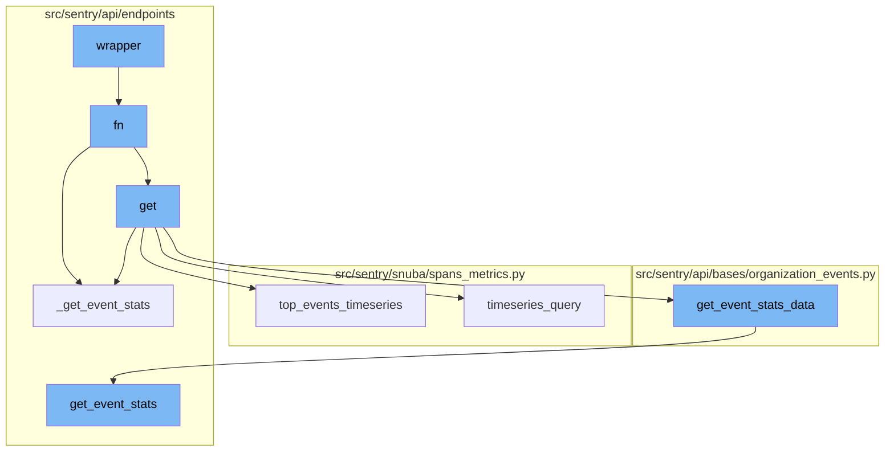
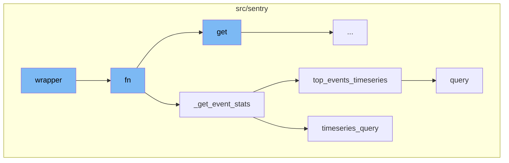
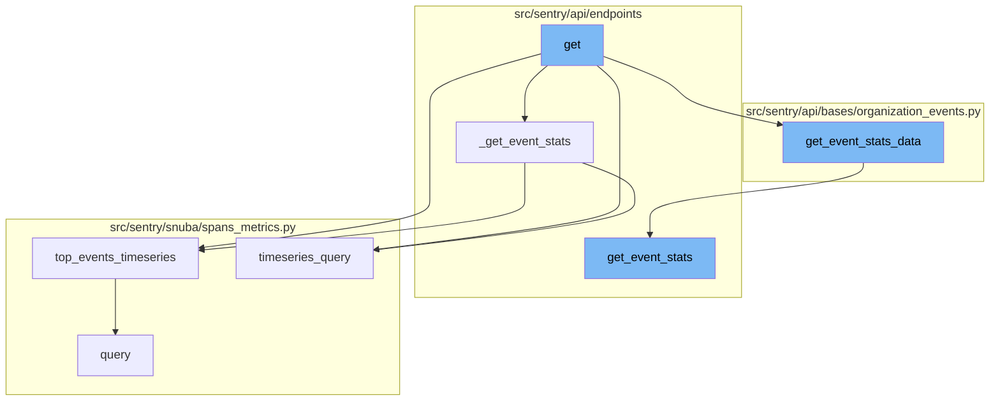

# Wrapper

A wrapper, in the context of programming, is a function or a piece of code that provides a compatibility layer between two functions or pieces of code. It's a type of software design pattern that encapsulates (wraps) functions or classes to add additional functionalities, modify behaviors, or handle inputs/outputs between them. In the sentry-demo project, the term 'wrapper' is used to refer to a function that takes another function as an argument, and extends or alters the behavior of the latter function without explicitly modifying it.

<SwmSnippet path="/src/sentry_plugins/amazon_sqs/plugin.py" line="33">

---

## Wrapper Function

The `wrapper` function is a higher-order function that takes in any function `fn` and its arguments, and executes it. It tracks the success of the function execution and increments a metric accordingly. If an exception occurs during the execution of `fn`, it increments a failure metric and rethrows the exception.

```python
    def wrapper(*args, **kwargs):
        try:
            success = fn(*args, **kwargs)
            metrics.incr(
                "data-forwarding.http_response", tags={"plugin": "amazon-sqs", "success": success}
            )
        except Exception:
            metrics.incr(
                "data-forwarding.http_response", tags={"plugin": "amazon-sqs", "success": False}
            )
            raise
        return success
```

---

</SwmSnippet>

<SwmSnippet path="/src/sentry/api/endpoints/organization_events_stats.py" line="316">

---

## Function fn

`fn` is a function that performs a complex operation of fetching event statistics. It takes in several parameters including query columns, query string, parameters, rollup, and others. Depending on certain conditions, it calls the `_get_event_stats` function with different arguments. It also handles exceptions and returns the result of the `_get_event_stats` function.

```python
            def fn(
                query_columns: Sequence[str],
                query: str,
                params: dict[str, str],
                rollup: int,
                zerofill_results: bool,
                comparison_delta: datetime | None,
            ) -> SnubaTSResult | dict[str, SnubaTSResult]:

                if not (metrics_enhanced and dashboard_widget_id):
                    return _get_event_stats(
                        scoped_dataset,
                        query_columns,
                        query,
                        params,
                        rollup,
                        zerofill_results,
                        comparison_delta,
                    )

                try:
```

---

</SwmSnippet>

<SwmSnippet path="/src/sentry/api/endpoints/organization_events_stats.py" line="254">

---

## Function \_get_event_stats

`_get_event_stats` is a function that fetches event statistics based on the provided parameters. If the `top_events` parameter is greater than 0, it calls the `top_events_timeseries` function, otherwise, it calls the `timeseries_query` function.

```python
        def _get_event_stats(
            scoped_dataset: Any,
            query_columns: Sequence[str],
            query: str,
            params: dict[str, str],
            rollup: int,
            zerofill_results: bool,
            comparison_delta: datetime | None,
        ) -> SnubaTSResult | dict[str, SnubaTSResult]:
            if top_events > 0:
                return scoped_dataset.top_events_timeseries(
                    timeseries_columns=query_columns,
                    selected_columns=self.get_field_list(organization, request),
                    equations=self.get_equation_list(organization, request),
                    user_query=query,
                    params=params,
                    orderby=self.get_orderby(request),
                    rollup=rollup,
                    limit=top_events,
                    organization=organization,
                    referrer=referrer + ".find-topn",
```

---

</SwmSnippet>

<SwmSnippet path="/src/sentry/snuba/spans_metrics.py" line="138">

---

## Function top_events_timeseries

`top_events_timeseries` is a function that performs a timeseries query for a limited number of top events. It returns a dictionary of `SnubaTSResult` objects that have been zerofilled in case of gaps.

```python
def top_events_timeseries(
    timeseries_columns,
    selected_columns,
    user_query,
    params,
    orderby,
    rollup,
    limit,
    organization,
    equations=None,
    referrer=None,
    top_events=None,
    allow_empty=True,
    zerofill_results=True,
    include_other=False,
    functions_acl=None,
    on_demand_metrics_enabled=False,
    on_demand_metrics_type: MetricSpecType | None = None,
):
    """
    High-level API for doing arbitrary user timeseries queries for a limited number of top events
```

---

</SwmSnippet>

<SwmSnippet path="/src/sentry/snuba/spans_metrics.py" line="76">

---

## Function timeseries_query

`timeseries_query` is a function that performs arbitrary user timeseries queries against events. It returns a `SnubaTSResult` object.

```python
def timeseries_query(
    selected_columns: Sequence[str],
    query: str,
    params: dict[str, str],
    rollup: int,
    referrer: str,
    zerofill_results: bool = True,
    allow_metric_aggregates=True,
    comparison_delta: timedelta | None = None,
    functions_acl: list[str] | None = None,
    has_metrics: bool = True,
    use_metrics_layer: bool = False,
    on_demand_metrics_enabled: bool = False,
    on_demand_metrics_type: MetricSpecType | None = None,
    groupby: Column | None = None,
) -> SnubaTSResult:
    """
    High-level API for doing arbitrary user timeseries queries against events.
    this API should match that of sentry.snuba.discover.timeseries_query
    """
    metrics_query = TimeseriesSpansMetricsQueryBuilder(
```

---

</SwmSnippet>



# Flow drill down

First, we'll zoom into this section of the flow:



<SwmSnippet path="/src/sentry_plugins/amazon_sqs/plugin.py" line="33">

---

# Wrapper Function

The `wrapper` function is a higher-order function that takes in any function `fn` and its arguments, and executes it. It tracks the success of the function execution and increments a metric accordingly. If an exception occurs during the execution of `fn`, it increments a failure metric and rethrows the exception.

```python
    def wrapper(*args, **kwargs):
        try:
            success = fn(*args, **kwargs)
            metrics.incr(
                "data-forwarding.http_response", tags={"plugin": "amazon-sqs", "success": success}
            )
        except Exception:
            metrics.incr(
                "data-forwarding.http_response", tags={"plugin": "amazon-sqs", "success": False}
            )
            raise
        return success
```

---

</SwmSnippet>

<SwmSnippet path="/src/sentry/api/endpoints/organization_events_stats.py" line="316">

---

# Function fn

`fn` is a function that performs a complex operation of fetching event statistics. It takes in several parameters including query columns, query string, parameters, rollup, and others. Depending on certain conditions, it calls the `_get_event_stats` function with different arguments. It also handles exceptions and returns the result of the `_get_event_stats` function.

```python
            def fn(
                query_columns: Sequence[str],
                query: str,
                params: dict[str, str],
                rollup: int,
                zerofill_results: bool,
                comparison_delta: datetime | None,
            ) -> SnubaTSResult | dict[str, SnubaTSResult]:

                if not (metrics_enhanced and dashboard_widget_id):
                    return _get_event_stats(
                        scoped_dataset,
                        query_columns,
                        query,
                        params,
                        rollup,
                        zerofill_results,
                        comparison_delta,
                    )

                try:
```

---

</SwmSnippet>

<SwmSnippet path="/src/sentry/api/endpoints/organization_events_stats.py" line="254">

---

# Function \_get_event_stats

`_get_event_stats` is a function that fetches event statistics based on the provided parameters. If the `top_events` parameter is greater than 0, it calls the `top_events_timeseries` function, otherwise, it calls the `timeseries_query` function.

```python
        def _get_event_stats(
            scoped_dataset: Any,
            query_columns: Sequence[str],
            query: str,
            params: dict[str, str],
            rollup: int,
            zerofill_results: bool,
            comparison_delta: datetime | None,
        ) -> SnubaTSResult | dict[str, SnubaTSResult]:
            if top_events > 0:
                return scoped_dataset.top_events_timeseries(
                    timeseries_columns=query_columns,
                    selected_columns=self.get_field_list(organization, request),
                    equations=self.get_equation_list(organization, request),
                    user_query=query,
                    params=params,
                    orderby=self.get_orderby(request),
                    rollup=rollup,
                    limit=top_events,
                    organization=organization,
                    referrer=referrer + ".find-topn",
```

---

</SwmSnippet>

<SwmSnippet path="/src/sentry/snuba/spans_metrics.py" line="138">

---

# Function top_events_timeseries

`top_events_timeseries` is a function that performs a timeseries query for a limited number of top events. It returns a dictionary of `SnubaTSResult` objects that have been zerofilled in case of gaps.

```python
def top_events_timeseries(
    timeseries_columns,
    selected_columns,
    user_query,
    params,
    orderby,
    rollup,
    limit,
    organization,
    equations=None,
    referrer=None,
    top_events=None,
    allow_empty=True,
    zerofill_results=True,
    include_other=False,
    functions_acl=None,
    on_demand_metrics_enabled=False,
    on_demand_metrics_type: MetricSpecType | None = None,
):
    """
    High-level API for doing arbitrary user timeseries queries for a limited number of top events
```

---

</SwmSnippet>

<SwmSnippet path="/src/sentry/snuba/spans_metrics.py" line="76">

---

# Function timeseries_query

`timeseries_query` is a function that performs arbitrary user timeseries queries against events. It returns a `SnubaTSResult` object.

```python
def timeseries_query(
    selected_columns: Sequence[str],
    query: str,
    params: dict[str, str],
    rollup: int,
    referrer: str,
    zerofill_results: bool = True,
    allow_metric_aggregates=True,
    comparison_delta: timedelta | None = None,
    functions_acl: list[str] | None = None,
    has_metrics: bool = True,
    use_metrics_layer: bool = False,
    on_demand_metrics_enabled: bool = False,
    on_demand_metrics_type: MetricSpecType | None = None,
    groupby: Column | None = None,
) -> SnubaTSResult:
    """
    High-level API for doing arbitrary user timeseries queries against events.
    this API should match that of sentry.snuba.discover.timeseries_query
    """
    metrics_query = TimeseriesSpansMetricsQueryBuilder(
```

---

</SwmSnippet>

Now, lets zoom into this section of the flow:



<SwmSnippet path="/src/sentry/api/endpoints/organization_events_stats.py" line="167">

---

# Wrapper Flow

The wrapper flow starts with the `get` function in the `organization_events_stats.py` file. This function is responsible for handling the request and organization parameters and returning a response.

```python
    def get(self, request: Request, organization: Organization) -> Response:
        with sentry_sdk.start_span(op="discover.endpoint", description="filter_params") as span:
            span.set_data("organization", organization)

            top_events = 0

            if "topEvents" in request.GET:
                try:
                    top_events = int(request.GET.get("topEvents", 0))
                except ValueError:
                    return Response({"detail": "topEvents must be an integer"}, status=400)
                if top_events > MAX_TOP_EVENTS:
                    return Response(
                        {"detail": f"Can only get up to {MAX_TOP_EVENTS} top events"},
                        status=400,
                    )
                elif top_events <= 0:
                    return Response({"detail": "If topEvents needs to be at least 1"}, status=400)

            comparison_delta = None
            if "comparisonDelta" in request.GET:
```

---

</SwmSnippet>

<SwmSnippet path="/src/sentry/api/bases/organization_events.py" line="421">

---

# Get Event Stats Data

The `get_event_stats_data` function is called within the `get` function. This function is responsible for fetching event statistics data. It takes several parameters including the request, organization, and a callable `get_event_stats` function.

```python
    def get_event_stats_data(
        self,
        request: Request,
        organization: Organization,
        get_event_stats: Callable[
            [Sequence[str], str, dict[str, str], int, bool, timedelta | None], SnubaTSResult
        ],
        top_events: int = 0,
        query_column: str = "count()",
        params: ParamsType | None = None,
        query: str | None = None,
        allow_partial_buckets: bool = False,
        zerofill_results: bool = True,
        comparison_delta: timedelta | None = None,
        additional_query_column: str | None = None,
        dataset: Any | None = None,
    ) -> dict[str, Any]:
        with handle_query_errors():
            with sentry_sdk.start_span(
                op="discover.endpoint", description="base.stats_query_creation"
            ):
```

---

</SwmSnippet>

<SwmSnippet path="/src/sentry/api/endpoints/organization_profiling_functions.py" line="115">

---

# Get Event Stats

The `get_event_stats` function is used to fetch event statistics. It calculates the rollup from the range of the parameters and then builds a query to fetch the data.

```python
        def get_event_stats(_columns, query, params, _rollup, zerofill_results, _comparison_delta):
            rollup = get_rollup_from_range(params["end"] - params["start"])

            chunks = [
                top_functions["data"][i : i + FUNCTIONS_PER_QUERY]
                for i in range(0, len(top_functions["data"]), FUNCTIONS_PER_QUERY)
            ]

            builders = [
                ProfileTopFunctionsTimeseriesQueryBuilder(
                    dataset=Dataset.Functions,
                    params=params,
                    interval=rollup,
                    top_events=chunk,
                    other=False,
                    query=query,
                    selected_columns=["project.id", "fingerprint"],
                    # It's possible to override the columns via
                    # the `yAxis` qs. So we explicitly ignore the
                    # columns, and hard code in the columns we want.
                    timeseries_columns=[data["function"], "examples()"],
```

---

</SwmSnippet>

<SwmSnippet path="/src/sentry/snuba/spans_metrics.py" line="138">

---

# Top Events Timeseries

The `top_events_timeseries` function is called within the `_get_event_stats` function. This function is responsible for doing arbitrary user timeseries queries for a limited number of top events.

```python
def top_events_timeseries(
    timeseries_columns,
    selected_columns,
    user_query,
    params,
    orderby,
    rollup,
    limit,
    organization,
    equations=None,
    referrer=None,
    top_events=None,
    allow_empty=True,
    zerofill_results=True,
    include_other=False,
    functions_acl=None,
    on_demand_metrics_enabled=False,
    on_demand_metrics_type: MetricSpecType | None = None,
):
    """
    High-level API for doing arbitrary user timeseries queries for a limited number of top events
```

---

</SwmSnippet>

<SwmSnippet path="/src/sentry/snuba/spans_metrics.py" line="76">

---

# Timeseries Query

The `timeseries_query` function is used to perform arbitrary user timeseries queries against events. It is called within the `_get_event_stats` function when the number of top events is not greater than 0.

```python
def timeseries_query(
    selected_columns: Sequence[str],
    query: str,
    params: dict[str, str],
    rollup: int,
    referrer: str,
    zerofill_results: bool = True,
    allow_metric_aggregates=True,
    comparison_delta: timedelta | None = None,
    functions_acl: list[str] | None = None,
    has_metrics: bool = True,
    use_metrics_layer: bool = False,
    on_demand_metrics_enabled: bool = False,
    on_demand_metrics_type: MetricSpecType | None = None,
    groupby: Column | None = None,
) -> SnubaTSResult:
    """
    High-level API for doing arbitrary user timeseries queries against events.
    this API should match that of sentry.snuba.discover.timeseries_query
    """
    metrics_query = TimeseriesSpansMetricsQueryBuilder(
```

---

</SwmSnippet>

&nbsp;

*This is an auto-generated document by Swimm AI 🌊 and has not yet been verified by a human*

<SwmMeta version="3.0.0" repo-id="Z2l0aHViJTNBJTNBc2VudHJ5LWRlbW8lM0ElM0FTd2ltbS1EZW1v" repo-name="sentry-demo" doc-type="flows"><sup>Powered by [Swimm](/)</sup></SwmMeta>
