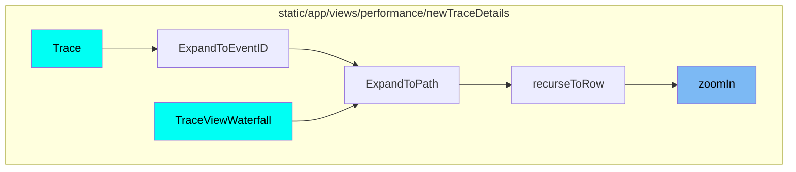
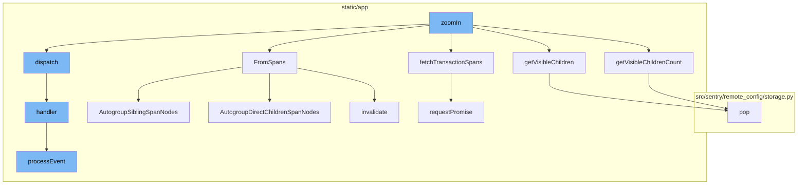

# Overview

The `zoomIn` function is a key part of the Sentry application's performance monitoring capabilities. It is used to focus on specific nodes within a trace tree, allowing developers to examine the performance of individual transactions in detail.

<SwmSnippet path="/static/app/views/performance/newTraceDetails/traceModels/traceTree.tsx" line="1460">

---

# zoomIn Function

The `zoomIn` function is a method in the `TraceTree` class. It takes a node, a boolean `zoomedIn`, and an options object as parameters. The function checks if the node is already zoomed in. If it is, it returns a resolved promise with null. If not, it checks if the node is in the list. If it's not in the list, it returns a resolved promise with null. If it is in the list, it gets the count of visible children, removes them from the list, and sets the node's `zoomedIn` property. If the node is expanded, it adds the visible children back to the list. If the node needs to be zoomed in, it fetches the transaction spans and updates the node's `fetchStatus` to 'loading'. Once the promise is resolved, it updates the node's `fetchStatus` to 'resolved', removes existing entries from the list, sorts the spans data, and updates the space of the tree and the trace root node. It then gets the visible children of the node and adds them to the list. The function finally returns the promise.

```tsx
  zoomIn(
    node: TraceTreeNode<TraceTree.NodeValue>,
    zoomedIn: boolean,
    options: {
      api: Client;
      organization: Organization;
    }
  ): Promise<Event | null> {
    if (zoomedIn === node.zoomedIn) {
      return Promise.resolve(null);
    }

    if (!zoomedIn) {
      const index = this._list.indexOf(node);

      if (index === -1) {
        return Promise.resolve(null);
      }

      const childrenCount = node.getVisibleChildrenCount();
      this._list.splice(index + 1, childrenCount);
```

---

</SwmSnippet>

<SwmSnippet path="/static/app/views/performance/newTraceDetails/traceModels/traceTree.tsx" line="204">

---

# fetchTransactionSpans Function

The `fetchTransactionSpans` function is used to fetch the transaction spans from the API. It takes an API client, an organization, a project slug, and an event id as parameters. It returns a promise that resolves to the transaction spans.

```tsx
function fetchTransactionSpans(
  api: Client,
  organization: Organization,
  project_slug: string,
  event_id: string
): Promise<EventTransaction> {
  return api.requestPromise(
    `/organizations/${organization.slug}/events/${project_slug}:${event_id}/?averageColumn=span.self_time&averageColumn=span.duration`
  );
}
```

---

</SwmSnippet>

<SwmSnippet path="/static/app/views/performance/newTraceDetails/traceModels/traceTree.tsx" line="804">

---

# FromSpans Function

The `FromSpans` function is a static method in the `TraceTree` class. It takes a parent node, data, spans, and options as parameters. The function invalidates the parent node, checks if the parent node is a span node, and creates a lookup table. It then loops through the spans, creates a new node for each span, and adds it to the lookup table. If the span has a parent span id, it sets the parent of the node to the parent span node. If not, it adds the node to the parent's children. The function then autogroups sibling span nodes and direct children span nodes, and returns the parent node and the minimum and maximum span timestamps.

```tsx
  static FromSpans(
    parent: TraceTreeNode<TraceTree.NodeValue>,
    data: Event,
    spans: RawSpanType[],
    options: {sdk: string | undefined} | undefined
  ): [TraceTreeNode<TraceTree.NodeValue>, [number, number] | null] {
    parent.invalidate(parent);
    const platformHasMissingSpans = shouldAddMissingInstrumentationSpan(options?.sdk);

    let min_span_start = Number.POSITIVE_INFINITY;
    let min_span_end = Number.NEGATIVE_INFINITY;

    const parentIsSpan = isSpanNode(parent);
    const lookuptable: Record<
      RawSpanType['span_id'],
      TraceTreeNode<TraceTree.Span | TraceTree.Transaction>
    > = {};

    // If we've already fetched children, the tree is already assembled
    if (parent.spanChildren.length > 0) {
      parent.zoomedIn = true;
```

---

</SwmSnippet>

<SwmSnippet path="/static/app/views/performance/newTraceDetails/traceModels/traceTree.tsx" line="2005">

---

# getVisibleChildrenCount Function

The `getVisibleChildrenCount` function is a method in the `TraceTreeNode` class. It returns the count of visible children of the node. It uses a stack to traverse the tree and increment the count for each visible child.

```tsx
  getVisibleChildrenCount(): number {
    const stack: TraceTreeNode<TraceTree.NodeValue>[] = [];
    let count = 0;

    if (isParentAutogroupedNode(this)) {
      if (this.expanded) {
        return this.head.getVisibleChildrenCount();
      }
      return this.tail.getVisibleChildrenCount();
    }

    if (this.expanded || isMissingInstrumentationNode(this)) {
      for (let i = this.children.length - 1; i >= 0; i--) {
        stack.push(this.children[i]);
      }
    }

    while (stack.length > 0) {
      const node = stack.pop()!;
      count++;
      // Since we're using a stack and it's LIFO, reverse the children before pushing them
```

---

</SwmSnippet>

<SwmSnippet path="/static/app/views/performance/newTraceDetails/traceModels/traceTree.tsx" line="2037">

---

# getVisibleChildren Function

The `getVisibleChildren` function is a method in the `TraceTreeNode` class. It returns an array of visible children of the node. It uses a stack to traverse the tree and add each visible child to the array.

```tsx
  getVisibleChildren(): TraceTreeNode<TraceTree.NodeValue>[] {
    const stack: TraceTreeNode<TraceTree.NodeValue>[] = [];
    const children: TraceTreeNode<TraceTree.NodeValue>[] = [];

    if (
      this.expanded ||
      isParentAutogroupedNode(this) ||
      isMissingInstrumentationNode(this)
    ) {
      for (let i = this.children.length - 1; i >= 0; i--) {
        stack.push(this.children[i]);
      }
    }

    while (stack.length > 0) {
      const node = stack.pop()!;
      children.push(node);
      // Since we're using a stack and it's LIFO, reverse the children before pushing them
      // to ensure they are processed in the original left-to-right order.
      if (node.expanded || isParentAutogroupedNode(node)) {
        for (let i = node.children.length - 1; i >= 0; i--) {
```

---

</SwmSnippet>

<SwmSnippet path="/static/app/views/performance/newTraceDetails/traceModels/traceTree.tsx" line="1624">

---

# dispatch Function

The `dispatch` function is a method in the `TraceTree` class. It takes an event and arguments, and calls the handler for the event with the arguments. If there are no listeners for the event, it returns early.

```tsx
  dispatch<K extends keyof TraceTree.TraceTreeEvents>(
    event: K,
    ...args: ArgumentTypes<TraceTree.TraceTreeEvents[K]>
  ): void {
    if (!this.listeners[event]) {
      return;
    }

    for (const handler of this.listeners[event]) {
      // @ts-expect-error
      handler(...args);
    }
  }
```

---

</SwmSnippet>

<SwmSnippet path="/static/app/components/replays/canvasReplayerPlugin.tsx" line="300">

---

# handler Function

The `handler` function is a method in the `canvasReplayerPlugin` class. It takes an event, a boolean `isSync`, and a `replayer` object as parameters. The function checks if the event is a canvas mutation event. If it is and `isSync` is true, it processes the event synchronously and prunes it. If it is not a canvas mutation event, it only prunes the event. If it is a canvas mutation event and `isSync` is false, it processes the event asynchronously.

```tsx
    /**
     * Mutate canvas outside of iframe, then export the canvas as an image, and
     * draw inside of the image el inside of replay canvas.
     */
    handler: (e: eventWithTime, isSync: boolean, {replayer}: {replayer: Replayer}) => {
      const isCanvas = isCanvasMutationEvent(e);

      // isSync = true means it is fast forwarding vs playing
      // nothing to do when fast forwarding since canvas mutations for us are
      // image snapshots and do not depend on past events
      if (isSync) {
        // Set this to -1 to indicate that we will need to search
        // `canvasMutationEvents` for starting point of preloading
        //
        // Only do this when isSync is true, meaning there was a seek, since we
        // don't know where next index is
        nextPreloadIndex = -1;

        if (isCanvas) {
          processEventSync(e, {replayer});
        }
```

---

</SwmSnippet>

<SwmSnippet path="/static/app/components/replays/canvasReplayerPlugin.tsx" line="230">

---

# processEvent Function

The `processEvent` function is used to process canvas mutation events. It takes an event and a `replayer` object as parameters. The function preloads the event, gets the source and target canvases, checks if the target canvas exists, mutates the target canvas, and updates the image element with the target canvas's data URL. It then prunes the event.

```tsx
  /**
   * Processes canvas mutation events
   */
  async function processEvent(e: CanvasEventWithTime, {replayer}: {replayer: Replayer}) {
    preload(e);

    const source = replayer.getMirror().getNode(e.data.id);
    const target =
      canvases.get(e.data.id) ||
      (source && cloneCanvas(e.data.id, source as HTMLCanvasElement));

    if (!target) {
      throw new InvalidCanvasNodeError('No canvas found for id');
    }

    await canvasMutation({
      event: e,
      mutation: e.data,
      target,
      imageMap,
      canvasEventMap,
```

---

</SwmSnippet>

# Where is this flow used?

This flow is used multiple times in the codebase. For instance, it is used in the `Trace` and `TraceViewWaterfall` classes in the `static/app/views/performance/newTraceDetails` directory. In these classes, the `zoomIn` function is called as part of the process of expanding to a specific event ID or path, and recursing to a specific row.



# Flow drill down



<SwmSnippet path="/static/app/views/performance/newTraceDetails/traceModels/traceTree.tsx" line="1460">

---

# zoomIn Function

The `zoomIn` function is a method in the `TraceTree` class. It takes a node, a boolean `zoomedIn`, and an options object as parameters. The function checks if the node is already zoomed in. If it is, it returns a resolved promise with null. If not, it checks if the node is in the list. If it's not in the list, it returns a resolved promise with null. If it is in the list, it gets the count of visible children, removes them from the list, and sets the node's `zoomedIn` property. If the node is expanded, it adds the visible children back to the list. If the node needs to be zoomed in, it fetches the transaction spans and updates the node's `fetchStatus` to 'loading'. Once the promise is resolved, it updates the node's `fetchStatus` to 'resolved', removes existing entries from the list, sorts the spans data, and updates the space of the tree and the trace root node. It then gets the visible children of the node and adds them to the list. The function finally returns the promise.

```tsx
  zoomIn(
    node: TraceTreeNode<TraceTree.NodeValue>,
    zoomedIn: boolean,
    options: {
      api: Client;
      organization: Organization;
    }
  ): Promise<Event | null> {
    if (zoomedIn === node.zoomedIn) {
      return Promise.resolve(null);
    }

    if (!zoomedIn) {
      const index = this._list.indexOf(node);

      if (index === -1) {
        return Promise.resolve(null);
      }

      const childrenCount = node.getVisibleChildrenCount();
      this._list.splice(index + 1, childrenCount);
```

---

</SwmSnippet>

<SwmSnippet path="/static/app/views/performance/newTraceDetails/traceModels/traceTree.tsx" line="204">

---

# fetchTransactionSpans Function

The `fetchTransactionSpans` function is used to fetch the transaction spans from the API. It takes an API client, an organization, a project slug, and an event id as parameters. It returns a promise that resolves to the transaction spans.

```tsx
function fetchTransactionSpans(
  api: Client,
  organization: Organization,
  project_slug: string,
  event_id: string
): Promise<EventTransaction> {
  return api.requestPromise(
    `/organizations/${organization.slug}/events/${project_slug}:${event_id}/?averageColumn=span.self_time&averageColumn=span.duration`
  );
}
```

---

</SwmSnippet>

<SwmSnippet path="/static/app/views/performance/newTraceDetails/traceModels/traceTree.tsx" line="804">

---

# FromSpans Function

The `FromSpans` function is a static method in the `TraceTree` class. It takes a parent node, data, spans, and options as parameters. The function invalidates the parent node, checks if the parent node is a span node, and creates a lookup table. It then loops through the spans, creates a new node for each span, and adds it to the lookup table. If the span has a parent span id, it sets the parent of the node to the parent span node. If not, it adds the node to the parent's children. The function then autogroups sibling span nodes and direct children span nodes, and returns the parent node and the minimum and maximum span timestamps.

```tsx
  static FromSpans(
    parent: TraceTreeNode<TraceTree.NodeValue>,
    data: Event,
    spans: RawSpanType[],
    options: {sdk: string | undefined} | undefined
  ): [TraceTreeNode<TraceTree.NodeValue>, [number, number] | null] {
    parent.invalidate(parent);
    const platformHasMissingSpans = shouldAddMissingInstrumentationSpan(options?.sdk);

    let min_span_start = Number.POSITIVE_INFINITY;
    let min_span_end = Number.NEGATIVE_INFINITY;

    const parentIsSpan = isSpanNode(parent);
    const lookuptable: Record<
      RawSpanType['span_id'],
      TraceTreeNode<TraceTree.Span | TraceTree.Transaction>
    > = {};

    // If we've already fetched children, the tree is already assembled
    if (parent.spanChildren.length > 0) {
      parent.zoomedIn = true;
```

---

</SwmSnippet>

<SwmSnippet path="/static/app/views/performance/newTraceDetails/traceModels/traceTree.tsx" line="2005">

---

# getVisibleChildrenCount Function

The `getVisibleChildrenCount` function is a method in the `TraceTreeNode` class. It returns the count of visible children of the node. It uses a stack to traverse the tree and increment the count for each visible child.

```tsx
  getVisibleChildrenCount(): number {
    const stack: TraceTreeNode<TraceTree.NodeValue>[] = [];
    let count = 0;

    if (isParentAutogroupedNode(this)) {
      if (this.expanded) {
        return this.head.getVisibleChildrenCount();
      }
      return this.tail.getVisibleChildrenCount();
    }

    if (this.expanded || isMissingInstrumentationNode(this)) {
      for (let i = this.children.length - 1; i >= 0; i--) {
        stack.push(this.children[i]);
      }
    }

    while (stack.length > 0) {
      const node = stack.pop()!;
      count++;
      // Since we're using a stack and it's LIFO, reverse the children before pushing them
```

---

</SwmSnippet>

<SwmSnippet path="/static/app/views/performance/newTraceDetails/traceModels/traceTree.tsx" line="2037">

---

# getVisibleChildren Function

The `getVisibleChildren` function is a method in the `TraceTreeNode` class. It returns an array of visible children of the node. It uses a stack to traverse the tree and add each visible child to the array.

```tsx
  getVisibleChildren(): TraceTreeNode<TraceTree.NodeValue>[] {
    const stack: TraceTreeNode<TraceTree.NodeValue>[] = [];
    const children: TraceTreeNode<TraceTree.NodeValue>[] = [];

    if (
      this.expanded ||
      isParentAutogroupedNode(this) ||
      isMissingInstrumentationNode(this)
    ) {
      for (let i = this.children.length - 1; i >= 0; i--) {
        stack.push(this.children[i]);
      }
    }

    while (stack.length > 0) {
      const node = stack.pop()!;
      children.push(node);
      // Since we're using a stack and it's LIFO, reverse the children before pushing them
      // to ensure they are processed in the original left-to-right order.
      if (node.expanded || isParentAutogroupedNode(node)) {
        for (let i = node.children.length - 1; i >= 0; i--) {
```

---

</SwmSnippet>

<SwmSnippet path="/static/app/views/performance/newTraceDetails/traceModels/traceTree.tsx" line="1624">

---

# dispatch Function

The `dispatch` function is a method in the `TraceTree` class. It takes an event and arguments, and calls the handler for the event with the arguments. If there are no listeners for the event, it returns early.

```tsx
  dispatch<K extends keyof TraceTree.TraceTreeEvents>(
    event: K,
    ...args: ArgumentTypes<TraceTree.TraceTreeEvents[K]>
  ): void {
    if (!this.listeners[event]) {
      return;
    }

    for (const handler of this.listeners[event]) {
      // @ts-expect-error
      handler(...args);
    }
  }
```

---

</SwmSnippet>

<SwmSnippet path="/static/app/components/replays/canvasReplayerPlugin.tsx" line="300">

---

# handler Function

The `handler` function is a method in the `canvasReplayerPlugin` class. It takes an event, a boolean `isSync`, and a `replayer` object as parameters. The function checks if the event is a canvas mutation event. If it is and `isSync` is true, it processes the event synchronously and prunes it. If it is not a canvas mutation event, it only prunes the event. If it is a canvas mutation event and `isSync` is false, it processes the event asynchronously.

```tsx
    /**
     * Mutate canvas outside of iframe, then export the canvas as an image, and
     * draw inside of the image el inside of replay canvas.
     */
    handler: (e: eventWithTime, isSync: boolean, {replayer}: {replayer: Replayer}) => {
      const isCanvas = isCanvasMutationEvent(e);

      // isSync = true means it is fast forwarding vs playing
      // nothing to do when fast forwarding since canvas mutations for us are
      // image snapshots and do not depend on past events
      if (isSync) {
        // Set this to -1 to indicate that we will need to search
        // `canvasMutationEvents` for starting point of preloading
        //
        // Only do this when isSync is true, meaning there was a seek, since we
        // don't know where next index is
        nextPreloadIndex = -1;

        if (isCanvas) {
          processEventSync(e, {replayer});
        }
```

---

</SwmSnippet>

<SwmSnippet path="/static/app/components/replays/canvasReplayerPlugin.tsx" line="230">

---

# processEvent Function

The `processEvent` function is used to process canvas mutation events. It takes an event and a `replayer` object as parameters. The function preloads the event, gets the source and target canvases, checks if the target canvas exists, mutates the target canvas, and updates the image element with the target canvas's data URL. It then prunes the event.

```tsx
  /**
   * Processes canvas mutation events
   */
  async function processEvent(e: CanvasEventWithTime, {replayer}: {replayer: Replayer}) {
    preload(e);

    const source = replayer.getMirror().getNode(e.data.id);
    const target =
      canvases.get(e.data.id) ||
      (source && cloneCanvas(e.data.id, source as HTMLCanvasElement));

    if (!target) {
      throw new InvalidCanvasNodeError('No canvas found for id');
    }

    await canvasMutation({
      event: e,
      mutation: e.data,
      target,
      imageMap,
      canvasEventMap,
```

---

</SwmSnippet>

# Where is this flow used?

This flow is used multiple times in the codebase as represented in the following diagram:


&nbsp;

*This is an auto-generated document by Swimm AI 🌊 and has not yet been verified by a human*

<SwmMeta version="3.0.0" repo-id="Z2l0aHViJTNBJTNBc2VudHJ5LWRlbW8lM0ElM0FTd2ltbS1EZW1v" repo-name="sentry-demo" doc-type="flows"><sup>Powered by [Swimm](/)</sup></SwmMeta>
