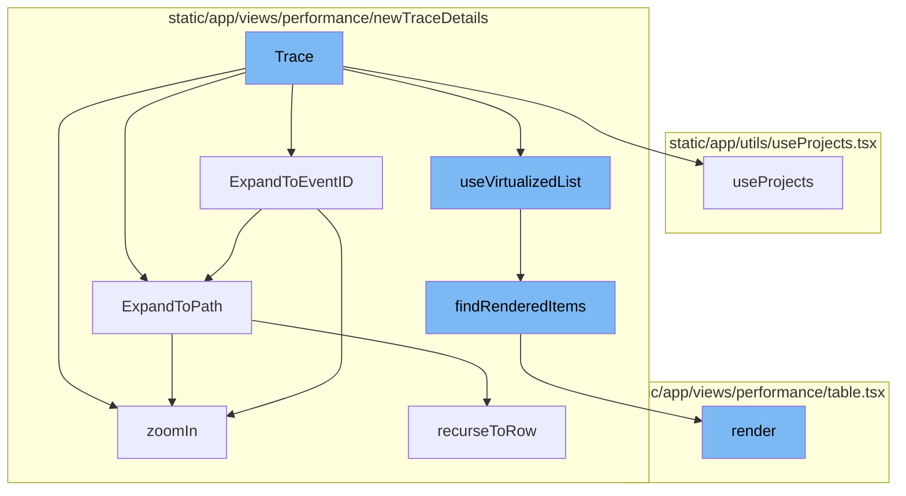

# Trace Overview

A Trace in Sentry represents a series of events, or tree of spans, that share a common root or parent. It provides a detailed snapshot of the sequence of operations that happen when handling a request. This is useful in understanding the flow of requests, dependencies, and the bottlenecks in a system.

<SwmSnippet path="/static/app/views/performance/newTraceDetails/trace.tsx" line="179">

---

# Trace Flow

The `Trace` function is the entry point of the trace flow. It sets up the necessary context and state for the trace view. This includes setting up theme, API, projects, organization, and trace state.

```tsx
export function Trace({
  trace,
  onRowClick,
  manager,
  scrollQueueRef,
  previouslyFocusedNodeRef,
  onTraceSearch,
  onTraceLoad,
  rerender,
  scheduler,
  initializedRef,
  forceRerender,
  trace_id,
}: TraceProps) {
  const theme = useTheme();
  const api = useApi();
  const {projects} = useProjects();
  const organization = useOrganization();
  const traceState = useTraceState();
  const traceDispatch = useTraceStateDispatch();

```

---

</SwmSnippet>

<SwmSnippet path="/static/app/views/performance/newTraceDetails/traceModels/traceTree.tsx" line="1310">

---

# Expanding to Event ID

The `ExpandToEventID` method is used to find a specific node in the trace tree based on its event ID. If the node is found, it expands the path to that node and fetches its children if necessary.

```tsx
  static ExpandToEventID(
    eventId: string,
    tree: TraceTree,
    rerender: () => void,
    options: ViewManagerScrollToOptions
  ): Promise<{index: number; node: TraceTreeNode<TraceTree.NodeValue>} | null | null> {
    const node = findInTreeByEventId(tree.root, eventId);

    if (!node) {
      return Promise.resolve(null);
    }

    return TraceTree.ExpandToPath(tree, node.path, rerender, options).then(
      async result => {
        // When users are coming off an eventID link, we want to fetch the children
        // of the node that the eventID points to. This is because the eventID link
        // only points to the transaction, but we want to fetch the children of the
        // transaction to show the user the list of spans in that transaction
        if (result?.node?.canFetch) {
          await tree.zoomIn(result.node, true, options).catch(_e => {
            Sentry.captureMessage('Failed to fetch children of eventId on mount');
```

---

</SwmSnippet>

<SwmSnippet path="/static/app/views/performance/newTraceDetails/traceModels/traceTree.tsx" line="1340">

---

# Expanding to Path

The `ExpandToPath` method is used to expand a specific path in the trace tree. It traverses the tree based on the given path segments, expanding nodes and fetching their children as necessary.

```tsx
  static ExpandToPath(
    tree: TraceTree,
    scrollQueue: TraceTree.NodePath[],
    rerender: () => void,
    options: ViewManagerScrollToOptions
  ): Promise<{index: number; node: TraceTreeNode<TraceTree.NodeValue>} | null | null> {
    const segments = [...scrollQueue];
    const list = tree.list;

    if (!list) {
      return Promise.resolve(null);
    }

    if (segments.length === 1 && segments[0] === 'trace-root') {
      rerender();
      return Promise.resolve({index: 0, node: tree.root.children[0]});
    }

    // Keep parent reference as we traverse the tree so that we can only
    // perform searching in the current level and not the entire tree
    let parent: TraceTreeNode<TraceTree.NodeValue> = tree.root;
```

---

</SwmSnippet>

<SwmSnippet path="/static/app/views/performance/newTraceDetails/traceModels/traceTree.tsx" line="1460">

---

# Zooming In

The `zoomIn` method is used to fetch more detailed information about a specific node in the trace tree. It fetches the transaction spans for the node and updates the node and tree accordingly.

```tsx
  zoomIn(
    node: TraceTreeNode<TraceTree.NodeValue>,
    zoomedIn: boolean,
    options: {
      api: Client;
      organization: Organization;
    }
  ): Promise<Event | null> {
    if (zoomedIn === node.zoomedIn) {
      return Promise.resolve(null);
    }

    if (!zoomedIn) {
      const index = this._list.indexOf(node);

      if (index === -1) {
        return Promise.resolve(null);
      }

      const childrenCount = node.getVisibleChildrenCount();
      this._list.splice(index + 1, childrenCount);
```

---

</SwmSnippet>

<SwmSnippet path="/static/app/utils/useProjects.tsx" line="141">

---

# Using Projects

The `useProjects` function is a hook that provides projects from the ProjectsStore. It also provides a way to select specific project slugs, and search for more projects that may not be in the project store.

```tsx
/**
 * Provides projects from the ProjectsStore
 *
 * This hook also provides a way to select specific project slugs, and search
 * (type-ahead) for more projects that may not be in the project store.
 *
 * NOTE: Currently ALL projects are always loaded, but this hook is designed
 * for future-compat in a world where we do _not_ load all projects.
 */
function useProjects({limit, slugs, orgId: propOrgId}: Options = {}) {
  const api = useApi();

  const organization = useOrganization({allowNull: true});
  const store = useLegacyStore(ProjectsStore);

  const orgId = propOrgId ?? organization?.slug ?? organization?.slug;

  const storeSlugs = new Set(store.projects.map(t => t.slug));
  const slugsToLoad = slugs?.filter(slug => !storeSlugs.has(slug)) ?? [];
  const shouldLoadSlugs = slugsToLoad.length > 0;

```

---

</SwmSnippet>

<SwmSnippet path="/static/app/views/performance/newTraceDetails/traceRenderers/traceVirtualizedList.tsx" line="34">

---

# Using Virtualized List

The `useVirtualizedList` function is a hook that provides a virtualized list of items. It optimizes rendering performance by only rendering the items that are currently visible in the viewport.

```tsx
export const useVirtualizedList = (
  props: UseVirtualizedListProps
): UseVirtualizedListResult => {
  const list = useRef<VirtualizedList | null>();

  const scrollTopRef = useRef<number>(0);
  const scrollHeightRef = useRef<number>(0);
  const scrollContainerRef = useRef<HTMLElement | null>(null);

  const renderCache = useRef<Map<number, React.ReactNode>>();
  const styleCache = useRef<Map<number, React.CSSProperties>>();
  const resizeObserverRef = useRef<ResizeObserver | null>(null);

  if (!styleCache.current) {
    styleCache.current = new Map();
  }
  if (!renderCache.current) {
    renderCache.current = new Map();
  }

  const [items, setItems] = useState<{
```

---

</SwmSnippet>

<SwmSnippet path="/static/app/views/performance/newTraceDetails/traceRenderers/traceVirtualizedList.tsx" line="262">

---

# Finding Rendered Items

The `findRenderedItems` function is used to find the items that should be rendered based on the current scroll position. It calculates the viewport and determines which items fall within it.

```tsx
function findRenderedItems({
  items,
  overscroll,
  rowHeight,
  scrollHeight,
  scrollTop,
  styleCache,
  renderCache,
  render,
  manager,
}: {
  items: ReadonlyArray<TraceTreeNode<TraceTree.NodeValue>>;
  manager: VirtualizedViewManager;
  overscroll: number;
  render: (arg: VirtualizedRow) => React.ReactNode;
  renderCache: Map<number, React.ReactNode>;
  rowHeight: number;
  scrollHeight: number;
  scrollTop: number;
  styleCache: Map<number, React.CSSProperties>;
}): {rendered: React.ReactNode[]; virtualized: VirtualizedRow[]} {
```

---

</SwmSnippet>

<SwmSnippet path="/static/app/views/performance/table.tsx" line="480">

---

# Rendering the Table

The `render` method in the Table component is responsible for rendering the performance table. It fetches the necessary data and passes it to the `GridEditable` component for rendering.

```tsx
  render() {
    const {eventView, organization, location, setError} = this.props;
    const {widths, transaction, transactionThreshold} = this.state;
    const columnOrder = eventView
      .getColumns()
      // remove team_key_transactions from the column order as we'll be rendering it
      // via a prepended column
      .filter(
        (col: TableColumn<React.ReactText>) =>
          col.name !== 'team_key_transaction' &&
          !col.name.startsWith('count_miserable') &&
          col.name !== 'project_threshold_config'
      )
      .map((col: TableColumn<React.ReactText>, i: number) => {
        if (typeof widths[i] === 'number') {
          return {...col, width: widths[i]};
        }
        return col;
      });

    const sortedEventView = this.getSortedEventView();
```

---

</SwmSnippet>



# Flow drill down


# Trace

A Trace in Sentry represents a series of events, or tree of spans, that share a common root or parent. It provides a detailed snapshot of the sequence of operations that happen when handling a request. This is useful in understanding the flow of requests, dependencies, and the bottlenecks in a system.

<SwmSnippet path="/static/app/views/performance/newTraceDetails/trace.tsx" line="179">

---

# Trace Flow

The `Trace` function is the entry point of the trace flow. It sets up the necessary context and state for the trace view. This includes setting up theme, API, projects, organization, and trace state.

```tsx
export function Trace({
  trace,
  onRowClick,
  manager,
  scrollQueueRef,
  previouslyFocusedNodeRef,
  onTraceSearch,
  onTraceLoad,
  rerender,
  scheduler,
  initializedRef,
  forceRerender,
  trace_id,
}: TraceProps) {
  const theme = useTheme();
  const api = useApi();
  const {projects} = useProjects();
  const organization = useOrganization();
  const traceState = useTraceState();
  const traceDispatch = useTraceStateDispatch();

```

---

</SwmSnippet>

<SwmSnippet path="/static/app/views/performance/newTraceDetails/traceModels/traceTree.tsx" line="1310">

---

# Expanding to Event ID

The `ExpandToEventID` method is used to find a specific node in the trace tree based on its event ID. If the node is found, it expands the path to that node and fetches its children if necessary.

```tsx
  static ExpandToEventID(
    eventId: string,
    tree: TraceTree,
    rerender: () => void,
    options: ViewManagerScrollToOptions
  ): Promise<{index: number; node: TraceTreeNode<TraceTree.NodeValue>} | null | null> {
    const node = findInTreeByEventId(tree.root, eventId);

    if (!node) {
      return Promise.resolve(null);
    }

    return TraceTree.ExpandToPath(tree, node.path, rerender, options).then(
      async result => {
        // When users are coming off an eventID link, we want to fetch the children
        // of the node that the eventID points to. This is because the eventID link
        // only points to the transaction, but we want to fetch the children of the
        // transaction to show the user the list of spans in that transaction
        if (result?.node?.canFetch) {
          await tree.zoomIn(result.node, true, options).catch(_e => {
            Sentry.captureMessage('Failed to fetch children of eventId on mount');
```

---

</SwmSnippet>

<SwmSnippet path="/static/app/views/performance/newTraceDetails/traceModels/traceTree.tsx" line="1340">

---

# Expanding to Path

The `ExpandToPath` method is used to expand a specific path in the trace tree. It traverses the tree based on the given path segments, expanding nodes and fetching their children as necessary.

```tsx
  static ExpandToPath(
    tree: TraceTree,
    scrollQueue: TraceTree.NodePath[],
    rerender: () => void,
    options: ViewManagerScrollToOptions
  ): Promise<{index: number; node: TraceTreeNode<TraceTree.NodeValue>} | null | null> {
    const segments = [...scrollQueue];
    const list = tree.list;

    if (!list) {
      return Promise.resolve(null);
    }

    if (segments.length === 1 && segments[0] === 'trace-root') {
      rerender();
      return Promise.resolve({index: 0, node: tree.root.children[0]});
    }

    // Keep parent reference as we traverse the tree so that we can only
    // perform searching in the current level and not the entire tree
    let parent: TraceTreeNode<TraceTree.NodeValue> = tree.root;
```

---

</SwmSnippet>

<SwmSnippet path="/static/app/views/performance/newTraceDetails/traceModels/traceTree.tsx" line="1460">

---

# Zooming In

The `zoomIn` method is used to fetch more detailed information about a specific node in the trace tree. It fetches the transaction spans for the node and updates the node and tree accordingly.

```tsx
  zoomIn(
    node: TraceTreeNode<TraceTree.NodeValue>,
    zoomedIn: boolean,
    options: {
      api: Client;
      organization: Organization;
    }
  ): Promise<Event | null> {
    if (zoomedIn === node.zoomedIn) {
      return Promise.resolve(null);
    }

    if (!zoomedIn) {
      const index = this._list.indexOf(node);

      if (index === -1) {
        return Promise.resolve(null);
      }

      const childrenCount = node.getVisibleChildrenCount();
      this._list.splice(index + 1, childrenCount);
```

---

</SwmSnippet>

<SwmSnippet path="/static/app/utils/useProjects.tsx" line="141">

---

# Using Projects

The `useProjects` function is a hook that provides projects from the ProjectsStore. It also provides a way to select specific project slugs, and search for more projects that may not be in the project store.

```tsx
/**
 * Provides projects from the ProjectsStore
 *
 * This hook also provides a way to select specific project slugs, and search
 * (type-ahead) for more projects that may not be in the project store.
 *
 * NOTE: Currently ALL projects are always loaded, but this hook is designed
 * for future-compat in a world where we do _not_ load all projects.
 */
function useProjects({limit, slugs, orgId: propOrgId}: Options = {}) {
  const api = useApi();

  const organization = useOrganization({allowNull: true});
  const store = useLegacyStore(ProjectsStore);

  const orgId = propOrgId ?? organization?.slug ?? organization?.slug;

  const storeSlugs = new Set(store.projects.map(t => t.slug));
  const slugsToLoad = slugs?.filter(slug => !storeSlugs.has(slug)) ?? [];
  const shouldLoadSlugs = slugsToLoad.length > 0;

```

---

</SwmSnippet>

<SwmSnippet path="/static/app/views/performance/newTraceDetails/traceRenderers/traceVirtualizedList.tsx" line="34">

---

# Using Virtualized List

The `useVirtualizedList` function is a hook that provides a virtualized list of items. It optimizes rendering performance by only rendering the items that are currently visible in the viewport.

```tsx
export const useVirtualizedList = (
  props: UseVirtualizedListProps
): UseVirtualizedListResult => {
  const list = useRef<VirtualizedList | null>();

  const scrollTopRef = useRef<number>(0);
  const scrollHeightRef = useRef<number>(0);
  const scrollContainerRef = useRef<HTMLElement | null>(null);

  const renderCache = useRef<Map<number, React.ReactNode>>();
  const styleCache = useRef<Map<number, React.CSSProperties>>();
  const resizeObserverRef = useRef<ResizeObserver | null>(null);

  if (!styleCache.current) {
    styleCache.current = new Map();
  }
  if (!renderCache.current) {
    renderCache.current = new Map();
  }

  const [items, setItems] = useState<{
```

---

</SwmSnippet>

<SwmSnippet path="/static/app/views/performance/newTraceDetails/traceRenderers/traceVirtualizedList.tsx" line="262">

---

# Finding Rendered Items

The `findRenderedItems` function is used to find the items that should be rendered based on the current scroll position. It calculates the viewport and determines which items fall within it.

```tsx
function findRenderedItems({
  items,
  overscroll,
  rowHeight,
  scrollHeight,
  scrollTop,
  styleCache,
  renderCache,
  render,
  manager,
}: {
  items: ReadonlyArray<TraceTreeNode<TraceTree.NodeValue>>;
  manager: VirtualizedViewManager;
  overscroll: number;
  render: (arg: VirtualizedRow) => React.ReactNode;
  renderCache: Map<number, React.ReactNode>;
  rowHeight: number;
  scrollHeight: number;
  scrollTop: number;
  styleCache: Map<number, React.CSSProperties>;
}): {rendered: React.ReactNode[]; virtualized: VirtualizedRow[]} {
```

---

</SwmSnippet>

<SwmSnippet path="/static/app/views/performance/table.tsx" line="480">

---

# Rendering the Table

The `render` method in the Table component is responsible for rendering the performance table. It fetches the necessary data and passes it to the `GridEditable` component for rendering.

```tsx
  render() {
    const {eventView, organization, location, setError} = this.props;
    const {widths, transaction, transactionThreshold} = this.state;
    const columnOrder = eventView
      .getColumns()
      // remove team_key_transactions from the column order as we'll be rendering it
      // via a prepended column
      .filter(
        (col: TableColumn<React.ReactText>) =>
          col.name !== 'team_key_transaction' &&
          !col.name.startsWith('count_miserable') &&
          col.name !== 'project_threshold_config'
      )
      .map((col: TableColumn<React.ReactText>, i: number) => {
        if (typeof widths[i] === 'number') {
          return {...col, width: widths[i]};
        }
        return col;
      });

    const sortedEventView = this.getSortedEventView();
```

---

</SwmSnippet>

&nbsp;

*This is an auto-generated document by Swimm AI 🌊 and has not yet been verified by a human*

<SwmMeta version="3.0.0" repo-id="Z2l0aHViJTNBJTNBc2VudHJ5LWRlbW8lM0ElM0FTd2ltbS1EZW1v" repo-name="sentry-demo" doc-type="flows"><sup>Powered by [Swimm](/)</sup></SwmMeta>
