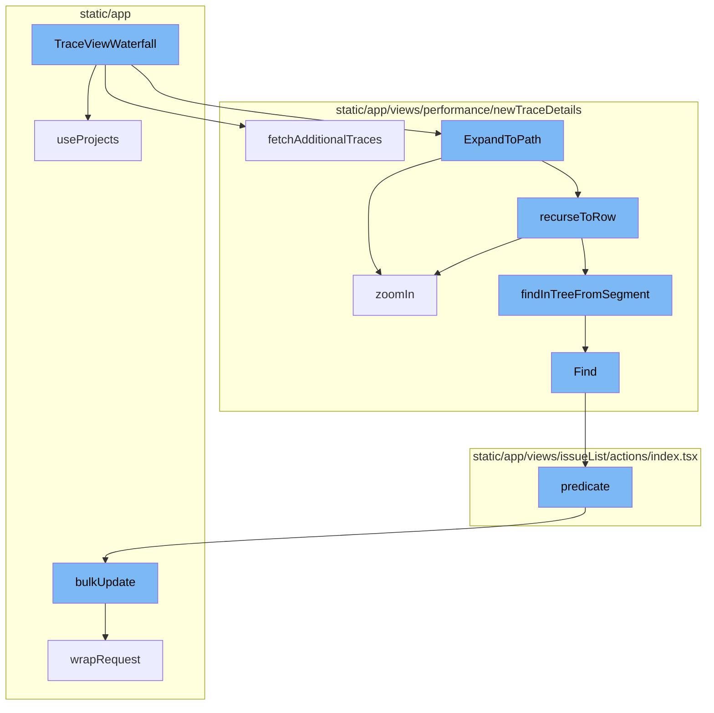
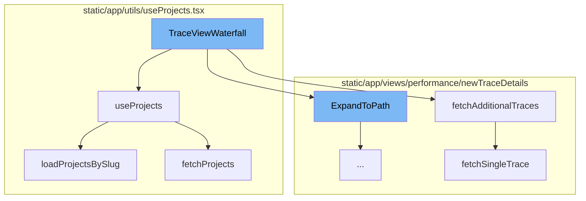
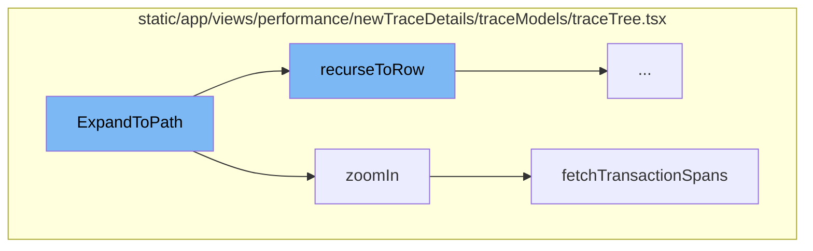
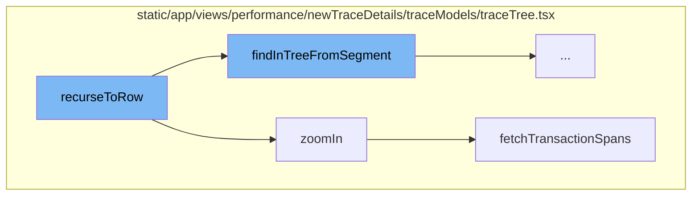
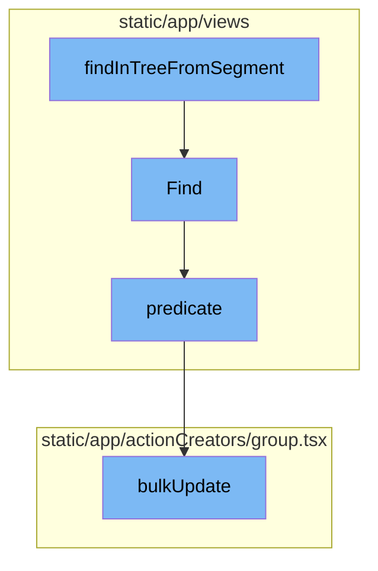

# TraceViewWaterfall Overview

TraceViewWaterfall is a key component in the Sentry application. It is responsible for managing and displaying the trace view waterfall, a visual representation of the execution of a program. It uses various hooks and states to manage the trace view and defines several callback functions to handle different events such as trace view changes, physical space changes, trace space initialization, and trace search.

# useProjects Hook

`useProjects` is a hook that provides projects from the ProjectsStore. It also provides a way to select specific project slugs, and search (type-ahead) for more projects that may not be in the project store. It fetches projects by slug and handles search functionality.

# Fetching Additional Traces

`fetchAdditionalTraces` is a method that fetches additional traces for the trace view. It uses the `fetchSingleTrace` function to fetch each trace and then appends the fetched trace to the trace tree.

# Fetching Single Trace

`fetchSingleTrace` is a function that fetches a single trace from the server. It makes an API request to the server with the organization slug, query parameters, and trace ID.

# Loading Projects by Slug

`loadProjectsBySlug` is a function that loads projects by their slugs. It fetches projects using the `fetchProjects` function and updates the state and the ProjectsStore with the fetched projects.

# Fetching Projects

`fetchProjects` is a helper function that fetches projects from the server. It makes an API request to the server with the organization ID and other query parameters such as slugs, search, limit, lastSearch, and cursor.

# Expanding to Path

The `ExpandToPath` method is the starting point of the flow. It takes a `TraceTree`, a `scrollQueue`, a `rerender` function, and `options` as parameters. It traverses the tree based on the segments in the `scrollQueue` and performs operations based on the type of the current node. The `recurseToRow` function is used to traverse the tree recursively.

# Zooming In

The `zoomIn` method is called within `ExpandToPath` when the current node is a transaction node and the next segment starts with 'span-', 'empty-', 'ag-', or 'ms-'. This method fetches transaction spans and updates the tree based on the fetched data. It also handles the case when the node is collapsed before the promise is resolved.

# Fetching Transaction Spans

The `fetchTransactionSpans` function is called within the `zoomIn` method. It sends a request to the API to fetch transaction spans for a given project and event.

# Recursing to Row

The `recurseToRow` function is a recursive function that navigates through the trace tree. It pops a segment from the path and tries to find it in the tree. If the segment is not found, it checks if the segment is a span and if it is, it checks if it's already on the node. If it's still not found, an error message is sent to Sentry. If the segment is found, the function checks if it's a transaction node and if it is, it zooms in. If the segment is an autogrouped node, it expands the node. If there are more segments, it calls itself again. If there are no more segments, it finds the node in the list and returns the index and the node.

# Finding in Tree from Segment

The `findInTreeFromSegment` function is the starting point of this flow. It takes a start node and a segment, splits the segment into type and id, and then uses these to find a specific node in the trace tree.

# Finding Node

The `Find` method is used within `findInTreeFromSegment`. It takes a root node and a predicate function, and uses a queue to traverse the tree until it finds a node that satisfies the predicate.

# Predicate Function

The `predicate` function is used as a parameter in the `Find` method. It checks if the query starts with a specific string, which is used to determine if the node satisfies the condition.

# Bulk Update

The `bulkUpdate` function is the final step in this flow. It takes an API client, update parameters, and request options, and uses these to update a group of items in the store.



# Flow drill down

First, we'll zoom into this section of the flow:



<SwmSnippet path="/static/app/views/performance/newTraceDetails/index.tsx" line="258">

---

# TraceViewWaterfall

The `TraceViewWaterfall` function is the main entry point for the trace view waterfall. It uses various hooks and states to manage the trace view. It also defines several callback functions to handle different events such as trace view changes, physical space changes, trace space initialization, and trace search.

```tsx
export function TraceViewWaterfall(props: TraceViewWaterfallProps) {
  const api = useApi();
  const {projects} = useProjects();
  const organization = useOrganization();
  const loadingTraceRef = useRef<TraceTree | null>(null);
  const [forceRender, rerender] = useReducer(x => (x + 1) % Number.MAX_SAFE_INTEGER, 0);
  const traceState = useTraceState();
  const traceDispatch = useTraceStateDispatch();
  const traceStateEmitter = useTraceStateEmitter();
  const filters = usePageFilters();
  const traceScheduler = useMemo(() => new TraceScheduler(), []);
  const traceView = useMemo(() => new TraceViewModel(), []);

  const forceRerender = useCallback(() => {
    flushSync(rerender);
  }, []);

  useEffect(() => {
    trackAnalytics('performance_views.trace_view_v1_page_load', {
      organization: props.organization,
      source: props.source,
```

---

</SwmSnippet>

<SwmSnippet path="/static/app/utils/useProjects.tsx" line="150">

---

## useProjects

`useProjects` is a hook that provides projects from the ProjectsStore. It also provides a way to select specific project slugs, and search (type-ahead) for more projects that may not be in the project store. It fetches projects by slug and handles search functionality.

```tsx
function useProjects({limit, slugs, orgId: propOrgId}: Options = {}) {
  const api = useApi();

  const organization = useOrganization({allowNull: true});
  const store = useLegacyStore(ProjectsStore);

  const orgId = propOrgId ?? organization?.slug ?? organization?.slug;

  const storeSlugs = new Set(store.projects.map(t => t.slug));
  const slugsToLoad = slugs?.filter(slug => !storeSlugs.has(slug)) ?? [];
  const shouldLoadSlugs = slugsToLoad.length > 0;

  const [state, setState] = useState<State>({
    initiallyLoaded: !store.loading && !shouldLoadSlugs,
    fetching: shouldLoadSlugs,
    hasMore: null,
    lastSearch: null,
    nextCursor: null,
    fetchError: null,
  });

```

---

</SwmSnippet>

<SwmSnippet path="/static/app/views/performance/newTraceDetails/traceModels/traceTree.tsx" line="626">

---

## fetchAdditionalTraces

`fetchAdditionalTraces` is a method that fetches additional traces for the trace view. It uses the `fetchSingleTrace` function to fetch each trace and then appends the fetched trace to the trace tree.

```tsx
  fetchAdditionalTraces(options: TraceFetchOptions): () => void {
    let cancelled = false;
    const {organization, api, urlParams, filters, rerender, replayTraces} = options;
    const clonedTraceIds = [...replayTraces];

    const root = this.root.children[0];
    root.fetchStatus = 'loading';
    rerender();

    (async () => {
      while (clonedTraceIds.length > 0) {
        const batch = clonedTraceIds.splice(0, 3);
        const results = await Promise.allSettled(
          batch.map(batchTraceData => {
            return fetchSingleTrace(api, {
              orgSlug: organization.slug,
              query: qs.stringify(
                getTraceQueryParams(urlParams, filters.selection, {
                  timestamp: batchTraceData.timestamp,
                })
              ),
```

---

</SwmSnippet>

<SwmSnippet path="/static/app/views/performance/newTraceDetails/traceModels/traceTree.tsx" line="427">

---

## fetchSingleTrace

`fetchSingleTrace` is a function that fetches a single trace from the server. It makes an API request to the server with the organization slug, query parameters, and trace ID.

```tsx
function fetchSingleTrace(
  api: Client,
  params: {
    orgSlug: string;
    query: string;
    traceId: string;
  }
): Promise<TraceSplitResults<TraceTree.Transaction>> {
  return api.requestPromise(
    `/organizations/${params.orgSlug}/events-trace/${params.traceId}/?${params.query}`
  );
}
```

---

</SwmSnippet>

<SwmSnippet path="/static/app/utils/useProjects.tsx" line="188">

---

## loadProjectsBySlug

`loadProjectsBySlug` is a function that loads projects by their slugs. It fetches projects using the `fetchProjects` function and updates the state and the ProjectsStore with the fetched projects.

```tsx
  async function loadProjectsBySlug() {
    if (orgId === undefined) {
      // eslint-disable-next-line no-console
      console.error('Cannot use useProjects({slugs}) without an organization in context');
      return;
    }

    setState(prev => ({...prev, fetching: true}));
    try {
      const {results, hasMore, nextCursor} = await fetchProjects(api, orgId, {
        slugs: slugsToLoad,
        limit,
      });

      const fetchedProjects = uniqBy([...store.projects, ...results], ({slug}) => slug);
      ProjectsStore.loadInitialData(fetchedProjects);

      setState(prev => ({
        ...prev,
        hasMore,
        fetching: false,
```

---

</SwmSnippet>

<SwmSnippet path="/static/app/utils/useProjects.tsx" line="87">

---

## fetchProjects

`fetchProjects` is a helper function that fetches projects from the server. It makes an API request to the server with the organization ID and other query parameters such as slugs, search, limit, lastSearch, and cursor.

```tsx
/**
 * Helper function to actually load projects
 */
async function fetchProjects(
  api: Client,
  orgId: string,
  {slugs, search, limit, lastSearch, cursor}: FetchProjectsOptions = {}
) {
  const query: {
    collapse: string[];
    all_projects?: number;
    cursor?: typeof cursor;
    per_page?: number;
    query?: string;
  } = {
    // Never return latestDeploys project property from api
    collapse: ['latestDeploys', 'unusedFeatures'],
  };

  if (slugs !== undefined && slugs.length > 0) {
    query.query = slugs.map(slug => `slug:${slug}`).join(' ');
```

---

</SwmSnippet>

Now, lets zoom into this section of the flow:



<SwmSnippet path="/static/app/views/performance/newTraceDetails/traceModels/traceTree.tsx" line="1340">

---

# TraceViewWaterfall Flow

The `ExpandToPath` method is the starting point of the flow. It takes a `TraceTree`, a `scrollQueue`, a `rerender` function, and `options` as parameters. It traverses the tree based on the segments in the `scrollQueue` and performs operations based on the type of the current node. The `recurseToRow` function is used to traverse the tree recursively.

```tsx
  static ExpandToPath(
    tree: TraceTree,
    scrollQueue: TraceTree.NodePath[],
    rerender: () => void,
    options: ViewManagerScrollToOptions
  ): Promise<{index: number; node: TraceTreeNode<TraceTree.NodeValue>} | null | null> {
    const segments = [...scrollQueue];
    const list = tree.list;

    if (!list) {
      return Promise.resolve(null);
    }

    if (segments.length === 1 && segments[0] === 'trace-root') {
      rerender();
      return Promise.resolve({index: 0, node: tree.root.children[0]});
    }

    // Keep parent reference as we traverse the tree so that we can only
    // perform searching in the current level and not the entire tree
    let parent: TraceTreeNode<TraceTree.NodeValue> = tree.root;
```

---

</SwmSnippet>

<SwmSnippet path="/static/app/views/performance/newTraceDetails/traceModels/traceTree.tsx" line="1460">

---

The `zoomIn` method is called within `ExpandToPath` when the current node is a transaction node and the next segment starts with 'span-', 'empty-', 'ag-', or 'ms-'. This method fetches transaction spans and updates the tree based on the fetched data. It also handles the case when the node is collapsed before the promise is resolved.

```tsx
  zoomIn(
    node: TraceTreeNode<TraceTree.NodeValue>,
    zoomedIn: boolean,
    options: {
      api: Client;
      organization: Organization;
    }
  ): Promise<Event | null> {
    if (zoomedIn === node.zoomedIn) {
      return Promise.resolve(null);
    }

    if (!zoomedIn) {
      const index = this._list.indexOf(node);

      if (index === -1) {
        return Promise.resolve(null);
      }

      const childrenCount = node.getVisibleChildrenCount();
      this._list.splice(index + 1, childrenCount);
```

---

</SwmSnippet>

<SwmSnippet path="/static/app/views/performance/newTraceDetails/traceModels/traceTree.tsx" line="204">

---

The `fetchTransactionSpans` function is called within the `zoomIn` method. It sends a request to the API to fetch transaction spans for a given project and event.

```tsx
function fetchTransactionSpans(
  api: Client,
  organization: Organization,
  project_slug: string,
  event_id: string
): Promise<EventTransaction> {
  return api.requestPromise(
    `/organizations/${organization.slug}/events/${project_slug}:${event_id}/?averageColumn=span.self_time&averageColumn=span.duration`
  );
}
```

---

</SwmSnippet>

Now, lets zoom into this section of the flow:



<SwmSnippet path="/static/app/views/performance/newTraceDetails/traceModels/traceTree.tsx" line="1362">

---

# TraceViewWaterfall Flow

The `recurseToRow` function is a recursive function that navigates through the trace tree. It pops a segment from the path and tries to find it in the tree. If the segment is not found, it checks if the segment is a span and if it is, it checks if it's already on the node. If it's still not found, an error message is sent to Sentry. If the segment is found, the function checks if it's a transaction node and if it is, it zooms in. If the segment is an autogrouped node, it expands the node. If there are more segments, it calls itself again. If there are no more segments, it finds the node in the list and returns the index and the node.

```tsx
    const recurseToRow = async (): Promise<{
      index: number;
      node: TraceTreeNode<TraceTree.NodeValue>;
    } | null | null> => {
      const path = segments.pop();
      let current = findInTreeFromSegment(parent, path!);

      if (!current) {
        // Some parts of the codebase link to span:span_id, txn:event_id, where span_id is
        // actally stored on the txn:event_id node. Since we cant tell from the link itself
        // that this is happening, we will perform a final check to see if we've actually already
        // arrived to the node in the previous search call.
        if (path) {
          const [type, id] = path.split('-');

          if (
            type === 'span' &&
            isTransactionNode(parent) &&
            parent.value.span_id === id
          ) {
            current = parent;
```

---

</SwmSnippet>

<SwmSnippet path="/static/app/views/performance/newTraceDetails/traceModels/traceTree.tsx" line="1460">

---

# Zooming In

The `zoomIn` function is used to zoom in on a node in the trace tree. If the node is already zoomed in, it returns null. If the node is not zoomed in, it removes the node's children from the list, sets the node's zoomedIn property to true, and adds the node's visible children to the list. If the node is zoomed in, it fetches the transaction spans for the node, sorts them, and adds them to the list. If the node is expanded, it adds the node's visible children to the list. If the node's fetch status is 'loading', it sets the fetch status to 'resolved' and returns the data.

```tsx
  zoomIn(
    node: TraceTreeNode<TraceTree.NodeValue>,
    zoomedIn: boolean,
    options: {
      api: Client;
      organization: Organization;
    }
  ): Promise<Event | null> {
    if (zoomedIn === node.zoomedIn) {
      return Promise.resolve(null);
    }

    if (!zoomedIn) {
      const index = this._list.indexOf(node);

      if (index === -1) {
        return Promise.resolve(null);
      }

      const childrenCount = node.getVisibleChildrenCount();
      this._list.splice(index + 1, childrenCount);
```

---

</SwmSnippet>

<SwmSnippet path="/static/app/views/performance/newTraceDetails/traceModels/traceTree.tsx" line="204">

---

# Fetching Transaction Spans

The `fetchTransactionSpans` function is used to fetch the transaction spans for a node. It makes an API request to the `/organizations/${organization.slug}/events/${project_slug}:${event_id}/?averageColumn=span.self_time&averageColumn=span.duration` endpoint and returns the response.

```tsx
function fetchTransactionSpans(
  api: Client,
  organization: Organization,
  project_slug: string,
  event_id: string
): Promise<EventTransaction> {
  return api.requestPromise(
    `/organizations/${organization.slug}/events/${project_slug}:${event_id}/?averageColumn=span.self_time&averageColumn=span.duration`
  );
}
```

---

</SwmSnippet>

Now, lets zoom into this section of the flow:



<SwmSnippet path="/static/app/views/performance/newTraceDetails/traceModels/traceTree.tsx" line="2495">

---

# TraceViewWaterfall Flow

The `findInTreeFromSegment` function is the starting point of this flow. It takes a start node and a segment, splits the segment into type and id, and then uses these to find a specific node in the trace tree.

```tsx
function findInTreeFromSegment(
  start: TraceTreeNode<TraceTree.NodeValue>,
  segment: TraceTree.NodePath
): TraceTreeNode<TraceTree.NodeValue> | null {
  const [type, id] = segment.split('-');

  if (!type || !id) {
    throw new TypeError('Node path must be in the format of `type-id`');
  }

  return TraceTreeNode.Find(start, node => {
    if (type === 'txn' && isTransactionNode(node)) {
      return node.value.event_id === id;
    }
    if (type === 'span' && isSpanNode(node)) {
      return node.value.span_id === id;
    }

    if (type === 'ag' && isAutogroupedNode(node)) {
      if (isParentAutogroupedNode(node)) {
        return node.head.value.span_id === id || node.tail.value.span_id === id;
```

---

</SwmSnippet>

<SwmSnippet path="/static/app/views/performance/newTraceDetails/traceModels/traceTree.tsx" line="2121">

---

The `Find` method is used within `findInTreeFromSegment`. It takes a root node and a predicate function, and uses a queue to traverse the tree until it finds a node that satisfies the predicate.

```tsx
  static Find(
    root: TraceTreeNode<TraceTree.NodeValue>,
    predicate: (node: TraceTreeNode<TraceTree.NodeValue>) => boolean
  ): TraceTreeNode<TraceTree.NodeValue> | null {
    const queue = [root];

    while (queue.length > 0) {
      const next = queue.pop()!;

      if (predicate(next)) {
        return next;
      }

      if (isParentAutogroupedNode(next)) {
        queue.push(next.head);
      } else {
        for (const child of next.children) {
          queue.push(child);
        }
      }
    }
```

---

</SwmSnippet>

<SwmSnippet path="/static/app/views/issueList/actions/index.tsx" line="331">

---

The `predicate` function is used as a parameter in the `Find` method. It checks if the query starts with a specific string, which is used to determine if the node satisfies the condition.

```tsx
                predicate: apiQuery =>
                  typeof apiQuery.queryKey[0] === 'string' &&
                  apiQuery.queryKey[0].startsWith(
                    `/organizations/${organization.slug}/issues/`
                  ),
```

---

</SwmSnippet>

<SwmSnippet path="/static/app/actionCreators/group.tsx" line="337">

---

The `bulkUpdate` function is the final step in this flow. It takes an API client, update parameters, and request options, and uses these to update a group of items in the store.

```tsx
export function bulkUpdate(
  api: Client,
  params: BulkUpdateParams,
  options: RequestCallbacks
) {
  const {itemIds, failSilently, data} = params;
  const path = getUpdateUrl(params);

  const query: QueryArgs = paramsToQueryArgs(params);
  const id = uniqueId();

  GroupStore.onUpdate(id, itemIds, data);

  return wrapRequest(
    api,
    path,
    {
      query,
      method: 'PUT',
      data,
      success: response => {
```

---

</SwmSnippet>

&nbsp;

*This is an auto-generated document by Swimm AI 🌊 and has not yet been verified by a human*

<SwmMeta version="3.0.0" repo-id="Z2l0aHViJTNBJTNBc2VudHJ5LWRlbW8lM0ElM0FTd2ltbS1EZW1v" repo-name="sentry-demo" doc-type="flows"><sup>Powered by [Swimm](/)</sup></SwmMeta>
