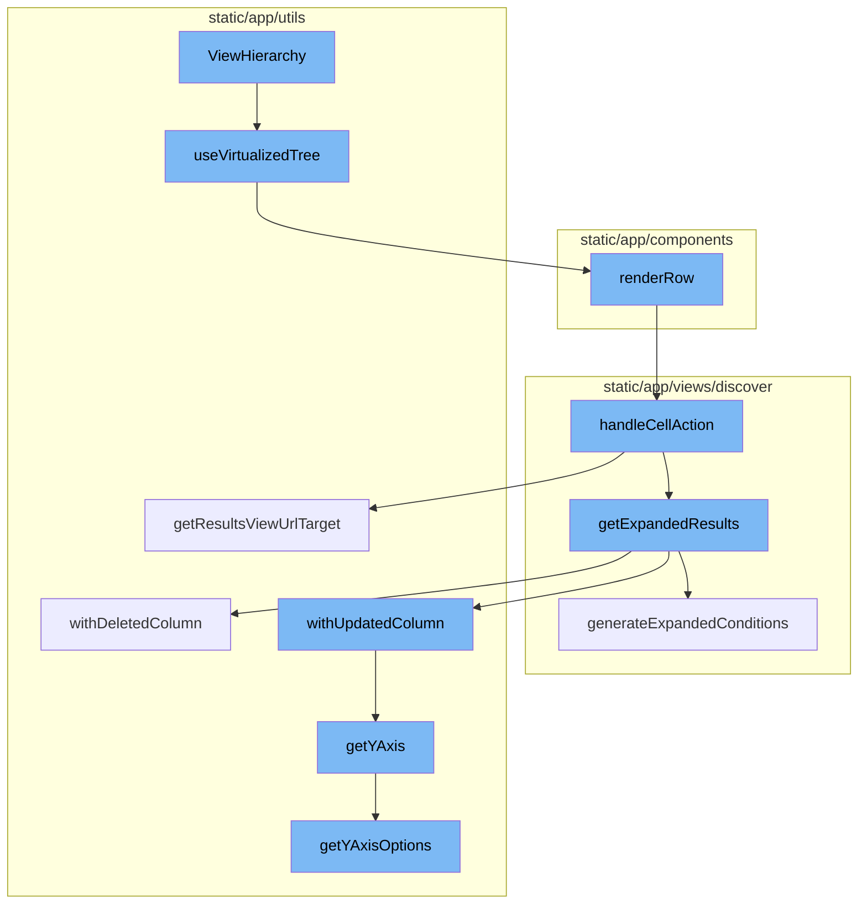
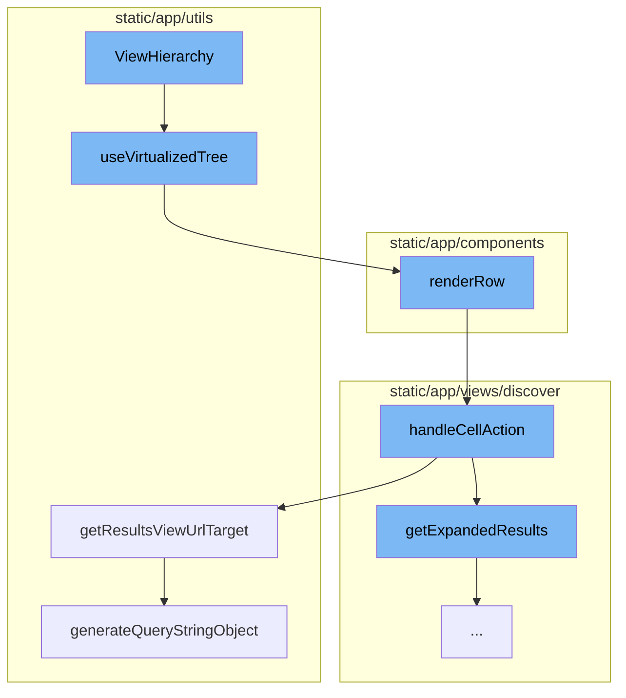
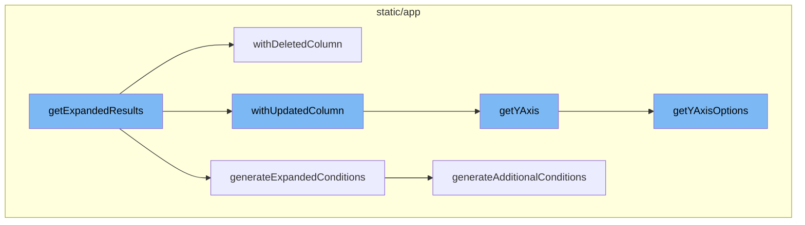

<SwmSnippet path="/static/app/components/events/viewHierarchy/index.tsx" line="79">

---

# ViewHierarchy

The `ViewHierarchy` function is the starting point of the flow. It sets up the state and memoizes the hierarchy of views. It also defines the `renderRow` function, which is responsible for rendering each row in the hierarchy. The `renderRow` function is passed to the `useVirtualizedTree` hook, which handles the virtualization of the tree.

```tsx
function ViewHierarchy({viewHierarchy, project}: ViewHierarchyProps) {
  const organization = useOrganization();
  const [scrollContainerRef, setScrollContainerRef] = useState<HTMLDivElement | null>(
    null
  );
  const [selectedNode, setSelectedNode] = useState<ViewHierarchyWindow | undefined>(
    viewHierarchy.windows[0]
  );
  const [userHasSelected, setUserHasSelected] = useState(false);
  const hierarchy = useMemo(() => {
    return viewHierarchy.windows;
  }, [viewHierarchy.windows]);

  const renderRow: UseVirtualizedTreeProps<ViewHierarchyWindow>['renderRow'] = (
    r,
    {
      handleExpandTreeNode,
      handleRowMouseEnter,
      handleRowClick,
      handleRowKeyDown,
      selectedNodeIndex,
```

---

</SwmSnippet>

<SwmSnippet path="/static/app/utils/profiling/hooks/useVirtualizedTree/useVirtualizedTree.tsx" line="125">

---

The `useVirtualizedTree` hook is used to create a virtualized tree of the hierarchy. It takes in the `renderRow` function from `ViewHierarchy` and uses it to render each row. It also handles scrolling and selection of nodes in the tree.

```tsx
export function useVirtualizedTree<T extends TreeLike>(
  props: UseVirtualizedTreeProps<T>
) {
  const onScrollToNode = props.onScrollToNode;
  const theme = useTheme();
  const clickedGhostRowRef = useRef<HTMLDivElement | null>(null);
  const hoveredGhostRowRef = useRef<HTMLDivElement | null>(null);

  const [state, dispatch] = useReducer(VirtualizedTreeReducer, {
    scrollTop: 0,
    roots: props.tree,
    selectedNodeIndex: props.initialSelectedNodeIndex ?? null,
    overscroll: props.overscroll ?? DEFAULT_OVERSCROLL_ITEMS,
    scrollHeight: getMaxScrollHeight(props.scrollContainer),
  });

  const [tree, setTree] = useState(() => {
    const initialTree =
      props.virtualizedTree ||
      VirtualizedTree.fromRoots(props.tree, props.expanded, props.skipFunction);

```

---

</SwmSnippet>

<SwmSnippet path="/static/app/components/discover/transactionsTable.tsx" line="114">

---

The `renderRow` function in `transactionsTable.tsx` is responsible for rendering each row in the transactions table. It uses the `handleCellAction` function to handle actions on each cell in the row.

```tsx
  renderRow(
    row: TableDataRow,
    rowIndex: number,
    columnOrder: TableColumn<React.ReactText>[],
    tableMeta: MetaType
  ): React.ReactNode[] {
    const {
      eventView,
      organization,
      location,
      generateLink,
      handleCellAction,
      titles,
      useAggregateAlias,
      referrer,
    } = this.props;
    const fields = eventView.getFields();

    if (titles?.length) {
      // Slice to match length of given titles
      columnOrder = columnOrder.slice(0, titles.length);
```

---

</SwmSnippet>

<SwmSnippet path="/static/app/views/discover/table/tableView.tsx" line="526">

---

The `handleCellAction` function handles actions on each cell in the row. Depending on the action, it may modify the query and navigate to a new view.

```tsx
  function handleCellAction(
    dataRow: TableDataRow,
    column: TableColumn<keyof TableDataRow>
  ) {
    return (action: Actions, value: React.ReactText) => {
      const {eventView, organization, location, tableData, isHomepage} = props;

      const query = new MutableSearch(eventView.query);

      let nextView = eventView.clone();
      trackAnalytics('discover_v2.results.cellaction', {
        organization,
        action,
      });

      switch (action) {
        case Actions.RELEASE: {
          const maybeProject = projects.find(project => {
            return project.slug === dataRow.project;
          });

```

---

</SwmSnippet>

<SwmSnippet path="/static/app/utils/discover/eventView.tsx" line="1190">

---

The `getResultsViewUrlTarget` method is used to generate the URL for the results view based on the current state of the event view.

```tsx
  getResultsViewUrlTarget(
    slug: string,
    isHomepage: boolean = false
  ): {pathname: string; query: Query} {
    const target = isHomepage ? 'homepage' : 'results';
    return {
      pathname: normalizeUrl(`/organizations/${slug}/discover/${target}/`),
      query: this.generateQueryStringObject(),
    };
  }
```

---

</SwmSnippet>

<SwmSnippet path="/static/app/utils/discover/eventView.tsx" line="672">

---

The `generateQueryStringObject` method is used to generate a query string object from the current state of the event view. This object is used in the URL for the results view.

```tsx
  generateQueryStringObject(): Query {
    const output = {
      id: this.id,
      name: this.name,
      field: this.getFields(),
      widths: this.getWidths(),
      sort: encodeSorts(this.sorts),
      environment: this.environment,
      project: this.project,
      query: this.query,
      yAxis: this.yAxis || this.getYAxis(),
      dataset: this.dataset,
      display: this.display,
      topEvents: this.topEvents,
      interval: this.interval,
    };

    for (const field of EXTERNAL_QUERY_STRING_KEYS) {
      if (this[field]?.length) {
        output[field] = this[field];
      }
```

---

</SwmSnippet>

<SwmSnippet path="/static/app/views/discover/utils.tsx" line="262">

---

# ViewHierarchy Flow

The `getExpandedResults` function is the starting point of the flow. It converts an aggregated query into one that does not have aggregates. It also applies additional conditions and generates conditions based on the `dataRow` parameter and the current fields in the `eventView`.

```tsx
export function getExpandedResults(
  eventView: EventView,
  additionalConditions: Record<string, string>,
  dataRow?: TableDataRow | Event
): EventView {
  const fieldSet = new Set();
  // Expand any functions in the resulting column, and dedupe the result.
  // Mark any column as null to remove it.
  const expandedColumns: (Column | null)[] = eventView.fields.map((field: Field) => {
    const exploded = explodeFieldString(field.field, field.alias);
    const column = exploded.kind === 'function' ? drilldownAggregate(exploded) : exploded;

    if (
      // if expanding the function failed
      column === null ||
      // the new column is already present
      fieldSet.has(column.field) ||
      // Skip aggregate equations, their functions will already be added so we just want to remove it
      isAggregateEquation(field.field)
    ) {
      return null;
```

---

</SwmSnippet>

<SwmSnippet path="/static/app/utils/discover/eventView.tsx" line="971">

---

The `withDeletedColumn` method is invoked within `getExpandedResults`. It removes a column from the EventView and adjusts the sort keys and yAxis accordingly.

```tsx
  withDeletedColumn(columnIndex: number, tableMeta: MetaType | undefined): EventView {
    // Disallow removal of the orphan column, and check for out-of-bounds
    if (this.fields.length <= 1 || this.fields.length <= columnIndex || columnIndex < 0) {
      return this;
    }

    // ensure tableMeta is non-empty
    tableMeta = validateTableMeta(tableMeta);

    // delete the column
    const newEventView = this.clone();
    const fields = [...newEventView.fields];
    fields.splice(columnIndex, 1);
    newEventView.fields = fields;

    // Ensure there is at least one auto width column
    // To ensure a well formed table results.
    const hasAutoIndex = fields.find(field => field.width === COL_WIDTH_UNDEFINED);
    if (!hasAutoIndex) {
      newEventView.fields[0].width = COL_WIDTH_UNDEFINED;
    }
```

---

</SwmSnippet>

<SwmSnippet path="/static/app/views/discover/utils.tsx" line="423">

---

The `generateExpandedConditions` function is called within `getExpandedResults`. It creates a new query by removing any aggregates from the search conditions and adding additional conditions.

```tsx
function generateExpandedConditions(
  eventView: EventView,
  additionalConditions: Record<string, string>,
  dataRow?: TableDataRow | Event
): string {
  const parsedQuery = new MutableSearch(eventView.query);

  // Remove any aggregates from the search conditions.
  // otherwise, it'll lead to an invalid query result.
  for (const key in parsedQuery.filters) {
    const column = explodeFieldString(key);
    if (column.kind === 'function') {
      parsedQuery.removeFilter(key);
    }
  }

  const conditions: Record<string, string | string[]> = Object.assign(
    {},
    additionalConditions,
    generateAdditionalConditions(eventView, dataRow)
  );
```

---

</SwmSnippet>

<SwmSnippet path="/static/app/utils/discover/eventView.tsx" line="877">

---

The `withUpdatedColumn` method is invoked within `getExpandedResults`. It updates a column in the EventView and adjusts the sort keys and yAxis accordingly.

```tsx
  withUpdatedColumn(
    columnIndex: number,
    updatedColumn: Column,
    tableMeta: MetaType | undefined
  ): EventView {
    const columnToBeUpdated = this.fields[columnIndex];
    const fieldAsString = generateFieldAsString(updatedColumn);

    const updateField = columnToBeUpdated.field !== fieldAsString;
    if (!updateField) {
      return this;
    }

    // ensure tableMeta is non-empty
    tableMeta = validateTableMeta(tableMeta);

    const newEventView = this.clone();

    const updatedField: Field = {
      field: fieldAsString,
      width: COL_WIDTH_UNDEFINED,
```

---

</SwmSnippet>

<SwmSnippet path="/static/app/utils/discover/eventView.tsx" line="1319">

---

The `getYAxis` method is invoked within `withUpdatedColumn` and `withDeletedColumn`. It returns the yAxis of the EventView, ensuring that the current selected yAxis is one of the items in yAxisOptions.

```tsx
  getYAxis(): string {
    const yAxisOptions = this.getYAxisOptions();

    const yAxis = this.yAxis;
    const defaultOption = yAxisOptions[0].value;

    if (!yAxis) {
      return defaultOption;
    }

    // ensure current selected yAxis is one of the items in yAxisOptions
    const result = yAxisOptions.findIndex(
      (option: SelectValue<string>) => option.value === yAxis
    );

    if (result >= 0) {
      return typeof yAxis === 'string' ? yAxis : yAxis[0];
    }

    return defaultOption;
  }
```

---

</SwmSnippet>

<SwmSnippet path="/static/app/utils/discover/eventView.tsx" line="1300">

---

The `getYAxisOptions` method is invoked within `getYAxis`. It returns the yAxis options for the EventView, including only aggregates that are graphable.

```tsx
  getYAxisOptions(): SelectValue<string>[] {
    // Make option set and add the default options in.
    return uniqBy(
      this.getAggregateFields()
        // Only include aggregates that make sense to be graphable (eg. not string or date)
        .filter(
          (field: Field) =>
            isLegalYAxisType(aggregateOutputType(field.field)) ||
            isAggregateEquation(field.field)
        )
        .map((field: Field) => ({
          label: isEquation(field.field) ? getEquation(field.field) : field.field,
          value: field.field,
        }))
        .concat(CHART_AXIS_OPTIONS),
      'value'
    );
  }
```

---

</SwmSnippet>



# Flow drill down

First, we'll zoom into this section of the flow:



<SwmSnippet path="/static/app/components/events/viewHierarchy/index.tsx" line="79">

---

# ViewHierarchy

The `ViewHierarchy` function is the starting point of the flow. It sets up the state and memoizes the hierarchy of views. It also defines the `renderRow` function, which is responsible for rendering each row in the hierarchy. The `renderRow` function is passed to the `useVirtualizedTree` hook, which handles the virtualization of the tree.

```tsx
function ViewHierarchy({viewHierarchy, project}: ViewHierarchyProps) {
  const organization = useOrganization();
  const [scrollContainerRef, setScrollContainerRef] = useState<HTMLDivElement | null>(
    null
  );
  const [selectedNode, setSelectedNode] = useState<ViewHierarchyWindow | undefined>(
    viewHierarchy.windows[0]
  );
  const [userHasSelected, setUserHasSelected] = useState(false);
  const hierarchy = useMemo(() => {
    return viewHierarchy.windows;
  }, [viewHierarchy.windows]);

  const renderRow: UseVirtualizedTreeProps<ViewHierarchyWindow>['renderRow'] = (
    r,
    {
      handleExpandTreeNode,
      handleRowMouseEnter,
      handleRowClick,
      handleRowKeyDown,
      selectedNodeIndex,
```

---

</SwmSnippet>

<SwmSnippet path="/static/app/utils/profiling/hooks/useVirtualizedTree/useVirtualizedTree.tsx" line="125">

---

The `useVirtualizedTree` hook is used to create a virtualized tree of the hierarchy. It takes in the `renderRow` function from `ViewHierarchy` and uses it to render each row. It also handles scrolling and selection of nodes in the tree.

```tsx
export function useVirtualizedTree<T extends TreeLike>(
  props: UseVirtualizedTreeProps<T>
) {
  const onScrollToNode = props.onScrollToNode;
  const theme = useTheme();
  const clickedGhostRowRef = useRef<HTMLDivElement | null>(null);
  const hoveredGhostRowRef = useRef<HTMLDivElement | null>(null);

  const [state, dispatch] = useReducer(VirtualizedTreeReducer, {
    scrollTop: 0,
    roots: props.tree,
    selectedNodeIndex: props.initialSelectedNodeIndex ?? null,
    overscroll: props.overscroll ?? DEFAULT_OVERSCROLL_ITEMS,
    scrollHeight: getMaxScrollHeight(props.scrollContainer),
  });

  const [tree, setTree] = useState(() => {
    const initialTree =
      props.virtualizedTree ||
      VirtualizedTree.fromRoots(props.tree, props.expanded, props.skipFunction);

```

---

</SwmSnippet>

<SwmSnippet path="/static/app/components/discover/transactionsTable.tsx" line="114">

---

The `renderRow` function in `transactionsTable.tsx` is responsible for rendering each row in the transactions table. It uses the `handleCellAction` function to handle actions on each cell in the row.

```tsx
  renderRow(
    row: TableDataRow,
    rowIndex: number,
    columnOrder: TableColumn<React.ReactText>[],
    tableMeta: MetaType
  ): React.ReactNode[] {
    const {
      eventView,
      organization,
      location,
      generateLink,
      handleCellAction,
      titles,
      useAggregateAlias,
      referrer,
    } = this.props;
    const fields = eventView.getFields();

    if (titles?.length) {
      // Slice to match length of given titles
      columnOrder = columnOrder.slice(0, titles.length);
```

---

</SwmSnippet>

<SwmSnippet path="/static/app/views/discover/table/tableView.tsx" line="526">

---

The `handleCellAction` function handles actions on each cell in the row. Depending on the action, it may modify the query and navigate to a new view.

```tsx
  function handleCellAction(
    dataRow: TableDataRow,
    column: TableColumn<keyof TableDataRow>
  ) {
    return (action: Actions, value: React.ReactText) => {
      const {eventView, organization, location, tableData, isHomepage} = props;

      const query = new MutableSearch(eventView.query);

      let nextView = eventView.clone();
      trackAnalytics('discover_v2.results.cellaction', {
        organization,
        action,
      });

      switch (action) {
        case Actions.RELEASE: {
          const maybeProject = projects.find(project => {
            return project.slug === dataRow.project;
          });

```

---

</SwmSnippet>

<SwmSnippet path="/static/app/utils/discover/eventView.tsx" line="1190">

---

The `getResultsViewUrlTarget` method is used to generate the URL for the results view based on the current state of the event view.

```tsx
  getResultsViewUrlTarget(
    slug: string,
    isHomepage: boolean = false
  ): {pathname: string; query: Query} {
    const target = isHomepage ? 'homepage' : 'results';
    return {
      pathname: normalizeUrl(`/organizations/${slug}/discover/${target}/`),
      query: this.generateQueryStringObject(),
    };
  }
```

---

</SwmSnippet>

<SwmSnippet path="/static/app/utils/discover/eventView.tsx" line="672">

---

The `generateQueryStringObject` method is used to generate a query string object from the current state of the event view. This object is used in the URL for the results view.

```tsx
  generateQueryStringObject(): Query {
    const output = {
      id: this.id,
      name: this.name,
      field: this.getFields(),
      widths: this.getWidths(),
      sort: encodeSorts(this.sorts),
      environment: this.environment,
      project: this.project,
      query: this.query,
      yAxis: this.yAxis || this.getYAxis(),
      dataset: this.dataset,
      display: this.display,
      topEvents: this.topEvents,
      interval: this.interval,
    };

    for (const field of EXTERNAL_QUERY_STRING_KEYS) {
      if (this[field]?.length) {
        output[field] = this[field];
      }
```

---

</SwmSnippet>

Now, lets zoom into this section of the flow:



<SwmSnippet path="/static/app/views/discover/utils.tsx" line="262">

---

# ViewHierarchy Flow

The `getExpandedResults` function is the starting point of the flow. It converts an aggregated query into one that does not have aggregates. It also applies additional conditions and generates conditions based on the `dataRow` parameter and the current fields in the `eventView`.

```tsx
export function getExpandedResults(
  eventView: EventView,
  additionalConditions: Record<string, string>,
  dataRow?: TableDataRow | Event
): EventView {
  const fieldSet = new Set();
  // Expand any functions in the resulting column, and dedupe the result.
  // Mark any column as null to remove it.
  const expandedColumns: (Column | null)[] = eventView.fields.map((field: Field) => {
    const exploded = explodeFieldString(field.field, field.alias);
    const column = exploded.kind === 'function' ? drilldownAggregate(exploded) : exploded;

    if (
      // if expanding the function failed
      column === null ||
      // the new column is already present
      fieldSet.has(column.field) ||
      // Skip aggregate equations, their functions will already be added so we just want to remove it
      isAggregateEquation(field.field)
    ) {
      return null;
```

---

</SwmSnippet>

<SwmSnippet path="/static/app/utils/discover/eventView.tsx" line="971">

---

The `withDeletedColumn` method is invoked within `getExpandedResults`. It removes a column from the EventView and adjusts the sort keys and yAxis accordingly.

```tsx
  withDeletedColumn(columnIndex: number, tableMeta: MetaType | undefined): EventView {
    // Disallow removal of the orphan column, and check for out-of-bounds
    if (this.fields.length <= 1 || this.fields.length <= columnIndex || columnIndex < 0) {
      return this;
    }

    // ensure tableMeta is non-empty
    tableMeta = validateTableMeta(tableMeta);

    // delete the column
    const newEventView = this.clone();
    const fields = [...newEventView.fields];
    fields.splice(columnIndex, 1);
    newEventView.fields = fields;

    // Ensure there is at least one auto width column
    // To ensure a well formed table results.
    const hasAutoIndex = fields.find(field => field.width === COL_WIDTH_UNDEFINED);
    if (!hasAutoIndex) {
      newEventView.fields[0].width = COL_WIDTH_UNDEFINED;
    }
```

---

</SwmSnippet>

<SwmSnippet path="/static/app/views/discover/utils.tsx" line="423">

---

The `generateExpandedConditions` function is called within `getExpandedResults`. It creates a new query by removing any aggregates from the search conditions and adding additional conditions.

```tsx
function generateExpandedConditions(
  eventView: EventView,
  additionalConditions: Record<string, string>,
  dataRow?: TableDataRow | Event
): string {
  const parsedQuery = new MutableSearch(eventView.query);

  // Remove any aggregates from the search conditions.
  // otherwise, it'll lead to an invalid query result.
  for (const key in parsedQuery.filters) {
    const column = explodeFieldString(key);
    if (column.kind === 'function') {
      parsedQuery.removeFilter(key);
    }
  }

  const conditions: Record<string, string | string[]> = Object.assign(
    {},
    additionalConditions,
    generateAdditionalConditions(eventView, dataRow)
  );
```

---

</SwmSnippet>

<SwmSnippet path="/static/app/utils/discover/eventView.tsx" line="877">

---

The `withUpdatedColumn` method is invoked within `getExpandedResults`. It updates a column in the EventView and adjusts the sort keys and yAxis accordingly.

```tsx
  withUpdatedColumn(
    columnIndex: number,
    updatedColumn: Column,
    tableMeta: MetaType | undefined
  ): EventView {
    const columnToBeUpdated = this.fields[columnIndex];
    const fieldAsString = generateFieldAsString(updatedColumn);

    const updateField = columnToBeUpdated.field !== fieldAsString;
    if (!updateField) {
      return this;
    }

    // ensure tableMeta is non-empty
    tableMeta = validateTableMeta(tableMeta);

    const newEventView = this.clone();

    const updatedField: Field = {
      field: fieldAsString,
      width: COL_WIDTH_UNDEFINED,
```

---

</SwmSnippet>

<SwmSnippet path="/static/app/utils/discover/eventView.tsx" line="1319">

---

The `getYAxis` method is invoked within `withUpdatedColumn` and `withDeletedColumn`. It returns the yAxis of the EventView, ensuring that the current selected yAxis is one of the items in yAxisOptions.

```tsx
  getYAxis(): string {
    const yAxisOptions = this.getYAxisOptions();

    const yAxis = this.yAxis;
    const defaultOption = yAxisOptions[0].value;

    if (!yAxis) {
      return defaultOption;
    }

    // ensure current selected yAxis is one of the items in yAxisOptions
    const result = yAxisOptions.findIndex(
      (option: SelectValue<string>) => option.value === yAxis
    );

    if (result >= 0) {
      return typeof yAxis === 'string' ? yAxis : yAxis[0];
    }

    return defaultOption;
  }
```

---

</SwmSnippet>

<SwmSnippet path="/static/app/utils/discover/eventView.tsx" line="1300">

---

The `getYAxisOptions` method is invoked within `getYAxis`. It returns the yAxis options for the EventView, including only aggregates that are graphable.

```tsx
  getYAxisOptions(): SelectValue<string>[] {
    // Make option set and add the default options in.
    return uniqBy(
      this.getAggregateFields()
        // Only include aggregates that make sense to be graphable (eg. not string or date)
        .filter(
          (field: Field) =>
            isLegalYAxisType(aggregateOutputType(field.field)) ||
            isAggregateEquation(field.field)
        )
        .map((field: Field) => ({
          label: isEquation(field.field) ? getEquation(field.field) : field.field,
          value: field.field,
        }))
        .concat(CHART_AXIS_OPTIONS),
      'value'
    );
  }
```

---

</SwmSnippet>

&nbsp;

*This is an auto-generated document by Swimm AI 🌊 and has not yet been verified by a human*

<SwmMeta version="3.0.0" repo-id="Z2l0aHViJTNBJTNBc2VudHJ5LWRlbW8lM0ElM0FTd2ltbS1EZW1v" repo-name="sentry-demo" doc-type="flows"><sup>Powered by [Swimm](/)</sup></SwmMeta>
