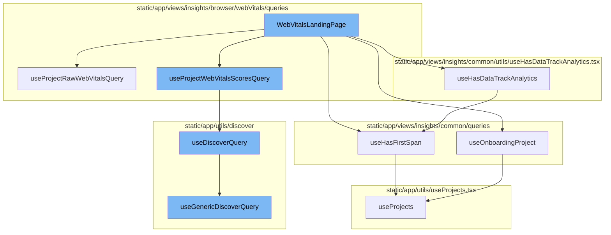

<SwmSnippet path="/static/app/views/insights/browser/webVitals/views/webVitalsLandingPage.tsx" line="47">

---

# WebVitalsLandingPage

The `WebVitalsLandingPage` function is the main entry point for the Web Vitals Landing Page. It uses several hooks to fetch and manage the state of the page. It also defines the layout and components that make up the page.

```tsx
export function WebVitalsLandingPage() {
  const organization = useOrganization();
  const location = useLocation();
  const onboardingProject = useOnboardingProject();
  const hasModuleData = useHasFirstSpan(ModuleName.VITAL);

  const router = useRouter();

  const [state, setState] = useState<{webVital: WebVitals | null}>({
    webVital: (location.query.webVital as WebVitals) ?? null,
  });

  const browserTypes = decodeBrowserTypes(location.query[SpanIndexedField.BROWSER_NAME]);

  const {data: projectData, isLoading} = useProjectRawWebVitalsQuery({browserTypes});
  const {data: projectScores, isLoading: isProjectScoresLoading} =
    useProjectWebVitalsScoresQuery({browserTypes});

  const projectScore =
    isProjectScoresLoading || isLoading
      ? undefined
```

---

</SwmSnippet>

<SwmSnippet path="/static/app/views/insights/browser/webVitals/queries/rawWebVitalsQueries/useProjectRawWebVitalsQuery.tsx" line="20">

---

## useProjectRawWebVitalsQuery

`useProjectRawWebVitalsQuery` is a custom hook that fetches raw web vitals data for a project. It constructs a query based on the provided parameters and uses the `useDiscoverQuery` hook to execute the query.

```tsx
export const useProjectRawWebVitalsQuery = ({
  transaction,
  tag,
  dataset,
  browserTypes,
}: Props = {}) => {
  const organization = useOrganization();
  const pageFilters = usePageFilters();
  const location = useLocation();
  const search = new MutableSearch([]);
  if (transaction) {
    search.addFilterValue('transaction', transaction);
  }
  if (tag) {
    search.addFilterValue(tag.key, tag.name);
  }
  if (browserTypes) {
    search.addDisjunctionFilterValues(SpanIndexedField.BROWSER_NAME, browserTypes);
  }

  const projectEventView = EventView.fromNewQueryWithPageFilters(
```

---

</SwmSnippet>

<SwmSnippet path="/static/app/views/insights/common/utils/useHasDataTrackAnalytics.tsx" line="10">

---

## useHasDataTrackAnalytics

`useHasDataTrackAnalytics` is a custom hook that tracks whether a module has ever sent data. It uses the `useHasFirstSpan` hook to check if the module has sent data and then sends this information to Sentry for analytics.

```tsx
export function useHasDataTrackAnalytics(module: ModuleName, analyticEvent: string) {
  const organization = useOrganization();
  const pageFilters = usePageFilters();
  const hasEverSentData = useHasFirstSpan(module);

  Sentry.withScope(scope => {
    scope.setTag(`insights.${module}.hasEverSentData`, hasEverSentData);
  });

  const projects = JSON.stringify(pageFilters.selection.projects);

  useEffect(() => {
    trackAnalytics(analyticEvent, {
      organization,
      has_ever_sent_data: hasEverSentData,
    });
  }, [organization, hasEverSentData, analyticEvent, projects]);
}
```

---

</SwmSnippet>

<SwmSnippet path="/static/app/views/insights/common/queries/useOnboardingProject.tsx" line="6">

---

## useOnboardingProject

`useOnboardingProject` is a custom hook that fetches the onboarding project for the current selection. It uses the `useProjects` hook to get all projects and then filters them based on the current selection.

```tsx
export function useOnboardingProject(): Project | undefined {
  const {projects} = useProjects();
  const pageFilters = usePageFilters();
  if (projects.length === 0) {
    return undefined;
  }

  // Current selection is 'my projects' or 'all projects'
  if (
    pageFilters.selection.projects.length === 0 ||
    pageFilters.selection.projects[0] === ALL_ACCESS_PROJECTS
  ) {
    const filtered = projects.filter(p => p.firstTransactionEvent === false);
    if (filtered.length === projects.length) {
      return filtered[0];
    }
  }

  // Any other subset of projects.
  const filtered = projects.filter(
    p =>
```

---

</SwmSnippet>

<SwmSnippet path="/static/app/views/insights/common/queries/useHasFirstSpan.tsx" line="30">

---

## useHasFirstSpan

`useHasFirstSpan` is a custom hook that checks if the current project selection has received a first insight span for a given module. It uses the `useProjects` hook to get all projects and then checks if any of them have received a first insight span for the module.

```tsx
/* Returns whether the module and current project selection has received a first insight span */
export function useHasFirstSpan(module: ModuleName): boolean {
  const {projects: allProjects} = useProjects();
  const pageFilters = usePageFilters();

  // Unsupported modules. Remove MOBILE_UI from this list once released.
  if ((excludedModuleNames as readonly ModuleName[]).includes(module)) return false;

  let selectedProjects: Project[] = [];
  // There are three cases for the selected pageFilter projects:
  //  - [] empty list represents "My Projects"
  //  - [-1] represents "All Projects"
  //  - [.., ..] otherwise, represents a list of project IDs
  if (pageFilters.selection.projects.length === 0) {
    selectedProjects = allProjects.filter(p => p.isMember);
  } else if (
    pageFilters.selection.projects.length === 1 &&
    pageFilters.selection.projects[0] === -1
  ) {
    selectedProjects = allProjects;
  } else {
```

---

</SwmSnippet>

<SwmSnippet path="/static/app/views/insights/browser/webVitals/queries/storedScoreQueries/useProjectWebVitalsScoresQuery.tsx" line="24">

---

## useProjectWebVitalsScoresQuery

`useProjectWebVitalsScoresQuery` is a custom hook that fetches the web vitals scores for a project. It constructs a query based on the provided parameters and uses the `useDiscoverQuery` hook to execute the query.

```tsx
export const useProjectWebVitalsScoresQuery = ({
  transaction,
  tag,
  dataset,
  enabled = true,
  weightWebVital = 'total',
  browserTypes,
}: Props = {}) => {
  const organization = useOrganization();
  const pageFilters = usePageFilters();
  const location = useLocation();
  const shouldUseStaticWeights = useStaticWeightsSetting();

  const search = new MutableSearch([]);
  if (transaction) {
    search.addFilterValue('transaction', transaction);
  }
  if (tag) {
    search.addFilterValue(tag.key, tag.name);
  }
  if (browserTypes) {
```

---

</SwmSnippet>

<SwmSnippet path="/static/app/utils/discover/discoverQuery.tsx" line="72">

---

## useDiscoverQuery

`useDiscoverQuery` is a custom hook that executes a Discover query and returns the results. It uses the `useGenericDiscoverQuery` hook to execute the query.

```tsx
export function useDiscoverQuery(props: Omit<DiscoverQueryComponentProps, 'children'>) {
  const afterFetch = (data, _) => {
    const {fields, ...otherMeta} = data.meta ?? {};
    return {
      ...data,
      meta: {...fields, ...otherMeta},
    };
  };

  const res = useGenericDiscoverQuery<TableData, DiscoverQueryPropsWithThresholds>({
    route: 'events',
    shouldRefetchData,
    afterFetch,
    ...props,
  });

  const pageLinks = res.response?.getResponseHeader('Link') ?? undefined;

  return {...res, pageLinks};
}
```

---

</SwmSnippet>

<SwmSnippet path="/static/app/utils/discover/genericDiscoverQuery.tsx" line="419">

---

## useGenericDiscoverQuery

`useGenericDiscoverQuery` is a custom hook that executes a generic Discover query and returns the results. It uses the `useQuery` hook from the `react-query` library to execute the query.

```tsx
export function useGenericDiscoverQuery<T, P>(props: Props<T, P>) {
  const api = useApi();
  const {orgSlug, route, options} = props;
  const url = `/organizations/${orgSlug}/${route}/`;
  const apiPayload = getPayload<T, P>(props);

  const res = useQuery<[T, string | undefined, ResponseMeta<T> | undefined], QueryError>(
    [route, apiPayload],
    ({signal: _signal}) =>
      doDiscoverQuery<T>(api, url, apiPayload, {
        queryBatching: props.queryBatching,
        skipAbort: props.skipAbort,
      }),
    options
  );

  return {
    ...res,
    data: res.data?.[0] ?? undefined,
    error: parseError(res.error),
    statusCode: res.data?.[1] ?? undefined,
```

---

</SwmSnippet>



# Flow drill down


<SwmSnippet path="/static/app/views/insights/browser/webVitals/views/webVitalsLandingPage.tsx" line="47">

---

# WebVitalsLandingPage

The `WebVitalsLandingPage` function is the main entry point for the Web Vitals Landing Page. It uses several hooks to fetch and manage the state of the page. It also defines the layout and components that make up the page.

```tsx
export function WebVitalsLandingPage() {
  const organization = useOrganization();
  const location = useLocation();
  const onboardingProject = useOnboardingProject();
  const hasModuleData = useHasFirstSpan(ModuleName.VITAL);

  const router = useRouter();

  const [state, setState] = useState<{webVital: WebVitals | null}>({
    webVital: (location.query.webVital as WebVitals) ?? null,
  });

  const browserTypes = decodeBrowserTypes(location.query[SpanIndexedField.BROWSER_NAME]);

  const {data: projectData, isLoading} = useProjectRawWebVitalsQuery({browserTypes});
  const {data: projectScores, isLoading: isProjectScoresLoading} =
    useProjectWebVitalsScoresQuery({browserTypes});

  const projectScore =
    isProjectScoresLoading || isLoading
      ? undefined
```

---

</SwmSnippet>

<SwmSnippet path="/static/app/views/insights/browser/webVitals/queries/rawWebVitalsQueries/useProjectRawWebVitalsQuery.tsx" line="20">

---

## useProjectRawWebVitalsQuery

`useProjectRawWebVitalsQuery` is a custom hook that fetches raw web vitals data for a project. It constructs a query based on the provided parameters and uses the `useDiscoverQuery` hook to execute the query.

```tsx
export const useProjectRawWebVitalsQuery = ({
  transaction,
  tag,
  dataset,
  browserTypes,
}: Props = {}) => {
  const organization = useOrganization();
  const pageFilters = usePageFilters();
  const location = useLocation();
  const search = new MutableSearch([]);
  if (transaction) {
    search.addFilterValue('transaction', transaction);
  }
  if (tag) {
    search.addFilterValue(tag.key, tag.name);
  }
  if (browserTypes) {
    search.addDisjunctionFilterValues(SpanIndexedField.BROWSER_NAME, browserTypes);
  }

  const projectEventView = EventView.fromNewQueryWithPageFilters(
```

---

</SwmSnippet>

<SwmSnippet path="/static/app/views/insights/common/utils/useHasDataTrackAnalytics.tsx" line="10">

---

## useHasDataTrackAnalytics

`useHasDataTrackAnalytics` is a custom hook that tracks whether a module has ever sent data. It uses the `useHasFirstSpan` hook to check if the module has sent data and then sends this information to Sentry for analytics.

```tsx
export function useHasDataTrackAnalytics(module: ModuleName, analyticEvent: string) {
  const organization = useOrganization();
  const pageFilters = usePageFilters();
  const hasEverSentData = useHasFirstSpan(module);

  Sentry.withScope(scope => {
    scope.setTag(`insights.${module}.hasEverSentData`, hasEverSentData);
  });

  const projects = JSON.stringify(pageFilters.selection.projects);

  useEffect(() => {
    trackAnalytics(analyticEvent, {
      organization,
      has_ever_sent_data: hasEverSentData,
    });
  }, [organization, hasEverSentData, analyticEvent, projects]);
}
```

---

</SwmSnippet>

<SwmSnippet path="/static/app/views/insights/common/queries/useOnboardingProject.tsx" line="6">

---

## useOnboardingProject

`useOnboardingProject` is a custom hook that fetches the onboarding project for the current selection. It uses the `useProjects` hook to get all projects and then filters them based on the current selection.

```tsx
export function useOnboardingProject(): Project | undefined {
  const {projects} = useProjects();
  const pageFilters = usePageFilters();
  if (projects.length === 0) {
    return undefined;
  }

  // Current selection is 'my projects' or 'all projects'
  if (
    pageFilters.selection.projects.length === 0 ||
    pageFilters.selection.projects[0] === ALL_ACCESS_PROJECTS
  ) {
    const filtered = projects.filter(p => p.firstTransactionEvent === false);
    if (filtered.length === projects.length) {
      return filtered[0];
    }
  }

  // Any other subset of projects.
  const filtered = projects.filter(
    p =>
```

---

</SwmSnippet>

<SwmSnippet path="/static/app/views/insights/common/queries/useHasFirstSpan.tsx" line="30">

---

## useHasFirstSpan

`useHasFirstSpan` is a custom hook that checks if the current project selection has received a first insight span for a given module. It uses the `useProjects` hook to get all projects and then checks if any of them have received a first insight span for the module.

```tsx
/* Returns whether the module and current project selection has received a first insight span */
export function useHasFirstSpan(module: ModuleName): boolean {
  const {projects: allProjects} = useProjects();
  const pageFilters = usePageFilters();

  // Unsupported modules. Remove MOBILE_UI from this list once released.
  if ((excludedModuleNames as readonly ModuleName[]).includes(module)) return false;

  let selectedProjects: Project[] = [];
  // There are three cases for the selected pageFilter projects:
  //  - [] empty list represents "My Projects"
  //  - [-1] represents "All Projects"
  //  - [.., ..] otherwise, represents a list of project IDs
  if (pageFilters.selection.projects.length === 0) {
    selectedProjects = allProjects.filter(p => p.isMember);
  } else if (
    pageFilters.selection.projects.length === 1 &&
    pageFilters.selection.projects[0] === -1
  ) {
    selectedProjects = allProjects;
  } else {
```

---

</SwmSnippet>

<SwmSnippet path="/static/app/views/insights/browser/webVitals/queries/storedScoreQueries/useProjectWebVitalsScoresQuery.tsx" line="24">

---

## useProjectWebVitalsScoresQuery

`useProjectWebVitalsScoresQuery` is a custom hook that fetches the web vitals scores for a project. It constructs a query based on the provided parameters and uses the `useDiscoverQuery` hook to execute the query.

```tsx
export const useProjectWebVitalsScoresQuery = ({
  transaction,
  tag,
  dataset,
  enabled = true,
  weightWebVital = 'total',
  browserTypes,
}: Props = {}) => {
  const organization = useOrganization();
  const pageFilters = usePageFilters();
  const location = useLocation();
  const shouldUseStaticWeights = useStaticWeightsSetting();

  const search = new MutableSearch([]);
  if (transaction) {
    search.addFilterValue('transaction', transaction);
  }
  if (tag) {
    search.addFilterValue(tag.key, tag.name);
  }
  if (browserTypes) {
```

---

</SwmSnippet>

<SwmSnippet path="/static/app/utils/discover/discoverQuery.tsx" line="72">

---

## useDiscoverQuery

`useDiscoverQuery` is a custom hook that executes a Discover query and returns the results. It uses the `useGenericDiscoverQuery` hook to execute the query.

```tsx
export function useDiscoverQuery(props: Omit<DiscoverQueryComponentProps, 'children'>) {
  const afterFetch = (data, _) => {
    const {fields, ...otherMeta} = data.meta ?? {};
    return {
      ...data,
      meta: {...fields, ...otherMeta},
    };
  };

  const res = useGenericDiscoverQuery<TableData, DiscoverQueryPropsWithThresholds>({
    route: 'events',
    shouldRefetchData,
    afterFetch,
    ...props,
  });

  const pageLinks = res.response?.getResponseHeader('Link') ?? undefined;

  return {...res, pageLinks};
}
```

---

</SwmSnippet>

<SwmSnippet path="/static/app/utils/discover/genericDiscoverQuery.tsx" line="419">

---

## useGenericDiscoverQuery

`useGenericDiscoverQuery` is a custom hook that executes a generic Discover query and returns the results. It uses the `useQuery` hook from the `react-query` library to execute the query.

```tsx
export function useGenericDiscoverQuery<T, P>(props: Props<T, P>) {
  const api = useApi();
  const {orgSlug, route, options} = props;
  const url = `/organizations/${orgSlug}/${route}/`;
  const apiPayload = getPayload<T, P>(props);

  const res = useQuery<[T, string | undefined, ResponseMeta<T> | undefined], QueryError>(
    [route, apiPayload],
    ({signal: _signal}) =>
      doDiscoverQuery<T>(api, url, apiPayload, {
        queryBatching: props.queryBatching,
        skipAbort: props.skipAbort,
      }),
    options
  );

  return {
    ...res,
    data: res.data?.[0] ?? undefined,
    error: parseError(res.error),
    statusCode: res.data?.[1] ?? undefined,
```

---

</SwmSnippet>

&nbsp;

*This is an auto-generated document by Swimm AI 🌊 and has not yet been verified by a human*

<SwmMeta version="3.0.0" repo-id="Z2l0aHViJTNBJTNBc2VudHJ5LWRlbW8lM0ElM0FTd2ltbS1EZW1v" repo-name="sentry-demo" doc-type="flows"><sup>Powered by [Swimm](/)</sup></SwmMeta>
