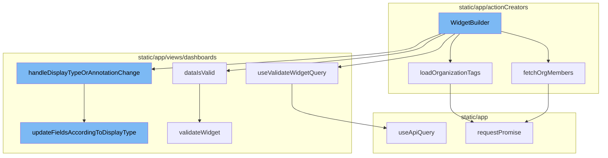

# WidgetBuilder Overview

The `WidgetBuilder` is a function that is responsible for building widgets in the application. It takes in parameters such as `widgetIndex`, `orgId`, `dashboardId`, `source`, `displayType`, `defaultTitle`, `limit`, and `dataset` from the location query. It also uses various states and hooks to manage the widget building process.

<SwmSnippet path="/static/app/actionCreators/members.tsx" line="17">

---

# Fetching Organization Members

The `fetchOrgMembers` function is used to fetch the members of an organization. It makes a GET request to the `/organizations/${orgId}/users/` endpoint. If the request is successful, it filters the members to get the users and loads them into the `MemberListStore`.

```tsx
export async function fetchOrgMembers(
  api: Client,
  orgId: string,
  projectIds: string[] | null = null
): Promise<Member[]> {
  const endpoint = `/organizations/${orgId}/users/`;
  const query = projectIds ? {project: projectIds} : {};

  try {
    const members = await api.requestPromise(endpoint, {method: 'GET', query});

    if (!members) {
      // This shouldn't happen if the request was successful
      // It should at least be an empty list
      Sentry.withScope(scope => {
        scope.setExtras({
          orgId,
          projectIds,
        });
        Sentry.captureException(new Error('Members is undefined'));
      });
```

---

</SwmSnippet>

<SwmSnippet path="/static/app/actionCreators/tags.tsx" line="28">

---

# Loading Organization Tags

The `loadOrganizationTags` function is used to load the tags of an organization based on a global selection value. It makes a GET request to the `/organizations/${orgSlug}/tags/` endpoint. If the request is successful, it triggers the `tagFetchSuccess` function.

```tsx
/**
 * Load an organization's tags based on a global selection value.
 */
export function loadOrganizationTags(
  api: Client,
  orgSlug: string,
  selection: PageFilters
): Promise<void> {
  TagStore.reset();

  const query: Query = selection.datetime
    ? {...normalizeDateTimeParams(selection.datetime)}
    : {};
  query.use_cache = '1';

  if (selection.projects) {
    query.project = selection.projects.map(String);
  }

  return api
    .requestPromise(`/organizations/${orgSlug}/tags/`, {
```

---

</SwmSnippet>

<SwmSnippet path="/static/app/views/dashboards/widgetBuilder/widgetBuilder.tsx" line="860">

---

# Validating Widget Data

The `dataIsValid` function is used to validate the widget data. It calls the `validateWidget` function with the `api`, `organization.slug`, and `widgetData` as parameters. If the validation is successful, it returns true, otherwise, it sets the loading state to false and returns false.

```tsx
  async function dataIsValid(widgetData: Widget): Promise<boolean> {
    setState({...state, loading: true});
    try {
      await validateWidget(api, organization.slug, widgetData);
      return true;
    } catch (error) {
      setState({
        ...state,
        loading: false,
        errors: {...state.errors, ...mapErrors(error?.responseJSON ?? {}, {})},
      });
      addErrorMessage(t('Unable to save widget'));
      return false;
    }
  }
```

---

</SwmSnippet>

<SwmSnippet path="/static/app/views/dashboards/hooks/useValidateWidget.tsx" line="23">

---

# Using Validate Widget Query

The `useValidateWidgetQuery` function is a hook that is used to validate the widget query. It uses the `useApiQuery` function with the `validateWidgetRequest` as parameters. The data returned from this hook is used in the `WidgetBuilder` function.

```tsx
export function useValidateWidgetQuery(_widget: Widget) {
  const organization = useOrganization();
  const {selection} = usePageFilters();

  const data = useApiQuery<ValidateWidgetResponse>(
    validateWidgetRequest(organization.slug, cleanWidgetForRequest(_widget), selection),
    {
      staleTime: 10000,
      enabled: hasOnDemandMetricWidgetFeature(organization),
    }
  );

  return data;
}
```

---

</SwmSnippet>

<SwmSnippet path="/static/app/views/dashboards/widgetBuilder/widgetBuilder.tsx" line="512">

---

# Handling Display Type or Annotation Change

The `handleDisplayTypeOrAnnotationChange` function is used to handle changes in the display type or annotation of the widget. It updates the state based on the new value and calls the `updateFieldsAccordingToDisplayType` function if the display type has changed.

```tsx
  function handleDisplayTypeOrAnnotationChange<
    F extends keyof Pick<State, 'displayType' | 'title' | 'description'>,
  >(field: F, value: State[F]) {
    value &&
      trackAnalytics('dashboards_views.widget_builder.change', {
        from: source,
        field,
        value,
        widget_type: widgetType,
        organization,
        new_widget: !isEditing,
      });

    setState(prevState => {
      const newState = cloneDeep(prevState);
      set(newState, field, value);
      if (['title', 'description'].includes(field)) {
        set(newState, 'userHasModified', true);
      }
      return {...newState, errors: undefined};
    });
```

---

</SwmSnippet>

<SwmSnippet path="/static/app/views/dashboards/widgetBuilder/widgetBuilder.tsx" line="404">

---

# Updating Fields According to Display Type

The `updateFieldsAccordingToDisplayType` function is used to update the fields of the widget according to the new display type. It checks if the new display type is supported by the current dataset and updates the state accordingly. It also normalizes the queries and sets the limit based on the new display type.

```tsx
  function updateFieldsAccordingToDisplayType(newDisplayType: DisplayType) {
    setState(prevState => {
      const newState = cloneDeep(prevState);

      if (!datasetConfig.supportedDisplayTypes.includes(newDisplayType)) {
        // Set to Events dataset if Display Type is not supported by
        // current dataset
        set(
          newState,
          'queries',
          normalizeQueries({
            displayType: newDisplayType,
            queries: [{...getDatasetConfig(WidgetType.DISCOVER).defaultWidgetQuery}],
            widgetType: WidgetType.DISCOVER,
          })
        );
        set(newState, 'dataSet', DataSet.EVENTS);
        setDataSetConfig(getDatasetConfig(WidgetType.DISCOVER));
        return {...newState, errors: undefined};
      }

```

---

</SwmSnippet>



# Flow drill down


# WidgetBuilder Overview

The `WidgetBuilder` is a function that is responsible for building widgets in the application. It takes in parameters such as `widgetIndex`, `orgId`, `dashboardId`, `source`, `displayType`, `defaultTitle`, `limit`, and `dataset` from the location query. It also uses various states and hooks to manage the widget building process.

<SwmSnippet path="/static/app/actionCreators/members.tsx" line="17">

---

# Fetching Organization Members

The `fetchOrgMembers` function is used to fetch the members of an organization. It makes a GET request to the `/organizations/${orgId}/users/` endpoint. If the request is successful, it filters the members to get the users and loads them into the `MemberListStore`.

```tsx
export async function fetchOrgMembers(
  api: Client,
  orgId: string,
  projectIds: string[] | null = null
): Promise<Member[]> {
  const endpoint = `/organizations/${orgId}/users/`;
  const query = projectIds ? {project: projectIds} : {};

  try {
    const members = await api.requestPromise(endpoint, {method: 'GET', query});

    if (!members) {
      // This shouldn't happen if the request was successful
      // It should at least be an empty list
      Sentry.withScope(scope => {
        scope.setExtras({
          orgId,
          projectIds,
        });
        Sentry.captureException(new Error('Members is undefined'));
      });
```

---

</SwmSnippet>

<SwmSnippet path="/static/app/actionCreators/tags.tsx" line="28">

---

# Loading Organization Tags

The `loadOrganizationTags` function is used to load the tags of an organization based on a global selection value. It makes a GET request to the `/organizations/${orgSlug}/tags/` endpoint. If the request is successful, it triggers the `tagFetchSuccess` function.

```tsx
/**
 * Load an organization's tags based on a global selection value.
 */
export function loadOrganizationTags(
  api: Client,
  orgSlug: string,
  selection: PageFilters
): Promise<void> {
  TagStore.reset();

  const query: Query = selection.datetime
    ? {...normalizeDateTimeParams(selection.datetime)}
    : {};
  query.use_cache = '1';

  if (selection.projects) {
    query.project = selection.projects.map(String);
  }

  return api
    .requestPromise(`/organizations/${orgSlug}/tags/`, {
```

---

</SwmSnippet>

<SwmSnippet path="/static/app/views/dashboards/widgetBuilder/widgetBuilder.tsx" line="860">

---

# Validating Widget Data

The `dataIsValid` function is used to validate the widget data. It calls the `validateWidget` function with the `api`, `organization.slug`, and `widgetData` as parameters. If the validation is successful, it returns true, otherwise, it sets the loading state to false and returns false.

```tsx
  async function dataIsValid(widgetData: Widget): Promise<boolean> {
    setState({...state, loading: true});
    try {
      await validateWidget(api, organization.slug, widgetData);
      return true;
    } catch (error) {
      setState({
        ...state,
        loading: false,
        errors: {...state.errors, ...mapErrors(error?.responseJSON ?? {}, {})},
      });
      addErrorMessage(t('Unable to save widget'));
      return false;
    }
  }
```

---

</SwmSnippet>

<SwmSnippet path="/static/app/views/dashboards/hooks/useValidateWidget.tsx" line="23">

---

# Using Validate Widget Query

The `useValidateWidgetQuery` function is a hook that is used to validate the widget query. It uses the `useApiQuery` function with the `validateWidgetRequest` as parameters. The data returned from this hook is used in the `WidgetBuilder` function.

```tsx
export function useValidateWidgetQuery(_widget: Widget) {
  const organization = useOrganization();
  const {selection} = usePageFilters();

  const data = useApiQuery<ValidateWidgetResponse>(
    validateWidgetRequest(organization.slug, cleanWidgetForRequest(_widget), selection),
    {
      staleTime: 10000,
      enabled: hasOnDemandMetricWidgetFeature(organization),
    }
  );

  return data;
}
```

---

</SwmSnippet>

<SwmSnippet path="/static/app/views/dashboards/widgetBuilder/widgetBuilder.tsx" line="512">

---

# Handling Display Type or Annotation Change

The `handleDisplayTypeOrAnnotationChange` function is used to handle changes in the display type or annotation of the widget. It updates the state based on the new value and calls the `updateFieldsAccordingToDisplayType` function if the display type has changed.

```tsx
  function handleDisplayTypeOrAnnotationChange<
    F extends keyof Pick<State, 'displayType' | 'title' | 'description'>,
  >(field: F, value: State[F]) {
    value &&
      trackAnalytics('dashboards_views.widget_builder.change', {
        from: source,
        field,
        value,
        widget_type: widgetType,
        organization,
        new_widget: !isEditing,
      });

    setState(prevState => {
      const newState = cloneDeep(prevState);
      set(newState, field, value);
      if (['title', 'description'].includes(field)) {
        set(newState, 'userHasModified', true);
      }
      return {...newState, errors: undefined};
    });
```

---

</SwmSnippet>

<SwmSnippet path="/static/app/views/dashboards/widgetBuilder/widgetBuilder.tsx" line="404">

---

# Updating Fields According to Display Type

The `updateFieldsAccordingToDisplayType` function is used to update the fields of the widget according to the new display type. It checks if the new display type is supported by the current dataset and updates the state accordingly. It also normalizes the queries and sets the limit based on the new display type.

```tsx
  function updateFieldsAccordingToDisplayType(newDisplayType: DisplayType) {
    setState(prevState => {
      const newState = cloneDeep(prevState);

      if (!datasetConfig.supportedDisplayTypes.includes(newDisplayType)) {
        // Set to Events dataset if Display Type is not supported by
        // current dataset
        set(
          newState,
          'queries',
          normalizeQueries({
            displayType: newDisplayType,
            queries: [{...getDatasetConfig(WidgetType.DISCOVER).defaultWidgetQuery}],
            widgetType: WidgetType.DISCOVER,
          })
        );
        set(newState, 'dataSet', DataSet.EVENTS);
        setDataSetConfig(getDatasetConfig(WidgetType.DISCOVER));
        return {...newState, errors: undefined};
      }

```

---

</SwmSnippet>

&nbsp;

*This is an auto-generated document by Swimm AI 🌊 and has not yet been verified by a human*

<SwmMeta version="3.0.0" repo-id="Z2l0aHViJTNBJTNBc2VudHJ5LWRlbW8lM0ElM0FTd2ltbS1EZW1v" repo-name="sentry-demo" doc-type="flows"><sup>Powered by [Swimm](/)</sup></SwmMeta>
